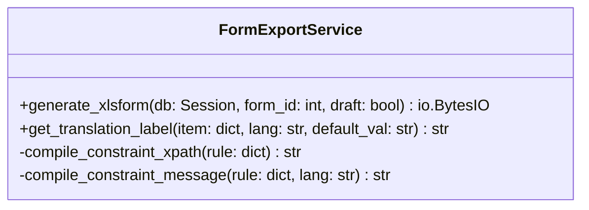
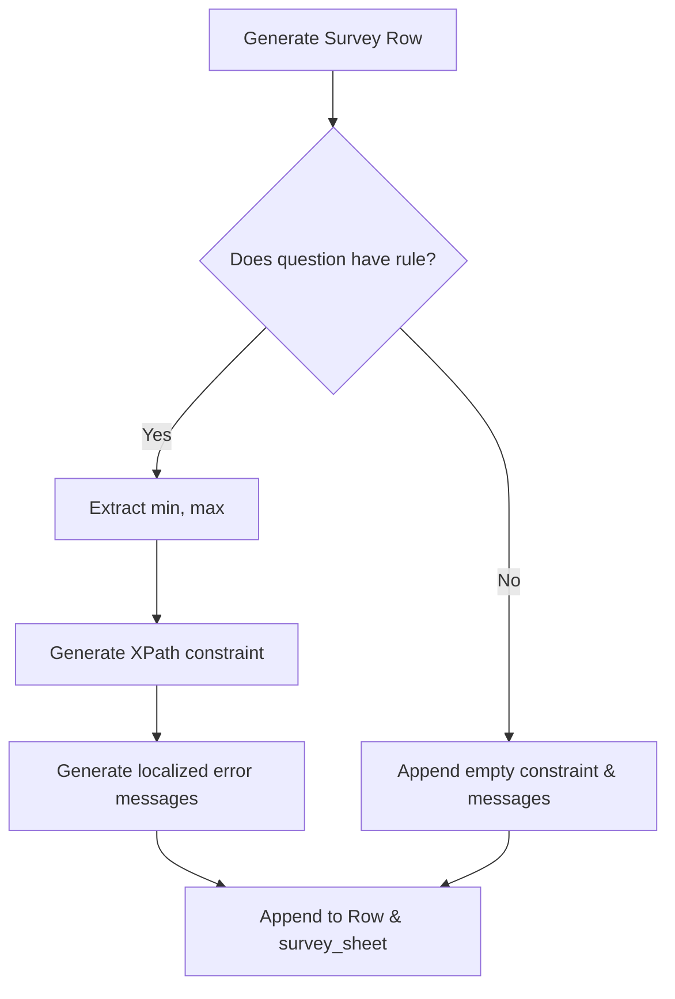

# LLD — XLSForm Validation Criteria Export

> **Stage 3 of 3 — Documentation Hierarchy**
> Owner: Winston (Architect) | Target Location: `docs/lld/xlsform_validation_export_lld.md` | References: `docs/prd/xlsform_validation_export_prd.md`
> Status: `In Review`

---

## 1. Overview & Scope

**Component / Module**:
`FormExportService` in `backend/app/services/form_export.py`

**PRD References**:

- **FR-001**: Exporter must add `constraint` and `constraint_message` columns.
- **FR-002**: Exporter must convert question rules (`min` and `max`) into XPath expressions.
- **FR-003**: Exporter must populate localized validation constraint messages.
- **FR-004**: Exporter must support multilingual headers/cells.

---

## 2. Component Design & Flow

### Class Design

We will modify `FormExportService` to generate the new headers and map validation rules for each question.



### Flow Diagram



---

## 3. Detailed Logic & Translation Mapping

### XPath Constraint Generation Algorithm

```python
def compile_constraint_xpath(rule: dict) -> str:
    if not rule or not isinstance(rule, dict):
        return ""
    min_val = rule.get("min")
    max_val = rule.get("max")

    if min_val is not None and max_val is not None:
        return f". >= {min_val} and . <= {max_val}"
    elif min_val is not None:
        return f". >= {min_val}"
    elif max_val is not None:
        return f". <= {max_val}"
    return ""
```

### Localized Default Error Messages

| Language         | Scenario       | Message Template                                    |
| ---------------- | -------------- | --------------------------------------------------- |
| **English (en)** | Both Min & Max | `Value must be between {min} and {max}`             |
|                  | Only Min       | `Value must be greater than or equal to {min}`      |
|                  | Only Max       | `Value must be less than or equal to {max}`         |
| **Swahili (sw)** | Both Min & Max | `Thamani lazima iwe kati ya {min} na {max}`         |
|                  | Only Min       | `Thamani lazima iwe kubwa kuliko au sawa na {min}`  |
|                  | Only Max       | `Thamani lazima iwe ndogo kuliko au sawa na {max}`  |
| **French (fr)**  | Both Min & Max | `La valeur doit être comprise entre {min} et {max}` |
|                  | Only Min       | `La valeur doit être supérieure ou égale à {min}`   |
|                  | Only Max       | `La valeur doit être inférieure ou égale à {max}`   |
| **Spanish (es)** | Both Min & Max | `El valor debe estar entre {min} y {max}`           |
|                  | Only Min       | `El valor debe ser mayor o igual a {min}`           |
|                  | Only Max       | `El valor debe ser menor o igual a {max}`           |

---

## 4. Verification & Testing Strategy

### Unit Tests (FastAPI / pytest)

In `backend/tests/test_form_export.py`, create a new test case `test_export_xlsform_with_validation_rules` that performs the following steps:

1. Create a form with a numeric question (`type: "number"`) and a custom `rule` dictionary `{ "min": 2, "max": 10, "allowDecimal": true }`.
2. Request the XLSForm export endpoint.
3. Parse the spreadsheet output stream using `openpyxl.load_workbook`.
4. Inspect the `survey` worksheet headers to verify that the columns `constraint` and `constraint_message::English (en)` exist.
5. Inspect the question's row and verify:
   - The cell under `constraint` contains `. >= 2 and . <= 10`.
   - The cell under `constraint_message::English (en)` contains `Value must be between 2 and 10`.
