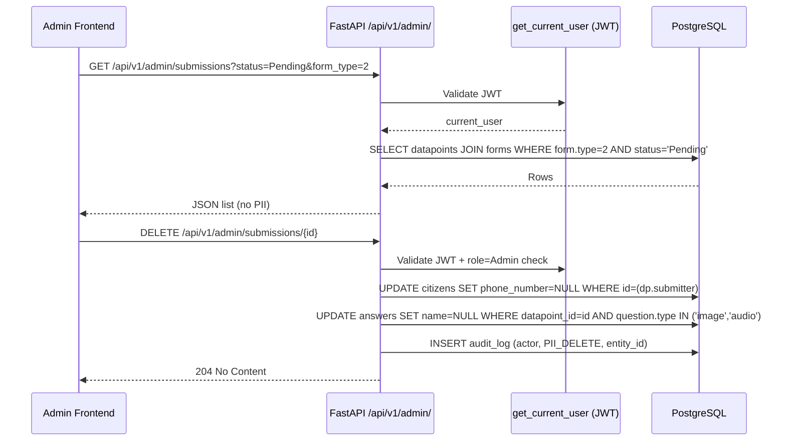

# PRD — Admin Data Workspace API (Sub-Task 2)
**Initiative:** Wetland Data Portal — Admin Workspace API
**Issue:** #63 *(to be confirmed)*
**Branch:** `feature/63-sub-task-2-admin-data-workspace-api`
**Status:** Draft — Awaiting Approval

---

## I. Overview & Goal

### Problem Statement
All admin-facing endpoints currently sit under the `/api/v1/` namespace alongside public routes. They lack a uniform, SSO-protected prefix, and several critical capabilities are completely absent:
- No `/api/v1/admin/` namespace isolating internal staff endpoints from the public layer.
- No soft-delete mechanism to scrub PII while preserving environmental data.
- No dead-letter triage endpoint under the admin prefix.
- The FGD and Lab QA "direct-to-approved" manual entry POST endpoints use the `/api/v1/internal/` prefix instead of `/api/v1/admin/`.

### Core Metric
All admin-only CRUD and triage actions are reachable exclusively under `/api/v1/admin/` and protected by `get_current_user`. PII deletion updates `phone_number` to NULL without removing the observation row.

---

## II. Pre-Flight: What Already Exists

### ✅ Already Implemented (can re-export or refactor)
| Feature | Location | Notes |
|---|---|---|
| `GET /api/v1/submissions` with `form_id`, `basin_id`, `status` filters | `submission_router.py` | Needs `basin` by **name** filter and re-prefix to `/api/v1/admin/` |
| `PATCH /api/v1/submissions/{id}/status` (Approve / Reject) | `submission_router.py` | Auth guard + audit log already present. Scoring triggered on Approve. |
| `POST /api/v1/internal/fgd` | `internal_router.py` | Direct-to-Approved POST already works; needs re-prefix to `/api/v1/admin/` |
| `POST /api/v1/internal/lab-qa` | `internal_router.py` | Direct-to-Approved POST already works; needs re-prefix to `/api/v1/admin/` |
| `GET /api/v1/dead-letters` | `dead_letter_router.py` | Needs re-prefix to `/api/v1/admin/` and auth guard added |
| `PUT /api/v1/dead-letters/{id}` (acknowledge/update status) | `dead_letter_router.py` | Needs re-prefix and auth guard |

### ❌ Net-New (must be built)
| Feature | Notes |
|---|---|
| `DELETE /api/v1/admin/submissions/{id}` | PII soft-delete: set `phone_number` to NULL in linked Citizen record, scrub identifying media GCS paths from answers; preserve the datapoint row. Write audit log. |
| `/api/v1/admin/` router namespace | New `admin_router.py` registered in `main.py` with `Depends(get_current_user)` on every route |
| `GET /api/v1/admin/submissions` | Superset of existing list — adds `basin` filter **by name** and `form_type` (int) filter alongside existing `status` |

---

## III. User Stories & Flows

### Personas
| Persona | Need |
|---|---|
| **Reviewer** | Load pending submissions, triage dead-letters, approve / reject KoboCollect sampling records |
| **Admin** | All Reviewer actions plus delete a citizen's pollution report (PII scrub) |
| **CSO Staff / Academic Partner** | Submit FGD session and Lab QA records directly to Approved without triage |

### Key User Flows

**Flow A — Submission Triage (Reviewer)**
1. Reviewer opens Data workspace.
2. Frontend calls `GET /api/v1/admin/submissions?status=Pending&form_type=2&basin=MARA`.
3. Backend returns filtered list of pending sampling records.
4. Reviewer clicks Approve → `PATCH /api/v1/admin/submissions/{id}/status` body `{"status": "APPROVED"}`.
5. Backend triggers Fuzzy Logic scoring engine, writes audit log, returns 200.

**Flow B — Dead-Letter Triage (Reviewer)**
1. Reviewer opens the Dead-Letter alert panel.
2. Frontend calls `GET /api/v1/admin/dead-letters?status=PENDING`.
3. Reviewer clicks "Acknowledge" → `PATCH /api/v1/admin/dead-letters/{id}` body `{"status": "ACKNOWLEDGED"}`.
4. Backend updates status, writes audit log, returns 200.

**Flow C — Manual Entry (CSO / Academic Partner)**
1. CSO staff clicks + Add New → selects FGD Session → submits webform.
2. Frontend calls `POST /api/v1/admin/submissions/fgd` with the session payload.
3. Backend hardcodes `status = APPROVED`, skips triage queue, writes audit log.

**Flow D — PII Soft-Delete (Admin)**
1. Admin clicks Delete on a citizen pollution report.
2. Frontend calls `DELETE /api/v1/admin/submissions/{id}`.
3. Backend finds the linked Citizen record and sets `phone_number = NULL`.
4. Scrubs any identifying media answer (GCS path to voice/photo) by setting `answer.name = NULL` where `question.type = "image"` or `"audio"`.
5. The Datapoint row and its aggregated sub-county count remain intact.
6. Backend writes audit log entry `action = "PII_DELETE"`.
7. Returns `204 No Content`.

---

## IV. Requirements

### Must-Have
- New `admin_router.py` registered under prefix `/api/v1/admin/` with `get_current_user` dependency applied to ALL routes.
- `GET /api/v1/admin/submissions` — filterable by `form_type` (int), `status` (string), and `basin` (basin name string). Returns full list ≤ 200 rows default limit.
- `PATCH /api/v1/admin/submissions/{id}/status` — Approve / Reject transitions. Triggers scoring on Approve and writes audit log (re-exported from existing logic).
- `DELETE /api/v1/admin/submissions/{id}` — PII soft-delete (nullify phone_number in Citizen table, nullify media answer paths). Admin role only. Audit log entry required.
- `GET /api/v1/admin/dead-letters` — Serve quarantine table, filterable by `status` and `source_system`. Auth-guarded.
- `PATCH /api/v1/admin/dead-letters/{id}` — Acknowledge / dismiss a dead-letter entry. Write audit log.
- `POST /api/v1/admin/submissions/fgd` — Direct-to-Approved FGD manual entry.
- `POST /api/v1/admin/submissions/lab-qa` — Direct-to-Approved Lab QA manual entry.
- Every PATCH, DELETE, and POST **must** write an `AuditLog` entry synchronously before returning 200.

### Nice-to-Have
- `?date_from` / `?date_to` filters on `GET /api/v1/admin/submissions`.
- Dead-letter resolution with manual JSON payload editing and force-retry insertion (deferred — see Open Questions).
- Pagination (`?limit=`, `?offset=`) on submission list.

### Out of Scope
- Frontend UI implementation (separate story).
- SSO provider configuration (Google / Microsoft OAuth, separate DevOps task).
- nginx auth proxy configuration.
- User management endpoints (`POST /api/v1/admin/users/invite`, etc.) — separate story.
- Site management endpoints — separate story.

---

## V. Architecture Design

### Data Flow

### Data Model Changes

| Change | Reason |
|---|---|
| No new tables | All existing models (Datapoint, Citizen, Answer, AuditLog, DeadLetter) already exist |
| New `admin_router.py` | Isolated namespace; `Depends(get_current_user)` on router-level |
| Refactor `submission_router.py` internal prefix | `PATCH` and `GET` endpoints re-exported or duplicated under `/api/v1/admin/` |
| Extend `GET /api/v1/admin/submissions` query | Add `basin` name join through `Basin.name ILIKE` and `form_type` filter |

> [!NOTE]
> The existing `/api/v1/submissions` and `/api/v1/dead-letters` routes will remain active for backward compatibility during transition. The admin-prefixed equivalents are the authoritative endpoints going forward.

---

## VI. Acceptance Criteria

### User Acceptance Criteria (UAC)
- **UAC-1 (State & Scoring):** A Reviewer calls `PATCH /api/v1/admin/submissions/{id}/status` with `{"status": "APPROVED"}`. The response returns 200 OK. Querying `GET /api/v1/sites/{site_id}` now shows an updated `health_class`.
- **UAC-2 (Triage):** A Reviewer calls `GET /api/v1/admin/dead-letters?status=PENDING`. Response returns quarantined KoboToolbox submission records. Reviewer calls `PATCH /api/v1/admin/dead-letters/{id}` to acknowledge. Returns 200.
- **UAC-3 (Manual Entry):** A CSO staff POSTs to `POST /api/v1/admin/submissions/fgd`. The returned datapoint has `status = "APPROVED"` without any manual review step.
- **UAC-4 (Data Privacy):** Admin calls `DELETE /api/v1/admin/submissions/{id}`. Response is 204. Querying the Citizen record shows `phone_number = NULL`. The sub-county incident count on `GET /api/v1/incidents` remains unchanged.

### Technical Acceptance Criteria (TAC)
- **TAC-1 (Auth Guard):** Every route under `/api/v1/admin/` returns `HTTP 401 Unauthorized` when called without a valid JWT token.
- **TAC-2 (Role Guard for Delete):** `DELETE /api/v1/admin/submissions/{id}` returns `HTTP 403 Forbidden` when called by a Reviewer role. Only Admin role can execute.
- **TAC-3 (Audit Log):** Every `PATCH`, `POST`, and `DELETE` to `/api/v1/admin/` generates a row in the `audit_logs` table with `actor_id`, `action`, `entity_type`, and `entity_id`.
- **TAC-4 (Soft-Delete Integrity):** After `DELETE /api/v1/admin/submissions/{id}`, the `datapoints` table row still exists with all environmental measurement answers intact. Only `citizen.phone_number` and media `answer.name` fields are NULL.
- **TAC-5 (Filtering):** `GET /api/v1/admin/submissions` supports `?form_type=2&status=Pending&basin=MARA` simultaneously.
- **TAC-6 (Direct-to-Approved):** FGD and Lab QA POST routes hardcode `status = "APPROVED"` in the service layer — this must not be overridable by the request payload.

---

## VII. Open Questions (Resolved & Unresolved)

| # | Question | Status | Resolution |
|---|---|---|---|
| OQ-1 | Dead-letter triage: Acknowledge/Dismiss only, or manual JSON re-try? | **Unresolved** | For this story: implement **Acknowledge/Dismiss only** (`status = "ACKNOWLEDGED"`). Manual JSON editing with force-retry is deferred to a future story when KoboToolbox form schema debugging workflow is defined. |
| OQ-2 | PII soft-delete scope: only `citizen.phone_number`, or also media paths in `answers`? | **Resolved** | Nullify `citizen.phone_number` AND set `answer.name = NULL` for media-type answers (`question.type IN ('image', 'audio')`) linked to the deleted datapoint. |
| OQ-3 | Should `/api/v1/submissions` and `/api/v1/dead-letters` be deprecated after this task? | **Unresolved** | Keep both prefixes active for now. Deprecation to be handled in a future cleanup story once admin frontend is migrated. |

---

## VIII. Edge Cases & Errors

| Scenario | Response |
|---|---|
| `DELETE` a submission with no linked Citizen (anonymous report) | Set media answer paths to NULL. Return 204 (no Citizen row to update). |
| `PATCH` a submission already `APPROVED` or `REJECTED` | HTTP 400 `{"detail": "Submission is already APPROVED."}` (existing behaviour) |
| `DELETE` called by Reviewer role | HTTP 403 Forbidden |
| `PATCH /api/v1/admin/dead-letters/{id}` with invalid status value | HTTP 422 Unprocessable Entity |
| Dead-letter record not found | HTTP 404 Not Found |
| Submission not found | HTTP 404 Not Found |

---

## IX. Epic & Ballpark Estimation

| Component | Complexity | Estimate |
|---|---|---|
| New `admin_router.py` skeleton with auth guard and prefix | Simple | 0.5h |
| Re-export `GET /api/v1/admin/submissions` with extended basin/form_type filters | Simple | 1.0h |
| Re-export `PATCH /api/v1/admin/submissions/{id}/status` | Simple | 0.5h |
| `DELETE /api/v1/admin/submissions/{id}` soft-delete + role guard + audit log | Medium | 2.0h |
| Re-export `GET /api/v1/admin/dead-letters` + `PATCH /api/v1/admin/dead-letters/{id}` with auth | Simple | 0.5h |
| Re-export `POST /api/v1/admin/submissions/fgd` + `POST /api/v1/admin/submissions/lab-qa` | Simple | 0.5h |
| Pytest test suite (auth, role, soft-delete, filters, audit log assertions) | Medium | 2.5h |
| **Total** | | **~7.5h** |

### Assumptions
- `get_current_user` JWT dependency already exists and works in `app/dependencies/auth.py`.
- `RoleChecker` class already exists for role-based access control.
- Citizen model's `phone_number` column is nullable (or can be patched to be so).
- No new Alembic migrations needed — all tables exist.
