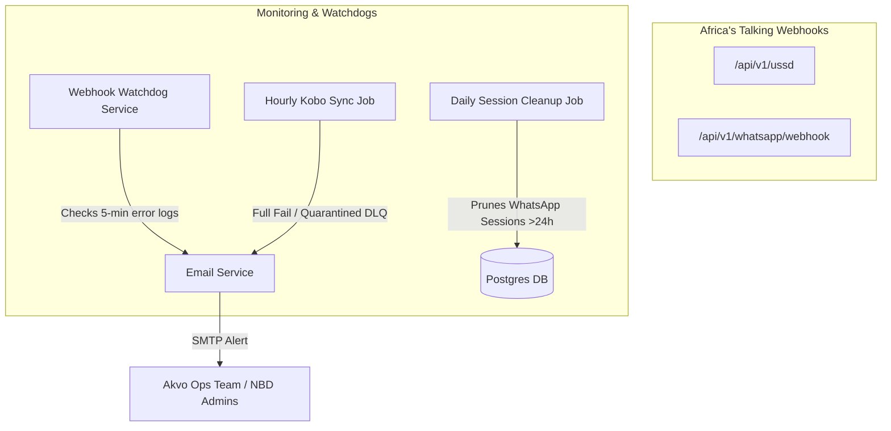

# Product Requirements Document (PRD) — Application Monitoring & Alert Hooks

> **Stage 2 of 3 — Documentation Hierarchy**
> Owner: PM (John) | Target Location: `docs/prd/application_monitoring_prd.md` | References: `docs/Final_SDD.md`, `docs/database_schema.md`
> Status: `Approved`

---

## I. Overview & Goal
While the ingestion pipelines (USSD, WhatsApp, KoboToolbox) are resilient (supporting retries and dead-letter queue quarantining), the Operations and Admin teams currently lack real-time visibility into pipeline failures.

This initiative aims to implement automated monitoring and email alerting systems to notify the **Akvo operations team** and **NBD Admins** immediately when critical integrations fail, down times exceed thresholds, or records are quarantined in the Dead-Letter Queue (DLQ).

### Core Metrics
* **Time to Detect Webhook Outage**: < 10 minutes from incident start.
* **Alert Latency (Kobo sync fail / DLQ entry)**: Dispatched within the same hourly sync execution run.
* **Compliance**: 100% of abandoned WhatsApp sessions (> 24 hours old) pruned daily.

---

## II. User Personas & Flows

### Personas
* **Akvo Operations Team**: Needs to know immediately when Africa's Talking API webhook endpoints are failing or unreachable.
* **NBD Platform Administrator**: Needs to receive email digests detailing KoboToolbox sync failures or quarantined data submissions in the DLQ.

### User Journeys
1. **Webhook Downtime Alert**:
   * Africa's Talking attempts to call `/api/v1/ussd` or `/api/v1/whatsapp/webhook`.
   * The endpoint responds with `500 Internal Server Error` or is completely unreachable.
   * A monitoring scheduler checks the endpoint logs. If errors/unavailability persist for **more than 5 minutes**, a critical alert email is sent to the Akvo ops team.
2. **Kobo Sync & Quarantine Alert**:
   * The hourly background Kobo sync task runs.
   * If a schema mismatch occurs or a record fails validation and is moved to the `dead_letters` table, the system compiles a notification summary.
   * An email alert is immediately sent to all registered Admins containing the error details and the quarantined payload ID.

---

## III. Scope & Guardrails

### Must-Have
* **Africa's Talking Webhook Monitoring**: A scheduler or watchdog job checking webhook availability/error state, sending email alerts if failures exceed 5 minutes.
* **Kobo Sync DLQ Alerts**: Integration in the `sync_kobo_submissions` service to dispatch email alerts to admins on full sync failures or when new items are quarantined in the `dead_letters` table.
* **WhatsApp Session Pruning**: Verification/execution of the daily pruning of WhatsApp sessions older than 24 hours.
* **HTML Email Alert Template**: A beautifully styled, responsive HTML template design for system alert emails (including failure details, environment indicators, error stack traces, and action links matching the NBD branding).

### Out of Scope
* Integration with third-party monitoring services like Datadog, PagerDuty, or Sentry (alerting must remain fully native via SMTP/Mailpit/Email Service).
* Frontend dashboard showing system health metrics.

---

## IV. Technical Architecture & Data Flow

---

## V. Acceptance Criteria

### User Acceptance Criteria (UAC)
* **UAC-01 (Webhook Monitoring)**: If the Africa's Talking webhook endpoints (`/api/v1/ussd` or `/api/v1/whatsapp/webhook`) are down or return 5xx errors for > 5 continuous minutes, an email notification is sent to the configured ops email list.
* **UAC-02 (Kobo Sync Failure)**: If the hourly Kobo sync fails due to API errors or schema mismatches, an email is immediately sent to Admins.
* **UAC-03 (DLQ Quarantine Alert)**: If any Kobo submission fails validation and is written to the `dead_letters` table, an email notification with the quarantined record detail is sent to Admins.
* **UAC-04 (Styled Alert Template)**: All alert emails sent by the watchdog or sync pipeline must render using a styled, responsive HTML layout containing clear call-to-action buttons, error details, status indicators, and branding elements.

### Technical Acceptance Criteria (TAC)
* **TAC-01 (Webhook Watchdog Implementation)**: Build an asynchronous checker or monitor in the background worker (`scheduler.py`) that queries the status of the endpoints or parses recent `audit_logs` for webhook requests to detect continuous failure rates over a 5-minute window.
* **TAC-02 (WhatsApp Session Pruning)**: Ensure `cleanup_whatsapp_sessions` is properly wired up in `scheduler.py` to target sessions created > 24 hours ago, executing on an hourly schedule.

---

## VI. Edge Cases & Errors
* **Email Rate Limiting / Spam**: The system must not send duplicate webhook outage emails repeatedly. Once an alert is sent for a down event, it must mute further alerts until the service recovers or a cooldown period (e.g. 1 hour) has passed.
* **Failed Mail Dispatch**: If the SMTP relay is offline, write the dispatch failure to system logs and staging tables to prevent silent worker crashes.

---

## VII. Rollout & Rollback Plan
* **Rollout**: Deploy background worker changes and update `.env` variables with SMTP credentials.
* **Rollback**: Disable scheduled jobs in `scheduler.py` or mute alerting toggles in configuration.

---

## VIII. Epic Breakdown & Ballpark Estimation

| Task Description | Complexity | Estimate (Developer Days) |
| :--- | :--- | :--- |
| **1. Webhook Watchdog Service**: Log parsing / tracking for webhook downtime and email dispatch | Medium | 1.5 Days |
| **2. Kobo Sync DLQ Alerts**: Integration inside `sync_kobo_submissions` to trigger email alerts | Simple | 1.0 Day |
| **3. WhatsApp Session Cleanup**: Confirm scheduler configurations and write tests | Simple | 0.5 Days |
| **4. Styled HTML Email Template**: Design and implement reusable HTML template with visual styling | Simple | 0.5 Days |
| **Total Estimate** | | **3.5 Days** |

