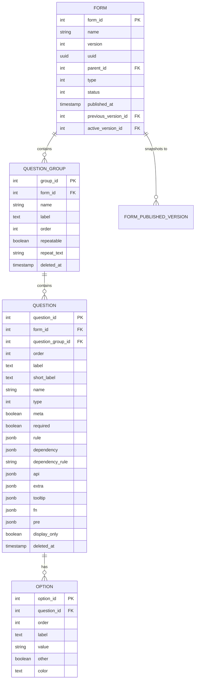

# PRD — ARF Form Blueprint (Dynamic Form Structures)

> **Stage 2 of 3 — Documentation Hierarchy**
> Owner: John (Product Manager) | Target Location: `docs/prd/arf_form_blueprint_prd.md` | References: `docs/product_brief.md`, `docs/database_schema.md`, `docs/form_definition_schema.md`
> Status: `In Review`

---

## 1. Overview

**One-liner**:
Establish the dynamic questionnaire blueprint structures (`form`, `question_group`, `question`, `option`, `form_published_version`) utilizing a version-controlled, soft-delete enabled layout.

**Brief / Problem Reference**:
Preceded by `docs/product_brief.md`, `docs/database_schema.md`, and `docs/form_definition_schema.md`.

**What we are building** (What):
We are building the database schemas, SQLAlchemy models, and associated migration scripts for the form definition layer (Layer C) of the platform. This consists of the tables:
- `form`: Dynamic forms with support for versioning, status (draft, published), and parent self-references.
- `question_group`: Sections/groups within forms with repeatable/loop controls, ordering, and soft-delete features.
- `question`: Individual fields, data types, validation rule objects, dependencies (skip logic), order, and soft-delete features.
- `option`: Multiple choice answers for option questions.
- `form_published_version`: Immutable snapshots of published schemas to prevent historical submission rendering from breaking if schemas evolve.

---

## 2. Goals & Success Metrics

| Goal | Success Metric | Baseline | Target | Owner |
|------|---------------|----------|--------|-------|
| Historical Submission Safety | Retain ability to render historic submissions against their exact schema at publish time | Modified schemas break old data | 100% schema integrity via `form_published_version` | PM / Architect |
| Soft Delete Support | Ability to restore/recreate groups/questions under the same name after deletion | Unique name violations | Conditional uniqueness on non-deleted records | PM |

**Anti-Goals** (what we will NOT optimize for):
- Creating actual `datapoints` and `answers` submissions (deferred to the next task).
- Restricting form visibility by user role mapping tables (`user_form`).
- Mapping generic question attributes dynamically outside standard question metadata columns.

---

## 3. Target Users & Personas

| Persona | Job-to-be-Done | Key Frustration | v1 Priority |
|---------|---------------|-----------------|-------------|
| System Administrator | Edit and publish new versions of forms without breaking historical records. | Schema updates break already collected citizen reports. | Primary |

---

## 4. User Stories

| ID | User Story | Priority (MoSCoW) | FR Reference |
|----|-----------|-------------------|--------------|
| US-001 | As an Admin, I want versioning and publishing on forms so that I can draft updates before publishing them to the field. | Must Have | FR-001 |
| US-002 | As the system, I want dynamic schema version snapshots so that old submissions are always rendered against the schema version they were collected in. | Must Have | FR-004 |
| US-003 | As an Admin, I want soft-deletion on groups and questions so that I can recreate or replace questions with the same name if deleted. | Must Have | FR-002, FR-003 |

---

## 5. Functional Requirements

| ID | Requirement | User Story | Priority |
|----|-------------|------------|----------|
| FR-001 | The system MUST support a `form` table with self-referencing relationships (`parent_id`, `previous_version_id`) and version status enums. | US-001 | Must Have |
| FR-002 | The system MUST support `question_group` and `question` tables inheriting soft-deletion capabilities (tracking `deleted_at`). | US-003 | Must Have |
| FR-003 | The system MUST support conditional unique indices on `(form_id, name)` where `deleted_at IS NULL` for groups and questions. | US-003 | Must Have |
| FR-004 | The system MUST support an immutable `form_published_version` table holding a full JSON schema snapshot of a form's questions at publication time. | US-002 | Must Have |

---

## 6. Non-Functional Requirements

| Category | Requirement | Metric |
|----------|-------------|--------|
| **Database Performance** | Fast loading of the entire Form Blueprint structure | < 20ms for full hierarchy read |
| **Data Safety & Integrity** | Cascading deletes on form hierarchy metadata | Delete cascades from Forms -> Groups -> Questions -> Options |

---

## 7. User Flows & Data Flow

### Relational Entity Blueprint

---

## 8. Scope

**v1 — In Scope**:
- Database migrations setting up tables `form`, `question_group`, `question`, `option`, and `form_published_version`.
- SQLAlchemy ORM models matching the relational design.
- Support for soft deletes logic (`deleted_at` tracking).
- Conditional unique indexes (ensuring uniqueness only for active/non-deleted elements).
- Pydantic schemas validating incoming form definitions, groups, questions, and options.

**v1 — Explicitly Out of Scope**:
- Submission payloads processing (`datapoints` and `answers` tables).

---

## 9. Assumptions & Constraints

**Assumptions**:
- [ ] Soft deletion is represented by a nullable `deleted_at` timestamp.
- [ ] Uniqueness constraints are enforced at the database level using PostgreSQL conditional indexes.

---

## 10. Change Log

| Version | Date | Author | Changes |
|---------|------|--------|---------|
| 0.1 | 2026-06-04 | John (PM) | Initial draft. |
| 0.2 | 2026-06-04 | John (PM) | Added options table to hierarchy, deferred datapoints/answers to next task. |
| 0.3 | 2026-06-04 | John (PM) | Aligned schema to versioned and soft-deleting Django reference models structure. |
| 0.4 | 2026-06-04 | John (PM) | Removed `user_form` table from scope. |
| 0.5 | 2026-06-04 | John (PM) | Removed `question_attribute` table from scope. |

---

## Exit Criterion

> [!IMPORTANT]
> This PRD MUST be signed off by both the Engineering Lead and Design Lead before LLD begins. No tickets may be created until this is complete.

**Sign-off Checklist**:
- [ ] All functional requirements are testable and unambiguous
- [ ] All user stories have acceptance criteria (at story level)
- [ ] Engineering Lead has reviewed feasibility
- [ ] Design Lead has reviewed user flows and wireframes
- [ ] Open questions from Brief are resolved or tracked
- [ ] Scope boundary is agreed upon by all leads
