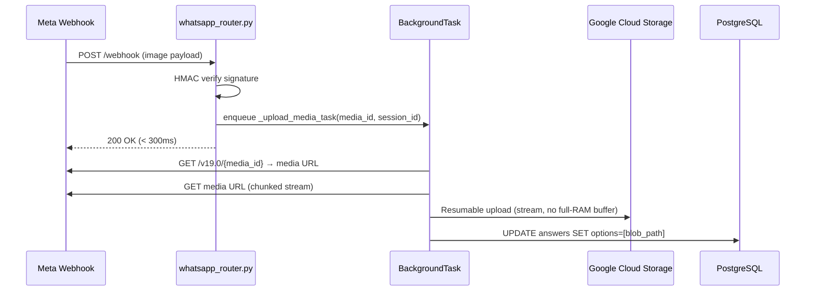

# PRD — Asynchronous Media Ingestion & Unified GCS Path Strategy

> **Stage 2 of 3 — Documentation Hierarchy**
> Owner: PM + Engineering Lead | Location: `docs/prd/async_media_ingestion_prd.md`
> Status: `Draft — Awaiting Approval`
> References: `docs/product_brief.md`, `docs/lld/whatsapp_pipeline_lld.md`

---

## I. Overview & Goal

### Problem Statement
The current WhatsApp media handler (`whatsapp_service.py` L364–368) downloads a binary file from Meta's Graph API and passes it as an in-memory `bytes` object to `StorageService.upload_file()`.

For large photos or videos this blocks the main FastAPI async thread, consumes unbounded RAM, and risks VM OOM under concurrent submissions. Additionally the project has two separate GCS bucket env vars (`GCS_BUCKET_NAME` and `WHATSAPP_GCS_BUCKET`) causing confusion about which bucket is the canonical one.

### Core Metric
- **Zero blocking I/O**: Media upload latency must not add to webhook response time (P99 < 300 ms).
- **Memory ceiling**: Peak RSS during a media upload must stay below 50 MB per concurrent request.

---

## II. User Stories & Flows

### Persona
- **Field Reporter** — NGO volunteer or registered citizen submitting a pollution event via WhatsApp.

### UAC 2B.1 (Happy Path)
> A user uploads a GPS-stamped photo in the WhatsApp bot's MEDIA_UPLOAD state.
> The webhook replies within 300 ms confirming receipt.
> Within 30 seconds the photo is securely stored in GCS and the `answers` table contains the internal
> cloud reference path (not a public URL).

### Flow

```
[Meta Webhook POST]
        │
        ▼
[whatsapp_router.py]  ─── signature verified ───►  200 OK (immediate)
        │
        ▼ (background task / worker)
[media_worker]
   1. Stream binary from Meta Graph API in chunks → GCS (no full-RAM buffer)
   2. Build blob path:  {APP_ENV}/{pipeline}/{uuid}.{ext}
        e.g.  development/whatsapp/a1b2c3.jpg
              production/whatsapp/a1b2c3.mp4
   3. Save blob path string to Answer.options[]
   4. DELETE the Meta media object (optional, future)
```

---

## III. Requirements (Scope Guardrails)

### Must-Have (v1)
- **FR-001**: Remove `WHATSAPP_GCS_BUCKET` env var. All pipelines share a single `GCS_BUCKET_NAME`.
- **FR-002**: `StorageService` gains a `stream_upload()` method that accepts an `AsyncIterator[bytes]` and uses the GCS Resumable Upload API to write chunks without buffering the full file.
- **FR-003**: GCS blob paths must follow the pattern `{APP_ENV}/{pipeline}/{uuid}.{ext}`:
  - `APP_ENV` = value of `APP_ENV` env var (`development` | `production`).
  - `pipeline` = slug identifying the ingestion source (e.g. `whatsapp`, `kobo`, `ussd`).
  - Example: `production/whatsapp/3fa85f64-5717-4562-b3fc-2c963f66afa6.jpg`
- **FR-004**: The webhook router must acknowledge Meta within 300 ms; media download + GCS upload must execute in a non-blocking background task (FastAPI `BackgroundTasks` or APScheduler).
- **FR-005**: Only the internal GCS blob path is persisted in `answers.options`. Public URLs are never stored. Read access is served via 15-minute signed URLs on demand.
- **FR-006**: If the background upload fails, the error is logged and the `Answer` record's `options` field is set to `["UPLOAD_FAILED"]` so the admin can reprocess.

### Nice-to-Have (v2)
- Retry with exponential backoff (3 attempts) on transient GCS upload errors.
- Dead-letter queue entry on permanent failure so admin UI can surface it.
- Virus/malware scan hook before upload (ClamAV or Cloud DLP).

### Out of Scope
- Voice note / audio transcription.
- Video thumbnail generation.
- Direct frontend streaming of media (served via signed URL only).
- Celery/Redis introduction — APScheduler `BackgroundTasks` is sufficient for v1.

---

## IV. Architecture Design

### Data Flow



### GCS Path Builder (new utility)

```python
# app/services/storage.py
def build_blob_path(pipeline: str, ext: str) -> str:
    env = os.getenv("APP_ENV", "development")
    uid = uuid.uuid4()
    return f"{env}/{pipeline}/{uid}.{ext}"
```

### StorageService Changes

| Method | Action |
|---|---|
| `upload_file(bytes, ...)` | **Keep** — used by admin upload endpoints |
| `stream_upload(iterator, blob_name, content_type)` | **Add** — chunked upload, no full-RAM buffer |
| `build_blob_path(pipeline, ext)` | **Add** — centralised path convention |

### Env Var Changes

| Var | Before | After |
|---|---|---|
| `GCS_BUCKET_NAME` | Used by `StorageService` | **Keep** — single source of truth |
| `WHATSAPP_GCS_BUCKET` | Used by WhatsApp DI config | **Remove** — delete from `.env.example`, `whatsapp_config.py`, `whatsapp_service.py` |

---

## V. Acceptance Criteria

### UAC 2B.1
- Given a WhatsApp user sends a photo, when the webhook is received, then Meta gets a `200 OK` in < 300 ms.
- The submitted photo appears in GCS under the correct path (`{env}/whatsapp/{uuid}.jpg`) within 30 s.
- The corresponding `Answer` record contains the blob path, not a public URL.

### TAC 2B.1 — Memory-Safe Streaming
- Peak RSS per upload ≤ 50 MB (measured by `tracemalloc` or `memory_profiler` in unit test).
- The main FastAPI thread is never blocked by I/O during media upload (verified by async profiling).

### TAC 2.2 — Path Convention
- All GCS writes use `build_blob_path(pipeline, ext)` — no ad-hoc string formatting in service code.
- `APP_ENV=development` → path starts with `development/`.
- `APP_ENV=production` → path starts with `production/`.

---

## VI. Edge Cases & Errors

| Scenario | Behaviour |
|---|---|
| Meta media URL expired (>5 min) | Log error, set `options=["UPLOAD_FAILED"]`, notify admin |
| GCS transient error | Retry ×3 with backoff; on exhaustion → `UPLOAD_FAILED` |
| User sends unsupported MIME (e.g. PDF) | Accept and store (no MIME restriction in v1) |
| `APP_ENV` not set | Default to `"development"` |
| Media > 100 MB (video) | Stream in 8 MB chunks — memory ceiling maintained |

---

## VII. Analytics & Telemetry

- Log `media_upload_success` with `{phone_hash, pipeline, blob_path, size_bytes, duration_ms}`.
- Log `media_upload_failure` with `{phone_hash, pipeline, error_type}`.

---

## VIII. Rollout & Rollback Plan

- **Branch**: `feature/21-b-asynchronous-media-ingestion` (already created).
- **Rollout**: Deploy to staging first; verify with a live WhatsApp test message from a dev phone.
- **Rollback**: Revert `upload_file()` inline call in `whatsapp_service.py`; `WHATSAPP_GCS_BUCKET` can be re-added to `.env` without a DB migration.

---

## IX. Epic & Ballpark Estimation

| Component | Complexity | Estimate |
|---|---|---|
| `StorageService.stream_upload()` + `build_blob_path()` | Medium | 2h |
| Remove `WHATSAPP_GCS_BUCKET`, unify to `GCS_BUCKET_NAME` | Simple | 0.5h |
| Refactor `whatsapp_service.py` media block → `BackgroundTasks` | Medium | 2h |
| Update `.env.example`, `whatsapp_config.py` | Simple | 0.5h |
| Unit tests (stream_upload mock, path convention, BG task isolation) | Medium | 2h |
| **Total** | | **~7h / 1 developer day** |

### Assumptions
- No Celery/Redis needed — FastAPI `BackgroundTasks` is sufficient for single-worker deployment.
- GCS Resumable Upload API is accessible with the existing service account credentials.
- `APP_ENV` is already set in Docker Compose for all environments.
