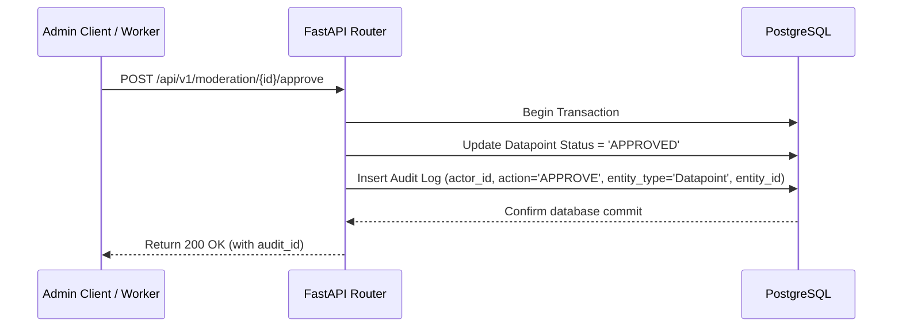

# PRD — Immutable Audit Trail (The Audit Logs Table)

> **Stage 2 of 3 — Documentation Hierarchy**
> Owner: PM + Winston (Architect) | Target Location: `docs/prd/audit_log_prd.md` | References: `docs/product_brief.md`, `docs/database_schema.md`, `docs/api_contract.md`
> Status: `Draft`

---

## 1. Overview & Goal

**Problem Statement**:
Environmental monitoring platforms require high data integrity and accountability. Actions taken by platform administrators—such as approving, rejecting, editing, or deleting citizen pollution reports and sampling records—must be fully traceable. If a valid pollution report is accidentally rejected or deleted, or if a user is invited with incorrect permissions, the system must retain a tamper-proof record of who performed the action, when, and on which entity.

**Core Metric**:
100% trace coverage of database state-mutating actions performed by administrative or reviewer staff.

---

## 2. User Stories & Flows

- **US-001**: As an **Administrator**, when I view the history of a specific monitoring site, I want to see a chronological log of every staff member who has approved or edited records for that site, so that I can audit changes and ensure quality control.
- **US-002**: As the **NBD Secretariat**, when a dispute or error occurs (e.g. data deletion or unauthorized invite), I want to search and query the audit trail by `actor_id` or `entity_id` so that I can pinpoint the account responsible.

### 2.1 Audit Logging Sequence

---

## 3. Requirements (Scope Guardrails)

### Must-Have (In Scope)
* **Immutable Audit Logs Table**: A `audit_logs` table in PostgreSQL.
* **Strictly Append-Only**: The database connection used by the backend application must be restricted so that it can only perform `INSERT` and `SELECT` queries on `audit_logs` (UPDATE and DELETE privileges denied).
* **Soft Deletion of Users**: Since logs reference `users(id)`, user accounts must support "soft deletion" via `is_active = False` instead of hard SQL `DELETE`s to preserve referential integrity.
* **System-Wide Integrations**: Automatically emit audit logs for the following mutations:
  - `APPROVE`, `REJECT` (Datapoints / Submissions)
  - `EDIT`, `DELETE` (Sites, Basins, Wetlands, Datapoints)
  - `INVITE_USER` (User creation/invitations)
* **Admin Verification APIs**: Endpoints to list and filter audit logs by actor, action type, entity type, and entity ID.

### Nice-to-Have (Deferred)
* Dedicated "Audit Trail" frontend interface (Admin UI screen).
* Automated archiving of audit logs older than 2 years to Google Cloud Storage.

---

## 4. Acceptance Criteria

### User Acceptance Criteria (UAC)
* **UAC 6.1**: Given an authenticated Admin, when they request the audit trail for a specific site ID, the API returns a chronological list of actions showing the email/user ID of the staff member, action type (`EDIT`, `DELETE`), and timestamp.

### Technical Acceptance Criteria (TAC)
* **TAC 6.1 (Schema)**: The `audit_logs` table must include:
  - `id` (UUID, Primary Key, default=uuid4)
  - `actor_id` (UUID, Foreign Key referencing `users.id`)
  - `action` (VARCHAR(30) / ENUM: `'APPROVE'`, `'REJECT'`, `'EDIT'`, `'DELETE'`, `'INVITE_USER'`)
  - `entity_type` (VARCHAR(50), e.g. `'Site'`, `'Datapoint'`)
  - `entity_id` (VARCHAR(100), the unique business or database ID of the modified entity)
  - `timestamp` (TIMESTAMP, defaults to `now()`)
* **TAC 6.2 (Performance Index)**: The table must have a composite index on `(entity_type, entity_id)` to optimize site and record history loading.
* **TAC 6.3 (Security)**: The FastAPI database user must not be granted `UPDATE` or `DELETE` permissions on `audit_logs`.

---

## 5. Edge Cases & Errors
1. **User Soft-Deleted**: When a user's `is_active` is set to `False`, their past audit records must remain intact.
2. **Missing Entity ID**: If auditing an event where the entity does not yet have an ID (e.g. initial creation failed), the transaction is rolled back, and no log is written.

---

## 6. Open Questions
1. **Audit Log Retention**: Should DevOps configure a monthly script to archive records older than 2 years to a GCS bucket as CSV/JSON lines to conserve Postgres disk space?
2. **Dedicated UI**: Will database administrators query logs directly via SQL, or do we need to expose a simple search API for a future Admin Portal Audit UI? (V1 will expose the search API, UI deferred).

---

## 7. Ballpark Estimation

* **Database Schema / Alembic Migration**: Simple (0.5 Dev-Days)
* **FASTAPI Middleware / Hook Logic**: Medium (1.0 Dev-Days)
* **API Audit Router**: Simple (0.5 Dev-Days)
* **Integration & Database Security Tests**: Medium (1.0 Dev-Days)

**Total Estimate**: 3.0 Dev-Days
