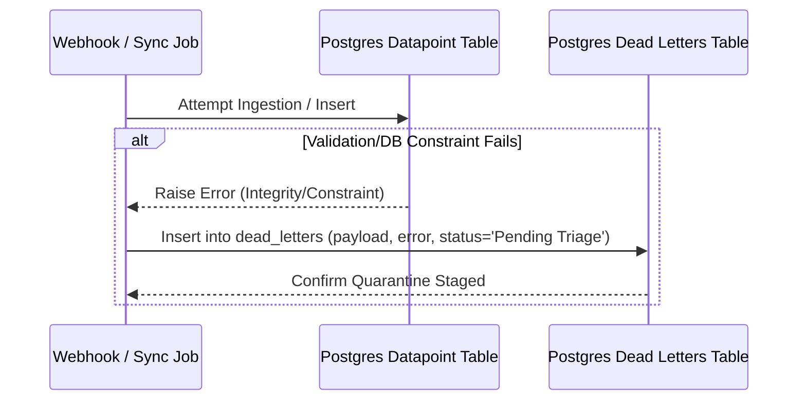

# PRD — Dead-Letter Table (Resilience Infrastructure)

> **Stage 2 of 3 — Documentation Hierarchy**
> Owner: PM + Tech Lead | Target Location: `docs/prd/dead_letter_prd.md` | References: `docs/product_brief.md`, `docs/database_schema.md`
> Status: `Draft`

---

## 1. Overview

**One-liner**:
Design and implement a PostgreSQL staging/quarantine table to securely capture failed webhooks and unprocessable KoboCollect payloads for administrative triage.

**What we are building**:
A resilient data quarantine mechanism consisting of:
- A `dead_letters` PostgreSQL table utilizing a schema-less `JSONB` payload column.
- Backend ingestion logic to intercept data validation failures, catch exceptions, and stage the raw inputs in the quarantine zone rather than failing silently or crashing.
- Database indexes on status fields to support rapid search queries by administrative interfaces.

**Why now**:
Citizen data submissions and webhook streams frequently arrive with missing coordinates, incorrect formats, or schema drift. Without a quarantine zone, these payloads are either permanently lost or trigger backend workers to raise unhandled exceptions. This table ensures 100% data durability and provides a triage path for admins.

---

## 2. Goals & Success Metrics

| Goal | Success Metric | Target |
| :--- | :--- | :--- |
| Zero data loss on failed submissions | Ingested error rate loss | 0% (All validation failures logged to quarantine) |
| Low latency admin triage loading | Admin query page load time | < 500ms for status filter queries |

---

## 3. Target Users & Personas

- **Reviewer / Administrator**: Needs to inspect the error queue, see exactly why payloads failed validation, identify correct parameters (e.g. mapping to a monitoring site), and resolve or discard them.
- **DevOps Engineer**: Needs to monitor sync health and verify the system is not discarding raw input data.

---

## 4. User Stories

- **US-001**: As an **Administrator**, when a webhook payload fails schema validation, I want it to be stored in the dead-letter queue so that the raw submitter data is never lost.
- **US-002**: As a **Reviewer**, I want to filter and search the quarantine queue by status (e.g., `'Pending Triage'`, `'Resolved'`) and source system (e.g., `'KoboToolbox'`) so that I can quickly triage outstanding ingestion failures.
- **US-003**: As a **Reviewer**, I want to see the specific validation error message (e.g. `"Missing required field: pH"`) alongside the payload so that I can understand why the ingestion failed.

---

## 5. Functional Requirements

- **FR-001**: The database MUST define a `dead_letters` table containing:
  - `id` (UUID, Primary Key, default=uuid4)
  - `source_system` (VARCHAR(50), e.g. `'KoboToolbox'`, `'Africa_Talking'`)
  - `raw_payload` (JSONB, containing the full unvalidated payload)
  - `error_reason` (TEXT, detailed exception or validation error string)
  - `status` (VARCHAR(20), default `'Pending Triage'`, checking constraints `'Pending Triage'`, `'Resolved'`, `'Discarded'`)
  - `created_at` (TIMESTAMP, default=now())
- **FR-002**: The table MUST have database indexes on `(status, source_system)` to support high-performance filtering.
- **FR-003**: Ingestion tasks (Kobo sync/webhooks) MUST catch database check constraint or Pydantic validation exceptions, serializing the inputs, and routing them into `dead_letters`.

---

## 6. Architecture & Data Flow

---

## 7. Scope

**In Scope**:
- Database table schema definition (`dead_letters`) via Alembic.
- SQLAlchemy model `DeadLetter` and Pydantic validation schemas.
- Ingestion helper functions to catch validation errors and insert payloads into the dead-letter queue.
- API endpoints to list, retrieve, and update the status of quarantined records.

**Out of Scope**:
- The manual reconciliation UI interface (to be built in a subsequent frontend task).
- Automated reconciliation algorithms (all triage resolution in this release is manual).

---

## 8. Open Questions
1. **Data Retention**: Should quarantined items be automatically purged after 90 days if left in `'Pending Triage'`?
2. **Editing Strategy**: Will the administrative API permit direct edits to `raw_payload` during manual resolution?

---

## 9. Ballpark Estimation

- **Database / Migration**: Simple (0.5 Dev-Days)
- **FastAPI Models & Router**: Medium (1.0 Dev-Days)
- **Integration Tests**: Simple (0.5 Dev-Days)
