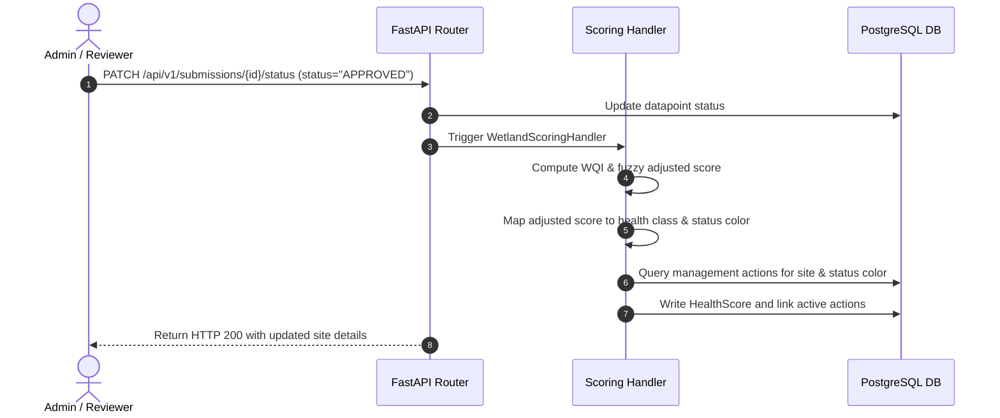

# PRD — Defuzzification & Event-Driven Classification

> **Stage 2 of 3 — Documentation Hierarchy**
> Owner: PM + Winston (Architect) | Target Location: `docs/prd/defuzzification_prd.md` | References: `docs/prd/scoring_engine_prd.md`, `docs/Final_SDD.md`
> Status: `Approved`

---

## 1. Overview

**One-liner**:
Collapse the fuzzy logic outputs into a precise numeric health score, assign the health rating class and status color (Traffic Light), and link them to actionable recommendations natively without Celery.

**Brief / Problem Reference**:
Refers to Sub-Task 3 of the scoring and fuzzy logic engine outlined in the System Design Document (`docs/Final_SDD.md`). Currently, health scores are calculated but the mapping to Traffic Light colors and integration with the `management_actions` recommendations has not been fully realized.

**What we are building** (What):
1. **Centroid Defuzzification Refinement**: Consolidate the fuzzy logic centroid outputs back into a precise Adjusted Aggregate Score.
2. **Traffic Light Assignment**: Map the final Adjusted Score to Health Classes A through E (where 0.8–1.0 is Class A and 0.0–0.2 is Class E), and assign the corresponding Traffic Light status color:
   - Class A, B &rarr; `GREEN`
   - Class C, D &rarr; `YELLOW`
   - Class E &rarr; `RED`
3. **Action Recommendation Linking**: Automatically resolve and map the calculated Traffic Light status of a site to the corresponding `management_actions` records so they can be served to the public portal detail drawer.
4. **FastAPI Native Execution**: Enforce that the entire scoring and action-linking pipeline triggers synchronously or via FastAPI `BackgroundTasks` without any Celery dependency.

**Why now** (Strategic context):
This ensures the final step of the scoring pipeline completes successfully, updating the public-facing dashboard with actionable restoration guidelines immediately when an administrator validates data.

---

## 2. Goals & Success Metrics

| Goal | Success Metric | Baseline | Target | Owner |
|------|---------------|----------|--------|-------|
| Automated Action Mappings | 100% of approved site submissions have a resolved status color mapped to at least one Management Action | 0% | 100% | PM |
| Real-time UI updates | Time between Admin clicking "Approve" and the UI reflecting the calculated class and recommendation | N/A | < 1 second | Dev |

**Anti-Goals**:
- We are not building a management action editing interface in the public portal. Management actions are seeded by administrators for each site.

---

## 3. Target Users & Personas

| Persona | Job-to-be-Done | Key Frustration | v1 Priority |
|---------|---------------|-----------------|-------------|
| Akvo / NBD Reviewer | Clicks "Approve" on a submission and expects the site status and recommendations to update in real time. | Having to manually link the site score to recommended restoration actions. | Primary |

---

## 4. User Stories

| ID | User Story | Priority (MoSCoW) | FR Reference |
|----|-----------|-------------------|--------------|
| US-001 | As an **Admin**, I want the site details to instantly reflect the new health class (A-E) and recommendation when I click "Approve". | Must Have | FR-001, FR-003 |
| US-002 | As a **Public Portal User**, I want to see the traffic light status color and corresponding recommended actions for each site on the map drawer. | Must Have | FR-002 |

---

## 5. Functional Requirements

| ID | Requirement | User Story | Priority |
|----|-------------|------------|----------|
| FR-001 | The system MUST calculate the Adjusted Score and assign a Health Class (A-E) and Status Color (`GREEN`, `YELLOW`, `RED`) based on the rules. | US-001 | Must Have |
| FR-002 | The system MUST link the resulting status color to the `management_actions` table by querying the seeded action recommendations for that site. | US-002 | Must Have |
| FR-003 | The backend API `/api/v1/submissions/{id}/status` and `/api/v1/sites/{id}` MUST return the calculated scores, health class, status color, and list of recommended management actions. | US-001 | Must Have |

---

## 6. Non-Functional Requirements

| Category | Requirement | Metric |
|----------|-------------|--------|
| **Performance** | Scoring and classification execution time | < 100ms within the transaction bounds |
| **Availability** | Native FastAPI execution (no Celery/Redis required) | 100% independent of background celery services |
| **Security** | Role-based check on status PATCH router | Only Admin/Reviewer can approve and trigger scoring |

---

## 7. User Flows & Data Flow

---

## 8. Scope

**v1 — In Scope**:
- Centroid defuzzification math and health class A-E mapping.
- Traffic light color code mappings (`GREEN`, `YELLOW`, `RED`).
- Querying and returning management actions associated with the calculated status color for a site.
- Native FastAPI execution.

**v1 — Explicitly Out of Scope**:
- Modifying dynamic layout options inside this specific sub-task.

---

## 9. Assumptions & Constraints

- A site must already have seeded `management_actions` records for each status color (`GREEN`, `YELLOW`, `RED`) in the database, otherwise the list of actions will return empty.

---

## Exit Criterion

> This PRD must be approved by the user to proceed to LLD and implementation plan.
