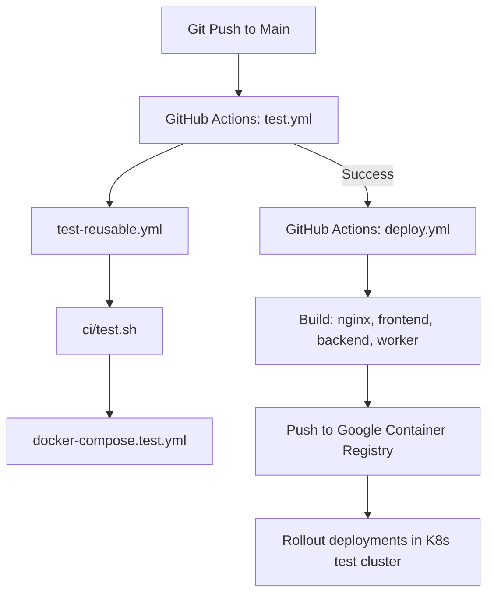

# PRD — CI/CD Pipeline and Deployment Automation

> **Stage 2 of 3 — Documentation Hierarchy**
> Owner: Winston (Architect) + Amelia (Developer) | Target Location: `docs/prd/deployment_prd.md`
> Status: `Approved`

---

## 1. Overview

**One-liner**:
A secure, automated GitHub Actions CI/CD pipeline that builds, tests, packages, and rolls out the multi-service Dockerized stack (Nginx, Frontend, Backend, Worker) to Google Container Registry and the Kubernetes test cluster.

**What we are building** (What):
We are building a robust deployment pipeline containing:
1. A test script (`ci/test.sh`) to selectively run frontend and backend test suites based on changed files detection.
2. A test orchestration file (`docker-compose.test.yml`) defining a lightweight test environment with PostGIS, backend, and frontend test configurations.
3. A reusable GitHub Actions workflow (`.github/workflows/test-reusable.yml`) executing `ci/test.sh` on the runner.
4. A trigger workflow (`.github/workflows/test.yml`) to validate pull requests and tag updates.
5. A GitHub Actions deploy workflow (`.github/workflows/deploy.yml`) using Akvo's composite actions (ref: `0.0.10`) to build, push, and roll out images for the four services (`nginx`, `frontend`, `backend`, `worker`).

**Why now** (Strategic context):
Standardizing the deployment automation ensures code quality is validated automatically before merging, prevents deployment drift, and streamlines rolling updates to the test cluster environment.

---

## 2. Goals & Success Metrics

| Goal | Success Metric | Baseline | Target | Owner |
|------|---------------|----------|--------|-------|
| Automated Verification | PR/Push test status reported on GitHub | Manual local tests | 100% automated test coverage | Dev |
| Fast Build Cycles | GitHub Action run duration for build & push | N/A | < 10 minutes | Architect |
| Consistent Topology | Kubernetes deployments kept in sync with code | Manual container restarts | Zero-downtime rolling updates | Architect |

**Anti-Goals**:
- Supporting multiple cloud providers (restricted to GCR/GKE).
- Handling local testing of the composite actions themselves.

---

## 3. Target Users & Personas

| Persona | Job-to-be-Done | Key Frustration | v1 Priority |
|---------|---------------|-----------------|-------------|
| Amelia (Developer) | Push code changes and see immediate automated validation and rollout status | Divergent environment bugs, manual image pushes, slow rollouts | Primary |

---

## 4. User Stories

| ID | User Story | Priority (MoSCoW) | FR Reference |
|----|-----------|-------------------|--------------|
| US-001 | As a developer, I want changed-files aware backend and frontend tests to run automatically on every pull request so that I don't accidentally introduce regressions. | Must Have | FR-001, FR-002 |
| US-002 | As a release manager, I want the Docker images for all active services to be built, tagged, and pushed to GCR on master/main merges. | Must Have | FR-003, FR-004 |
| US-003 | As a QA engineer, I want the latest build to be rolled out immediately to the test cluster namespace so that testing can proceed. | Must Have | FR-005 |

---

## 5. Functional Requirements

| ID | Requirement | User Story | Priority |
|----|-------------|------------|----------|
| FR-001 | The system MUST execute `ci/test.sh` via a reusable GHA workflow on pull requests and tag pushes. | US-001 | Must Have |
| FR-002 | `ci/test.sh` MUST run dedicated test service containers defined in `docker-compose.test.yml`. | US-001 | Must Have |
| FR-003 | The system MUST build and tag Docker images for: `nginx`, `frontend`, `backend`, and `worker`. | US-002 | Must Have |
| FR-004 | The system MUST authenticate and push the built images to GCR using `akvo/composite-actions` (ref: `0.0.10`). | US-002 | Must Have |
| FR-005 | The system MUST trigger Kubernetes rollouts for `nginx-deployment`, `frontend-deployment`, `backend-deployment`, and `worker-deployment` in the `nbd-namespace` test namespace on successful builds. | US-003 | Must Have |

---

## 6. Non-Functional Requirements

| Category | Requirement | Metric |
|----------|-------------|--------|
| **Performance** | Build and test run duration | < 5 minutes for CI test phase |
| **Security** | Secrets loaded from GitHub Repository Secrets | No secrets, credentials, or keys checked in |
| **Integrity** | Image tagging schema | Tied to short git commit hash & `latest` |

---

## 7. Topology Flow

---

## 8. Scope

**v1 — In Scope**:
- Creating `ci/test.sh` script for test automation.
- Creating `docker-compose.test.yml` file matching the services.
- Creating `.github/workflows/test-reusable.yml`, `.github/workflows/test.yml` and `.github/workflows/deploy.yml` workflow definitions.
- Configuring the GHA jobs to build and deploy: `nginx`, `frontend`, `backend`, and `worker`.

**v1 — Explicitly Out of Scope**:
- Setting up the GCP resources or Kubernetes cluster itself.
- Setting up GitHub Repository Secrets in this script (assumed to be configured in the repository settings).

---

## 9. Assumptions & Constraints

**Assumptions**:
- GitHub Actions runner has access to `akvo/composite-actions` using the GH_PAT.
- GCLOUD_SERVICE_ACCOUNT_REGISTRY and GCLOUD_SERVICE_ACCOUNT_K8S keys are already populated.
- Target Kubernetes cluster deployment names are: `nginx-deployment`, `frontend-deployment`, `backend-deployment`, and `worker-deployment` (under namespace `nbd-namespace`).

---

## 10. Change Log

| Version | Date | Author | Changes |
|---------|------|--------|---------|
| 1.0 | 2026-06-11 | Winston | Initial draft for NBD Phase 1 deployment |
| 1.1 | 2026-06-11 | Winston | Updated to use reusable test workflows, changed-files awareness, and composite actions v0.0.10 |

---

## Exit Criterion

> This PRD must be verified by the user to proceed to implementation planning.
