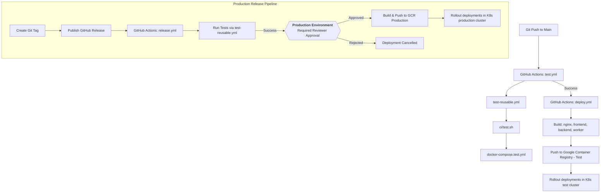

# PRD — CI/CD Pipeline and Deployment Automation

> **Stage 2 of 3 — Documentation Hierarchy**
> Owner: Winston (Architect) + Amelia (Developer) | Target Location: `docs/prd/deployment_prd.md`
> Status: `Approved` (Updated v1.2 — Production Release Pipeline)

---

## 1. Overview

**One-liner**:
A secure, automated GitHub Actions CI/CD pipeline that builds, tests, packages, and rolls out the multi-service Dockerized stack (Nginx, Frontend, Backend, Worker) to Google Container Registry and the Kubernetes test cluster.

**What we are building** (What):
We are building a robust two-tier deployment pipeline:

**Tier 1 — Test Cluster (Continuous Deployment)**:

1. A test script (`ci/test.sh`) to selectively run frontend and backend test suites based on changed files detection.
2. A test orchestration file (`docker-compose.test.yml`) defining a lightweight test environment with PostGIS, backend, and frontend test configurations.
3. A reusable GitHub Actions workflow (`.github/workflows/test-reusable.yml`) executing `ci/test.sh` on the runner.
4. A trigger workflow (`.github/workflows/test.yml`) to validate pull requests and tag updates.
5. A GitHub Actions deploy workflow (`.github/workflows/deploy.yml`) using Akvo's composite actions (ref: `0.0.10`) to build, push, and roll out images for the four services (`nginx`, `frontend`, `backend`, `worker`).

**Tier 2 — Production Cluster (Gated Release)**: 6. A GitHub Actions release workflow (`.github/workflows/release.yml`) triggered by a **GitHub Release published** event. 7. A protected `Production` GitHub Environment with required reviewer approval gate — no code reaches production without explicit human sign-off. 8. Production-targeted Docker builds and Kubernetes rollouts using `cluster-name: production`.

**Why now** (Strategic context):
The test cluster deployment pipeline is already in place. As the platform approaches production readiness, a formal gated release pipeline is required to prevent untested code from reaching live users and to provide a clear audit trail of who approved each production deployment.

---

## 2. Goals & Success Metrics

| Goal                   | Success Metric                                | Baseline                  | Target                        | Owner     |
| ---------------------- | --------------------------------------------- | ------------------------- | ----------------------------- | --------- |
| Automated Verification | PR/Push test status reported on GitHub        | Manual local tests        | 100% automated test coverage  | Dev       |
| Fast Build Cycles      | GitHub Action run duration for build & push   | N/A                       | < 10 minutes                  | Architect |
| Consistent Topology    | Kubernetes deployments kept in sync with code | Manual container restarts | Zero-downtime rolling updates | Architect |

**Anti-Goals**:

- Supporting multiple cloud providers (restricted to GCR/GKE).
- Handling local testing of the composite actions themselves.

---

## 3. Target Users & Personas

| Persona            | Job-to-be-Done                                                              | Key Frustration                                                | v1 Priority |
| ------------------ | --------------------------------------------------------------------------- | -------------------------------------------------------------- | ----------- |
| Amelia (Developer) | Push code changes and see immediate automated validation and rollout status | Divergent environment bugs, manual image pushes, slow rollouts | Primary     |

---

## 4. User Stories

| ID     | User Story                                                                                                                                                             | Priority (MoSCoW) | FR Reference   |
| ------ | ---------------------------------------------------------------------------------------------------------------------------------------------------------------------- | ----------------- | -------------- |
| US-001 | As a developer, I want changed-files aware backend and frontend tests to run automatically on every pull request so that I don't accidentally introduce regressions.   | Must Have         | FR-001, FR-002 |
| US-002 | As a release manager, I want the Docker images for all active services to be built, tagged, and pushed to GCR on master/main merges.                                   | Must Have         | FR-003, FR-004 |
| US-003 | As a QA engineer, I want the latest build to be rolled out immediately to the test cluster namespace so that testing can proceed.                                      | Must Have         | FR-005         |
| US-004 | As a release manager, I want to publish a GitHub Release on a versioned tag and have the production deployment paused for reviewer approval before any rollout occurs. | Must Have         | FR-006, FR-007 |
| US-005 | As a stakeholder, I want a designated reviewer to approve or reject production deployments via the GitHub UI without needing CLI access.                               | Must Have         | FR-007         |

---

## 5. Functional Requirements

| ID     | Requirement                                                                                                                                                                                          | User Story     | Priority  |
| ------ | ---------------------------------------------------------------------------------------------------------------------------------------------------------------------------------------------------- | -------------- | --------- |
| FR-001 | The system MUST execute `ci/test.sh` via a reusable GHA workflow on pull requests and tag pushes.                                                                                                    | US-001         | Must Have |
| FR-002 | `ci/test.sh` MUST run dedicated test service containers defined in `docker-compose.test.yml`.                                                                                                        | US-001         | Must Have |
| FR-003 | The system MUST build and tag Docker images for: `nginx`, `frontend`, `backend`, and `worker`.                                                                                                       | US-002         | Must Have |
| FR-004 | The system MUST authenticate and push the built images to GCR using `akvo/composite-actions` (ref: `0.0.10`).                                                                                        | US-002         | Must Have |
| FR-005 | The system MUST trigger Kubernetes rollouts for `nginx-deployment`, `frontend-deployment`, `backend-deployment`, and `worker-deployment` in the `nbd-namespace` test namespace on successful builds. | US-003         | Must Have |
| FR-006 | The release workflow MUST be triggered exclusively by a **GitHub Release published** event (not a raw tag push), to provide release notes and visibility.                                            | US-004         | Must Have |
| FR-007 | The `build-push` and `rollout` jobs in the release workflow MUST reference the `Production` GitHub Environment, enforcing the required reviewer approval gate before any production rollout.         | US-004, US-005 | Must Have |
| FR-008 | The `Production` GitHub Environment MUST be configured with at least one required reviewer in GitHub repository settings before this workflow is used.                                               | US-005         | Must Have |

---

## 6. Non-Functional Requirements

| Category        | Requirement                                   | Metric                                      |
| --------------- | --------------------------------------------- | ------------------------------------------- |
| **Performance** | Build and test run duration                   | < 5 minutes for CI test phase               |
| **Security**    | Secrets loaded from GitHub Repository Secrets | No secrets, credentials, or keys checked in |
| **Integrity**   | Image tagging schema                          | Tied to short git commit hash & `latest`    |

---

## 7. Topology Flow



---

## 8. Scope

**v1 — In Scope (Test Cluster)**:

- Creating `ci/test.sh` script for test automation.
- Creating `docker-compose.test.yml` file matching the services.
- Creating `.github/workflows/test-reusable.yml`, `.github/workflows/test.yml` and `.github/workflows/deploy.yml` workflow definitions.
- Configuring the GHA jobs to build and deploy: `nginx`, `frontend`, `backend`, and `worker`.

**v1.2 — In Scope (Production Release)**:

- Creating `.github/workflows/release.yml` triggered on GitHub Release published event.
- Configuring `Production` GitHub Environment with required reviewer approval gate.
- Adding production-cluster-targeted builds and rollouts for all 4 services.

**v1 — Explicitly Out of Scope**:

- Setting up the GCP resources or Kubernetes cluster itself.
- Setting up GitHub Repository Secrets in this script (assumed to be configured in the repository settings).
- Automated rollback mechanisms (manual rollback via GKE console is assumed).

---

## 9. Assumptions & Constraints

**Assumptions**:

- GitHub Actions runner has access to `akvo/composite-actions` using the GH_PAT.
- `GCLOUD_SERVICE_ACCOUNT_REGISTRY` and `GCLOUD_SERVICE_ACCOUNT_K8S` secrets are configured in both the `Test` and `Production` GitHub Environments.
- Target Kubernetes cluster deployment names are: `nginx-deployment`, `frontend-deployment`, `backend-deployment`, and `worker-deployment` (under namespace `nbd-namespace`).
- A production Kubernetes cluster exists and is accessible via the production service account.
- At least one GitHub user or team is designated as a required reviewer for the `Production` environment.

---

## 10. Production Release Runbook

Step-by-step guide for performing a production release:

### Prerequisites (One-time Setup) — GitHub Production Environment

> [!IMPORTANT]
> These steps must be completed **once** by a repository **admin** before the first production release. No production deployment can proceed without this configuration.

#### Step 1 — Create the Production Environment

1. Open your GitHub repository in a browser.
2. Click **Settings** in the top navigation bar.
3. In the left sidebar, under **Code and automation**, click **Environments**.
4. Click the **New environment** button (top right).
5. In the **Name** field, type exactly: `Production`
   > ⚠️ The name is **case-sensitive** and must match the `environment: name: Production` field in `release.yml` exactly.
6. Click **Configure environment**.

---

#### Step 2 — Enable Required Reviewer Approval Gate

You are now on the environment configuration page. Under **Deployment protection rules**:

1. Check the box next to **Required reviewers**.
2. In the search box that appears, type a GitHub **username** or **team name** to add as a reviewer.
   - A reviewer is the person who must explicitly approve each production deployment before it proceeds.
   - You can add up to **6 reviewers** (individuals or teams).
   - Best practice: add at least **2 reviewers** (e.g., the tech lead and the project manager).
3. Click the suggested result to add them.
4. Optionally, check **Prevent self-review** to require a different person to approve (recommended).
5. Scroll down and click **Save protection rules**.

---

#### Step 3 — Add Secrets to the Production Environment

Secrets scoped to an environment are **separate** from repository-level secrets. They are only injected when a job references that environment.

1. On the same environment page, scroll to **Environment secrets**.
2. Click **Add secret** and add each of the following:

   | Secret Name                       | Description                                                                              |
   | --------------------------------- | ---------------------------------------------------------------------------------------- |
   | `GCLOUD_SERVICE_ACCOUNT_REGISTRY` | GCP service account JSON key with `roles/storage.admin` for pushing Docker images to GCR |
   | `GCLOUD_SERVICE_ACCOUNT_K8S`      | GCP service account JSON key with `roles/container.developer` for K8s rollout access     |

3. For each secret:
   - Click **Add secret**.
   - Paste the full JSON key content into the **Value** field.
   - Click **Add secret** to save.

---

#### Step 4 — Add Environment Variables (if needed)

1. On the same environment page, scroll to **Environment variables**.
2. Click **Add variable** and add:

   | Variable Name                  | Description                                      |
   | ------------------------------ | ------------------------------------------------ |
   | `NEXT_PUBLIC_GOOGLE_CLIENT_ID` | Google OAuth client ID for the production domain |

3. Click **Add variable** to save.

---

#### Step 5 — Verify the Configuration

After setup, your `Production` environment page should show:

```
✅ Required reviewers        [reviewer names]
✅ Environment secrets       GCLOUD_SERVICE_ACCOUNT_REGISTRY
                             GCLOUD_SERVICE_ACCOUNT_K8S
✅ Environment variables     NEXT_PUBLIC_GOOGLE_CLIENT_ID
```

---

#### Step 6 — Test the Approval Gate (Dry Run)

Before the first real release, verify the gate works correctly:

1. Create a test tag and release: `git tag v0.0.0-test && git push origin v0.0.0-test`
2. Go to **GitHub → Releases → Draft a new release**, select `v0.0.0-test`, click **Publish release**.
3. Go to **Actions** and watch `Deploy to Production Cluster` start.
4. After tests pass, the workflow should **pause** with a yellow banner:
   > **"Waiting for review — This deployment is waiting for a review."**
5. Click **Review deployments**, select `Production`, and click **Approve and deploy** (or **Reject**).
6. Confirm the rollout job runs (or is cancelled on rejection).
7. Delete the test tag and release once verified.

---

### Release Workflow (Per Release)

```
Step 1: Merge all approved PRs into main
         └─ CI/CD automatically deploys to test cluster

Step 2: Validate on test environment
         └─ QA team signs off on test cluster

Step 3: Create and push a version tag
         $ git checkout main && git pull
         $ git tag v1.0.0
         $ git push origin v1.0.0

Step 4: Publish a GitHub Release
         → Go to GitHub → Releases → "Draft a new release"
         → Select tag v1.0.0
         → Write release notes (features, fixes, breaking changes)
         → Click "Publish release"

Step 5: Approve the deployment
         → GitHub Actions starts release.yml
         → Tests run automatically
         → Workflow pauses at the Production environment gate
         → Reviewer receives a notification (email + GitHub UI)
         → Reviewer inspects the release notes and approves/rejects

Step 6: Production rollout completes
         → Docker images are built and pushed to production GCR
         → K8s rollouts are triggered for all 4 services
         → Deployment is live on production
```

### Rollback Procedure

If a production deployment causes issues:

1. **Immediately** notify the team in the project channel.
2. Identify the previous stable image tag in GCR.
3. Manually update the K8s deployment image via GKE console or `kubectl`:
   ```bash
   kubectl set image deployment/backend-deployment backend=IMAGE:PREVIOUS_TAG -n nbd-namespace
   ```
4. Repeat for all affected services.
5. Create a hotfix branch (`hotfix/xxx`), fix the issue, and follow the normal release cycle.

---

## 11. Change Log

| Version | Date       | Author  | Changes                                                                                                  |
| ------- | ---------- | ------- | -------------------------------------------------------------------------------------------------------- |
| 1.0     | 2026-06-11 | Winston | Initial draft for NBD Phase 1 deployment                                                                 |
| 1.1     | 2026-06-11 | Winston | Updated to use reusable test workflows, changed-files awareness, and composite actions v0.0.10           |
| 1.2     | 2026-07-02 | Winston | Added Production release pipeline: release.yml, GitHub Environment approval gate, and production runbook |

---

## Exit Criterion

> This PRD must be verified by the user to proceed to implementation planning.
