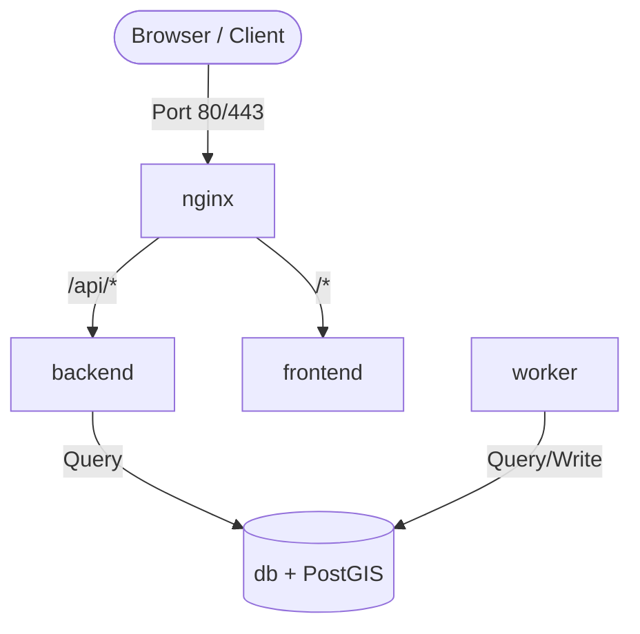

# PRD — Multi-Service Dockerized Project Setup

> **Stage 2 of 3 — Documentation Hierarchy**
> Owner: PM + Winston (Architect) | Target Location: `docs/prd/docker_setup_prd.md`
> Status: `Approved/`

---

## 1. Overview

**One-liner**:
A modular, high-performance local multi-container development environment containing Next.js, FastAPI, PostgreSQL with PostGIS, and Nginx, with scheduled background tasks handled via a native Python worker.

**What we are building** (What):
A fully containerized development stack orchestrated via `docker-compose.yml` and unified developer-friendly scripts (`dc.sh`). The stack isolates frontend, API backend, background task execution (using a native Python scheduler), transactional data storage, and local reverse proxy routing, strictly avoiding Celery or Redis broker complexity.

**Why now** (Strategic context):
Standardizing the developer environment prevents "works on my machine" issues, ensures database state is persisted properly, simplifies background scheduler debugging, and matches target production topology closely.

---

## 2. Goals & Success Metrics

| Goal | Success Metric | Baseline | Target | Owner |
|------|---------------|----------|--------|-------|
| Clean local bootstrap | Developer setup time | >1 hour | < 5 minutes | Architect |
| Consistent routing | Unified domain/port routing via Nginx | Multiple ports | Single endpoint (localhost:3000) | Architect |
| Database functionality | PostGIS extensions verified in local DB | Raw Postgres | Verified PostGIS startup | Dev |

**Anti-Goals**:
- Designing production-grade Kubernetes or cloud orchestration scripts in this phase.
- Setting up production TLS certificates (Let's Encrypt auto-renewal) in the local compose file.

---

## 3. Target Users & Personas

| Persona | Job-to-be-Done | Key Frustration | v1 Priority |
|---------|---------------|-----------------|-------------|
| Amelia (Developer) | Start, stop, and debug all services with single-line commands | Port conflicts, missing database extensions, raw setup errors | Primary |

---

## 4. User Stories

| ID | User Story | Priority (MoSCoW) | FR Reference |
|----|-----------|-------------------|--------------|
| US-001 | As a developer, I want to boot the entire stack with a single command so that I don't configure services manually. | Must Have | FR-001 |
| US-002 | As a developer, I want a single unified gateway URL so that frontend and backend communicate without CORS issues. | Must Have | FR-002 |
| US-003 | As a developer, I want my data to persist across container rebuilds so that I don't lose test records. | Must Have | FR-003 |

---

## 5. Functional Requirements

| ID | Requirement | User Story | Priority |
|----|-------------|------------|----------|
| FR-001 | The system MUST provision a unified `docker-compose.yml` defining: `nginx`, `db` (PostGIS), `backend`, `worker` (lightweight native scheduler), and `frontend`. | US-001 | Must Have |
| FR-002 | `nginx` MUST route `/api/*` to the backend and all other traffic to frontend. | US-002 | Must Have |
| FR-003 | `db` MUST use a named volume (`pg-data`) to persist geographic data. | US-003 | Must Have |
| FR-004 | The system MUST provide a control script `./dc.sh` supporting `up`, `down`, `logs`, and `exec` commands. | US-001 | Must Have |

---

## 6. Non-Functional Requirements

| Category | Requirement | Metric |
|----------|-------------|--------|
| **Performance** | Local database starts and accepts connections | Within 5 seconds of container boot |
| **Security** | Secrets loaded from local `.env` file | No hardcoded credentials in files |
| **Developer Experience** | Code changes auto-reload (hot reload) | Instant feedback on changes |

---

## 7. Topology Flow

---

## 8. Scope

**v1 — In Scope**:
- `docker-compose.yml` for all 6 services.
- `nginx.conf` routing logic.
- PostGIS database configuration.
- Local configuration script `dc.sh`.
- Basic backend/frontend placeholder directories containing configurations and Dockerfiles.

**v1 — Explicitly Out of Scope**:
- CI/CD deployment pipelines.
- Production SSL certificate generation.

---

## 9. Assumptions & Constraints

**Assumptions**:
- Developers have Docker Desktop / OrbStack installed locally.
- A local `.env` file exists or is copied from `.env.example`.

**Open Questions**:
- Do we need custom certificates (e.g., mkcert) for local HTTPS, or is HTTP on port 80 acceptable for local development?

---

## 10. Epic & Ballpark Estimation

| Component | Complexity | Ballpark Estimate | Assumptions |
|-----------|------------|-------------------|-------------|
| Docker Compose Setup | Medium | 0.5 Day | Standard topologies |
| Nginx Reverse Proxy Config | Medium | 0.5 Day | HTTP configuration suffices |
| Control Script (`dc.sh`) | Simple | 0.2 Day | Ported from existing skeleton patterns |

---

## Exit Criterion

> This PRD must be verified by the user to proceed to research or implementation.
