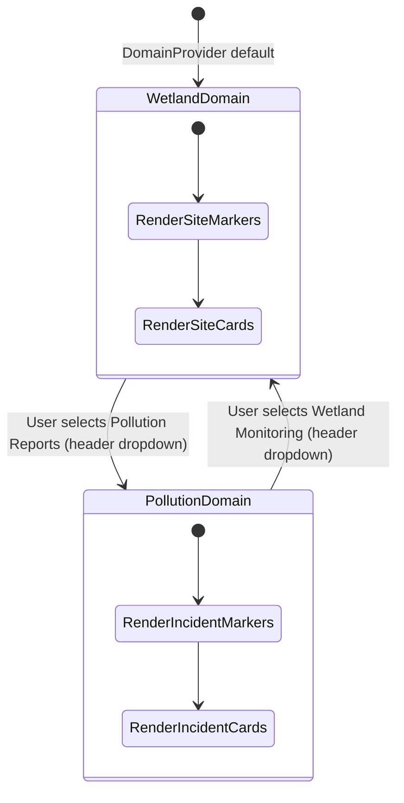
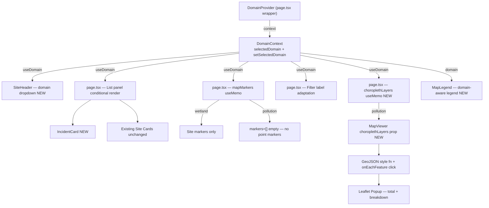
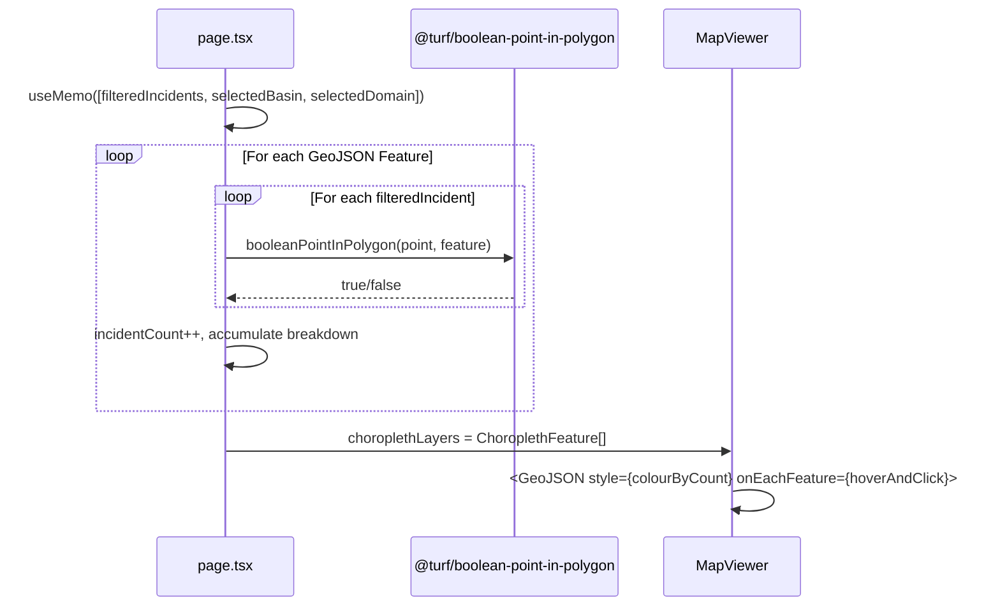

# PRD — Domain Selector & Differentiated Dashboard View

<!-- DIRTY_AMENDMENT: [Feedback #1 — DomainSelector relocated from sidebar to SiteHeader as a custom dropdown; state lifted to React Context (DomainContext). Approved 2026-06-26] -->
<!-- DIRTY_AMENDMENT: [Feedback #2 — Pollution Reports domain replaces point markers with a choropleth map rendered from sub-country GeoJSON shapefiles. Point markers suppressed on Pollution domain. Click popup shows total incidents + breakdown by type. Approved 2026-06-26] -->

* **Stage 2 of 3 — Documentation Hierarchy**
* **Initiative**: Domain-Differentiated Portal Dashboard
* **Owner**: John (Product Manager) & Sally (UX Designer)
* **Status**: Approved (Amended — Feedback Iterations #1 & #2)
* **Related Docs**:
  - [Decoupled Analysis Layer PRD](./decoupled_analysis_layer_prd.md)
  - [Decoupled Analysis Layer LLD](../lld/decoupled_analysis_layer_lld.md)
  - [Final SDD §4.5](../Final_SDD.md#45-wetland-data-portal)
  - [Pollution Choropleth PRD *(detailed sub-PRD for §IV items 13–21 and Feedback #2)*](./pollution_choropleth_prd.md)

---

## I. Overview & Goal

### Problem Statement

The public portal dashboard currently renders **pollution reports** (from `Pollution Reporting Form`) and **wetland health sites** (from Monthly Wetland Sampling) combined on the same map and the same list panel with no visual or functional differentiation. The manager has requested these two distinct data domains be clearly separated: users must be able to switch between a **"Pollution Reports" view** and a **"Wetland Monitoring" view** through an explicit domain selector. The list panel below the map must also reflect only the data relevant to the selected domain.

**Feedback #1 Amendment**: The domain selector has been moved from the left sidebar panel into the **global site header** as a custom dropdown, ensuring it is always visible regardless of sidebar scroll/collapse state.

This is the **frontend-first companion** to the Decoupled Analysis Layer initiative, which establishes the `domain` concept at the backend model and API layer. This PRD focuses solely on the **portal UX differentiation** — the domain switcher and differentiated list rendering — without requiring the full backend refactor from the Decoupled Analysis Layer to be complete first.

### Core Metric
- **Before:** Users cannot distinguish wetland health sites from pollution incident markers or their respective list items without prior domain knowledge.
- **After:** 100% of portal users can self-select their view context (Pollution vs. Wetland) and see a correctly filtered map + list within 1 interaction. Domain choice is always visible in the header regardless of sidebar state.

---

## II. 5W1H Analysis

| Dimension | Details |
|---|---|
| **Who** | Public portal users (NBD Secretariat, NDFs, officials, CSOs, public) and admin/partner users |
| **What** | A **domain dropdown** in the global site header that switches the view between "Pollution Reports" and "Wetland Monitoring". The map and the list panel update to only show data for the active domain. |
| **Where** | `frontend/src/components/ui/site-header.tsx` (domain dropdown), `frontend/src/app/page.tsx` (map/list logic), `frontend/src/context/domain-context.tsx` (shared state) |
| **When** | Triggered each time a user selects a different domain from the header dropdown. Defaults to **"Wetland Monitoring"** on first load. |
| **Why** | The two data types represent fundamentally different workflows, data shapes, and actions. Mixing them causes confusion for decision-makers who only care about one domain at a time. The SDD §4.5 (Key Features) lists "Pollution incident map" and "Wetland health scores" as separate features, validating the need for separation. The header placement ensures the domain selector is always visible even when the sidebar is collapsed or scrolled on mobile. |
| **How** | A `DomainContext` (React Context) provides `selectedDomain` and `setSelectedDomain`. `SiteHeader` consumes the context to render a custom styled dropdown. `page.tsx` consumes the same context to drive map marker and list panel rendering. |

---

## III. User Stories & Flows

### Personas
- **Public Portal Visitor**: Wants to quickly see either "what pollution events happened near me?" OR "how healthy is my local wetland?". Does not want mixed data cluttering the view.
- **NBD / NDF Decision-Maker**: Reviews wetland health scores for policy reports; not interested in raw pollution incidents during that session.
- **CSO Partner**: Cross-references pollution incidents in a basin with wetland health degradation; needs to switch between views fluidly.

### User Flows

#### Flow A — Wetland Monitoring Domain (Default)
```
User opens portal
  -> Header shows domain dropdown: "🌿 Wetland Monitoring" (active)
  -> Map shows: Health-class markers (A-E) for monitoring sites
  -> List shows: Site cards with health score, IK-adjusted badge, country, management action
  -> Filter toggles: "All / Critical / At risk / Healthy"
```

#### Flow B — Switching to Pollution Report Domain
```
User clicks the domain dropdown in the header
  -> Dropdown opens: two options with active checkmark on current
  -> User selects "⚠ Pollution Reports"
  -> Map shows: NO point markers
  -> Map shows: Choropleth polygons (sub-country shapefiles) colour-shaded by incident density
     -> 0 incidents  → slate-grey fill
     -> 1–5          → light amber fill
     -> 6–15         → orange fill
     -> 16+          → deep red fill
  -> Map legend switches to: None / Low / Moderate / High colour buckets
  -> List shows: IncidentCard components with incident type, severity badge, date, description
  -> Filter toggles adapt to: "All / Critical / Elevated"
  -> SiteDrawer closes automatically if open
```

#### Flow B2 — Clicking a Choropleth Polygon
```
User clicks a sub-region polygon on the Pollution domain map
  -> Leaflet popup opens (not a drawer)
  -> Popup shows:
     - Sub-region label (GeoJSON feature name / fallback "Sub-region N")
     - "Total Incidents: N"
     - Breakdown by incident type:
       • Oil Spill: 3
       • Chemical Discharge: 2
       • Waste Dumping: 1
       ...
```

#### Flow B3 — Basin Selector Changes (Pollution Domain Active)
```
User changes basin selector (MARA → SIO)
  -> Active shapefiles switch to sio-basin.geojson + sio-siteko-wetland.geojson
  -> Choropleth re-calculates counts against new filtered incident set
  -> Basin boundary outline remains (existing basinGeometry outline)
```

#### Flow C — Switching Back
```
User clicks domain dropdown in header
  -> Selects "🌿 Wetland Monitoring"
  -> Map resets to site markers
  -> List re-renders with site cards
  -> Basin selection preserved
```

---

## IV. Scope Guardrails

### Must-Have
1. **Domain Selector UI**: A custom dropdown in the **global site header** (between logo block and right-side actions) showing the active domain with a chevron icon. Click opens a panel listing:
   - `🌿 Wetland Monitoring` (default on every load)
   - `⚠ Pollution Reports`
   - Active option has a visible checkmark indicator.
2. **DomainContext**: A React Context (`src/context/domain-context.tsx`) providing `selectedDomain: "wetland" | "pollution"` and `setSelectedDomain`. Default: `"wetland"`.
3. **Header Dropdown Scope**: The dropdown only renders on the portal page; it is absent on the login page and any page not wrapped by `DomainProvider`.
4. **Map Filtering by Domain**:
   - Wetland active → only health-class site markers shown.
   - Pollution active → **zero point markers**; choropleth layer shown instead (see §IV items 13–20).
5. **Differentiated List Panel**:
   - **Wetland domain**: Existing site cards (unchanged).
   - **Pollution domain**: `IncidentCard` component showing: incident type label, severity badge (colour-coded), date reported, truncated description (max 2 lines).
6. **Filter Adaptation**:
   - Wetland domain: `All / Critical / At risk / Healthy` (current behaviour).
   - Pollution domain: `All / Critical / Elevated` (3 options only).
7. **List Section Header Update**:
   - Wetland: `Monitoring Sites (N)`
   - Pollution: `Pollution Incidents (N)`
8. **Auto-close SiteDrawer / IncidentDrawer**:
   - Switching to Pollution domain calls `setSelectedSite(null)`.
   - Switching to Wetland domain calls `setSelectedIncident(null)`.
9. **Default Domain**: `"wetland"` on every page load. No persistence to `localStorage`.
10. **IncidentDrawer on Card Click**:
    - Clicking an `IncidentCard` (or clicking an incident map marker) opens an `IncidentDrawer` displaying full incident details.
11. **Photo Display**:
    - If a pollution incident contains image attachments (answers of type `image`, `signature`, or `attachment`), display the photo(s) inline in the `IncidentDrawer` using secure, backend-generated read URLs.
12. **Header Dropdown Close**: Closes on outside click (same pattern as user-menu dropdown in `SiteHeader`).

13. **No Point Markers on Pollution Domain**: The `markers` array passed to `MapViewer` must be `[]` (empty) when `selectedDomain === "pollution"`.
14. **Choropleth Layer in MapViewer**: `MapViewer` receives a new optional prop `choroplethLayers?: ChoroplethFeature[]` containing enriched GeoJSON features with pre-computed incident counts.
15. **Static GeoJSON Shapefiles** — imported as static JSON (Next.js native support), selected by active basin:

    | `selectedBasin` | Shapefiles |
    |---|---|
    | `MARA` | `mara-basin.geojson` + `mara-wetland.geojson` |
    | `SIO` (or any other) | `sio-basin.geojson` + `sio-siteko-wetland.geojson` |

    Source files: `backend/app/seeds/spatial/`

16. **Point-in-Polygon Aggregation**: Use `@turf/boolean-point-in-polygon` to test each incident's `geo.coordinates` against each shapefile Feature polygon. Produce `incidentCount` + `incidentBreakdown: Record<string, number>` per feature.
17. **Colour Scale**:

    | Count | Fill Colour | Label |
    |---|---|---|
    | 0 | `#f1f5f9` (slate-100) | None |
    | 1–5 | `#fef3c7` (amber-100) | Low |
    | 6–15 | `#f97316` (orange-500) | Moderate |
    | 16+ | `#dc2626` (red-600) | High |

18. **Choropleth Click Popup** (Leaflet popup — not a drawer): Sub-region label + total count + per-type breakdown table (incident type extracted from `answers`, `question_id === 2` / `name === "incident_type"`).
19. **Hover Highlight**: On `mouseover`, polygon stroke weight increases to `3px` for clear affordance.
20. **Domain-Aware Map Legend**: `MapLegend` shows colour buckets (None / Low / Moderate / High) when Pollution domain is active; existing health-class legend when Wetland domain is active.
21. **Basin Boundary Outline Preserved**: Existing `basinGeometry` teal outline remains visible underneath the choropleth layer.

### Nice-to-Have (Deferred to future sprint)
- URL query param persistence (`?domain=pollution`) for shareability.
- Count badges on each domain option in the dropdown.
- Animated transition between domain views.
- Drill-down: clicking a choropleth polygon filters the sidebar incident list to that sub-region only.
- Backend-computed spatial aggregation endpoint for performance at scale.

### Out of Scope
- Full backend `domain` column migration (Decoupled Analysis Layer scope).
- Creating new monitoring domains (Forest, Soil, etc.).
- Admin interface changes.
- Any structural change to `SiteDrawer` itself.
- `localStorage` domain persistence.
- Keeping the pill-tab `DomainSelector` in the sidebar (removed).
- Displaying point markers alongside choropleth on Pollution domain.
- Server-side GeoJSON storage or PostGIS spatial queries.
- Adding new shapefiles beyond the 4 already in the repo.

---

## V. Architecture & Data Flow

### Frontend State Architecture



### Component Impact Map



### Choropleth Data Flow



### New Files

| File | Description |
|---|---|
| `src/context/domain-context.tsx` | React Context: `DomainProvider`, `useDomain` hook, default `"wetland"` |
| `src/lib/types.ts` (or extend existing) | `ChoroplethFeature` type — GeoJSON Feature + `incidentCount: number` + `incidentBreakdown: Record<string, number>` + `displayName: string` |

### New Components

| Component | File | Description |
|---|---|---|
| `DomainSelector` (original) | `src/components/ui/domain-selector.tsx` | Kept but no longer rendered on portal page; may be reused elsewhere |
| `IncidentCard` | `src/components/ui/incident-card.tsx` | Card displaying a single pollution incident in the list |

### New Dependency

| Package | Purpose | Install |
|---|---|---|
| `@turf/boolean-point-in-polygon` | Point-in-polygon spatial test | `./dc.sh exec frontend yarn add @turf/boolean-point-in-polygon` |

### Modified Files

| File | Change Summary |
|---|---|
| `src/app/page.tsx` | Wrap `<main>` with `<DomainProvider>`; replace local `selectedDomain` state with `useDomain()`; remove `<DomainSelector>` from sidebar; add `choroplethLayers` useMemo; pass `markers={[]}` on Pollution domain |
| `src/components/ui/site-header.tsx` | Import `useDomain`; add `domainDropdownOpen` state + outside-click ref; render custom styled domain dropdown between logo and right actions |
| `src/components/ui/map-viewer.tsx` | Add `choroplethLayers?: ChoroplethFeature[]` prop; render `<GeoJSON>` with `style(feature)` colour fn + `onEachFeature` hover/click handler + Leaflet popup |
| `src/components/ui/map-legend.tsx` | Accept `domain` prop; render choropleth colour buckets (None/Low/Moderate/High) on Pollution domain; existing health-class legend on Wetland domain |
| `src/lib/api.ts` | Add `IncidentSummary` TypeScript interface to type `dbIncidents` items |

---

## VI. Acceptance Criteria

### User Acceptance Criteria (UAC)

- **UAC-1 (Default State)**: Given a user opens the portal, "Wetland Monitoring" domain is active by default; header dropdown shows "🌿 Wetland Monitoring"; map shows health-class site markers; list shows site cards.
- **UAC-2 (Domain Switch via Header)**: Given "Wetland Monitoring" is active, when the user opens the header dropdown and selects "Pollution Reports", then: map shows only incident markers; list header changes to "Pollution Incidents (N)"; list renders `IncidentCard` components.
- **UAC-3 (Filter Adaptation)**: In "Pollution Reports" domain, filter labels show only "All / Critical / Elevated" and filter the incident list accordingly.
- **UAC-4 (Basin Selector Persists)**: Basin selection is preserved across domain switches.
- **UAC-5 (Empty States)**:
  - No incidents: "No pollution incidents reported in this basin."
  - No sites: Existing "No active stations matching filters."
- **UAC-6 (SiteDrawer Auto-close)**: Switching to the Pollution domain closes any open SiteDrawer.
- **UAC-7 (Incident Card Legibility)**: Each `IncidentCard` displays: incident type, severity badge, date reported, description (max 2 lines).
- **UAC-H1 (Header Always Visible)**: Domain dropdown is visible in the header at all times — including when sidebar is collapsed on mobile.
- **UAC-H2 (Login Page Clean)**: No domain dropdown is rendered on `http://localhost:3000/login` (page is not wrapped by `DomainProvider`).
- **UAC-H3 (Dropdown Close)**: Clicking outside the open domain dropdown closes it without changing the domain.
- **UAC-C1 (No Markers — Pollution)**: Given `selectedDomain === "pollution"`, zero point markers are rendered on the map.
- **UAC-C2 (Choropleth Visible)**: Given Pollution domain is active, colour-shaded polygons covering the active basin's sub-regions appear within 1 second of domain switch.
- **UAC-C3 (Colour Scale)**: A polygon with 0 incidents is slate-grey; 1–5 is amber; 6–15 is orange; 16+ is red.
- **UAC-C4 (Click Popup)**: Clicking a polygon opens a Leaflet popup showing total incident count and per-type breakdown.
- **UAC-C5 (Basin Switch — Choropleth)**: Switching basin updates the polygons and recomputes counts against the new shapefile set.
- **UAC-C6 (Domain Switch to Wetland)**: Switching to Wetland domain removes the choropleth and restores site markers.
- **UAC-C7 (Choropleth Legend)**: When Pollution domain is active, the legend shows None / Low / Moderate / High colour buckets.
- **UAC-C8 (Hover Effect)**: Hovering a polygon increases border weight for clear interactive affordance.

### Technical Acceptance Criteria (TAC)

- **TAC-1**: `selectedDomain` typed as `"wetland" | "pollution"` union literal in context; no `string` or `any` introduced.
- **TAC-2**: `mapMarkers` wrapped in `useMemo` depending on `[selectedDomain, filteredSites, filteredIncidents, t]`.
- **TAC-3**: `IncidentCard` has typed props; no implicit page-level dependencies.
- **TAC-4**: `SiteDrawer` is only opened when `selectedDomain === "wetland"`.
- **TAC-5**: All existing `__tests__/` continue to pass; new tests added for `DomainContext` and updated `SiteHeader` dropdown behaviour.
- **TAC-H1**: `DomainProvider` wraps only the portal page tree, not the global `layout.tsx` (prevents context leaking into admin/login pages).
- **TAC-H2**: `useDomain` throws a descriptive error when called outside `DomainProvider` (safe guard for future page additions).
- **TAC-H3**: Domain dropdown ref closes on `mousedown` outside — identical pattern to existing user-menu in `SiteHeader`.
- **TAC-C1**: `choroplethLayers` typed as `ChoroplethFeature[]`; each element extends GeoJSON `Feature` with `incidentCount: number`, `incidentBreakdown: Record<string, number>`, `displayName: string`.
- **TAC-C2**: `choroplethLayers` computation wrapped in `useMemo([filteredIncidents, selectedBasin, selectedDomain])`.
- **TAC-C3**: GeoJSON files imported as static JSON — no runtime HTTP fetch.
- **TAC-C4**: `@turf/boolean-point-in-polygon` used for point-in-polygon test — no custom geometry code.
- **TAC-C5**: Choropleth layer uses Leaflet's `onEachFeature` callback for hover and click — no custom D3 or canvas rendering.

---

## VII. Edge Cases & Errors

| Case | Behaviour |
|---|---|
| No incidents in basin | Pollution list: "No pollution incidents reported in this basin."; all choropleth polygons render in neutral grey |
| No sites in basin | Wetland list: existing "No active stations matching filters." |
| Incident with missing geo | Skipped from point-in-polygon test; map does not crash |
| Incident `geo.coordinates` is `[0,0]` | Treated as invalid; falls outside all polygons; counted as unattributed; not rendered |
| Domain switched while SiteDrawer open | Drawer closes (`setSelectedSite(null)`) |
| Incident with missing `answers` array | Fallback: type = "Pollution Report", severity = "Moderate" |
| `useDomain` called outside `DomainProvider` | Throws `Error: useDomain must be used within a DomainProvider` |
| GeoJSON feature has no `name` property | Fallback label: "Sub-region N" (feature index) |
| `selectedBasin` is not MARA or SIO | Default to SIO shapefiles; no crash |

---

## VIII. Rollout & Rollback Plan

### Rollout
- Deploy to staging; QA smoke test for both domains via header dropdown.
- Feature is purely additive; default is "Wetland Monitoring" — zero breaking changes.
- No database migration, no API contract change.
- Login page unaffected (not wrapped by `DomainProvider`).

### Rollback
- Revert `site-header.tsx` to pre-feature commit; remove `DomainContext` and `DomainProvider` from `page.tsx`; restore `<DomainSelector>` to sidebar.

---

## IX. Epic & Ballpark Estimation

### Original Scope

| Component | Complexity | Estimate |
|---|---|---|
| `IncidentCard` component | Simple | 1.5 h |
| `IncidentDrawer` component | Medium | 2 h |
| Backend image `read_url` generation & schema | Simple | 1 h |
| `page.tsx` wiring & state management | Medium | 2 h |
| Filter label adaptation (3-option pollution) | Simple | 0.5 h |
| Auto-close drawer on domain switch | Simple | 0.5 h |
| Unit tests (frontend & backend) | Medium | 1.5 h |
| QA + smoke testing | Simple | 1 h |

### Feedback #1 Delta (Header Dropdown)

| Component | Complexity | Estimate |
|---|---|---|
| `src/context/domain-context.tsx` (new) | Simple | 0.5 h |
| `SiteHeader` domain dropdown UI | Simple | 1.5 h |
| `page.tsx` — swap local state → `useDomain`, remove sidebar `<DomainSelector>` | Simple | 0.5 h |
| Unit tests — `DomainContext` + updated `SiteHeader` | Simple | 1 h |
| PRD amendment update | Simple | 0.5 h |
| QA smoke test (header dropdown, login page clean) | Simple | 0.5 h |
| **Feedback #1 Subtotal** | | **~4.5 h** |

### Feedback #2 Delta (Pollution Choropleth Map)

| Component | Complexity | Estimate |
|---|---|---|
| Install + type `@turf/boolean-point-in-polygon` | Simple | 0.5 h |
| `ChoroplethFeature` TypeScript type | Simple | 0.5 h |
| `choroplethLayers` useMemo in `page.tsx` (point-in-polygon aggregation) | Medium | 2 h |
| No-marker guard (`markers=[]` when Pollution domain) | Simple | 0.25 h |
| Basin → shapefile selection logic | Simple | 0.5 h |
| `MapViewer` choropleth rendering (style fn, hover, click popup) | Medium | 2.5 h |
| `MapLegend` domain-aware colour buckets | Simple | 0.5 h |
| Unit tests (choropleth aggregation, MapViewer rendering) | Medium | 1.5 h |
| QA smoke test (both basins, both domains) | Simple | 1 h |
| **Feedback #2 Subtotal** | | **~9.25 h** |

| **Grand Total (All Feedbacks)** | | **~19.75 hours / ~3 Story Points** |

### Assumptions
- `GET /api/v1/submissions?status=APPROVED` already returns incidents filtered to `form_name === "Pollution Reporting Form"` on the frontend.
- `mapMarkers` already supports `type: "site"` and `type: "incident"` — domain filtering is the only change.
- Decoupled Analysis Layer DB migration is **not** a prerequisite. Architecture is forward-compatible with that future migration.
- `DomainProvider` wraps only the portal `page.tsx` return; `layout.tsx` is untouched.

---

## X. GeoJSON Shapefile Reference

| File | Basin | Geometry Type | Key Properties |
|---|---|---|---|
| `mara-basin.geojson` | MARA | `FeatureCollection` (1 Feature, MultiPolygon) | `HYBAS_ID`, `SUB_AREA`, `PFAF_ID` |
| `mara-wetland.geojson` | MARA | `FeatureCollection` (1 Feature, Polygon) | `cluster`, `count`, `area` |
| `sio-basin.geojson` | SIO | `FeatureCollection` (1 Feature, MultiPolygon) | `FID` |
| `sio-siteko-wetland.geojson` | SIO | `FeatureCollection` (multi-Feature, MultiPolygon) | complex geometry, no named properties |

> **Display Name Strategy**: `feature.properties.name ?? feature.properties.HYBAS_ID ?? "Sub-region ${index + 1}"`

---

## XI. SDD Alignment Check

| SDD Feature (§4.5) | This PRD |
|---|---|
| "Pollution incident map" | Pollution domain: choropleth of incident density per sub-region; zero point markers |
| "Wetland health scores" | Wetland domain shows only health site markers + score list |
| "Search and Filter" (§4.5.3) | Domain-aware filter labels; basin selector persists |
| "Mobile-friendly layout" | DomainSelector in header is always accessible; sidebar collapse does not hide domain choice |
