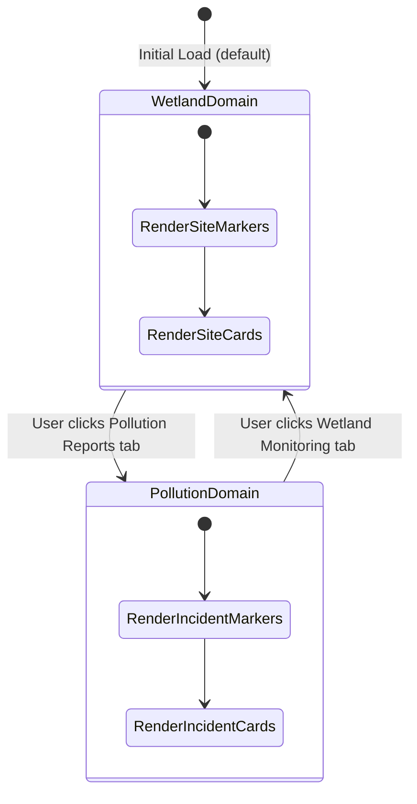
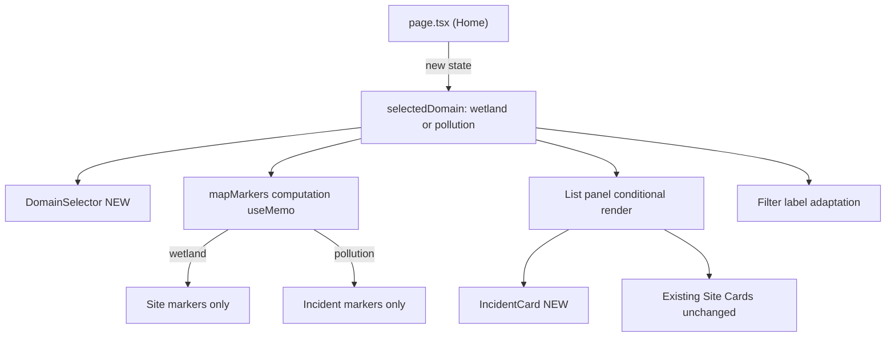

# PRD — Domain Selector & Differentiated Dashboard View

* **Stage 2 of 3 — Documentation Hierarchy**
* **Initiative**: Domain-Differentiated Portal Dashboard
* **Owner**: John (Product Manager) & Sally (UX Designer)
* **Status**: Approved
* **Related Docs**:
  - [Decoupled Analysis Layer PRD](./decoupled_analysis_layer_prd.md)
  - [Decoupled Analysis Layer LLD](../lld/decoupled_analysis_layer_lld.md)
  - [Final SDD §4.5](../Final_SDD.md#45-wetland-data-portal)

---

## I. Overview & Goal

### Problem Statement

The public portal dashboard currently renders **pollution reports** (from `Pollution Reporting Form`) and **wetland health sites** (from Monthly Wetland Sampling) combined on the same map and the same list panel with no visual or functional differentiation. The manager has requested these two distinct data domains be clearly separated: users must be able to switch between a **"Pollution Reports" view** and a **"Wetland Monitoring" view** through an explicit domain selector. The list panel below the map must also reflect only the data relevant to the selected domain.

This is the **frontend-first companion** to the Decoupled Analysis Layer initiative, which establishes the `domain` concept at the backend model and API layer. This PRD focuses solely on the **portal UX differentiation** — the domain switcher and differentiated list rendering — without requiring the full backend refactor from the Decoupled Analysis Layer to be complete first.

### Core Metric
- **Before:** Users cannot distinguish wetland health sites from pollution incident markers or their respective list items without prior domain knowledge.
- **After:** 100% of portal users can self-select their view context (Pollution vs. Wetland) and see a correctly filtered map + list within 1 interaction.

---

## II. 5W1H Analysis

| Dimension | Details |
|---|---|
| **Who** | Public portal users (NBD Secretariat, NDFs, officials, CSOs, public) and admin/partner users |
| **What** | A **domain menu** (tab/selector) in the left sidebar panel that switches the view between "Pollution Reports" and "Wetland Monitoring". The map and the list panel update to only show data for the active domain. |
| **Where** | `frontend/src/app/page.tsx` (portal dashboard) — the left sidebar panel and the `MapViewer` markers. |
| **When** | Triggered each time a user selects a different domain tab on the portal. Defaults to **"Wetland Monitoring"** on first load. |
| **Why** | The two data types represent fundamentally different workflows, data shapes, and actions. Mixing them causes confusion for decision-makers who only care about one domain at a time. The SDD §4.5 (Key Features) lists "Pollution incident map" and "Wetland health scores" as separate features, validating the need for separation. |
| **How** | Add a domain-selector toggle above the basin dropdown. State drives which data-fetching branch is active. Map markers and the sidebar list both respond to the active domain. |

---

## III. User Stories & Flows

### Personas
- **Public Portal Visitor**: Wants to quickly see either "what pollution events happened near me?" OR "how healthy is my local wetland?". Does not want mixed data cluttering the view.
- **NBD / NDF Decision-Maker**: Reviews wetland health scores for policy reports; not interested in raw pollution incidents during that session.
- **CSO Partner**: Cross-references pollution incidents in a basin with wetland health degradation; needs to switch between views fluidly.

### User Flows

#### Flow A — Wetland Monitoring Domain (Default)
```
User opens portal
  -> Domain Tab: "Wetland Monitoring" is active by default
  -> Map shows: Health-class markers (A-E) for monitoring sites
  -> List shows: Site cards with health score, IK-adjusted badge, country, management action
  -> Filter toggles: "All / Critical / At risk / Healthy"
```

#### Flow B — Pollution Report Domain
```
User clicks "Pollution Reports" domain tab
  -> Map shows: Pollution incident markers (Elevated / Critical severity)
  -> List shows: IncidentCard components with incident type, severity badge, date, description
  -> Filter toggles adapt to: "All / Critical / Elevated"
  -> SiteDrawer closes automatically if open
```

#### Flow C — Switching Back
```
User clicks "Wetland Monitoring" tab
  -> Map resets to site markers
  -> List re-renders with site cards
  -> Basin selection preserved
```

---

## IV. Scope Guardrails

### Must-Have
1. **Domain Selector UI**: A clearly visible tab/toggle in the left panel (above basin dropdown) with two options:
   - `Wetland Monitoring` (default on every load)
   - `Pollution Reports`
2. **Map Filtering by Domain**:
   - Wetland active → only health-class site markers shown.
   - Pollution active → only incident markers shown.
3. **Differentiated List Panel**:
   - **Wetland domain**: Existing site cards (unchanged).
   - **Pollution domain**: New `IncidentCard` component showing: incident type label, severity badge (colour-coded), date reported, truncated description (max 2 lines).
4. **Filter Adaptation**:
   - Wetland domain: `All / Critical / At risk / Healthy` (current behaviour).
   - Pollution domain: `All / Critical / Elevated` (3 options only).
5. **List Section Header Update**:
   - Wetland: `Monitoring Sites (N)`
   - Pollution: `Pollution Incidents (N)`
6. **Auto-close SiteDrawer / IncidentDrawer**:
   - Switching to Pollution domain calls `setSelectedSite(null)`.
   - Switching to Wetland domain calls `setSelectedIncident(null)`.
7. **Default Domain**: `"wetland"` on every page load. No persistence to `localStorage`.
8. **IncidentDrawer on Card Click**:
   - Clicking an `IncidentCard` (or clicking an incident map marker) opens an `IncidentDrawer` displaying full incident details.
9. **Photo Display**:
   - If a pollution incident contains image attachments (answers of type `image`, `signature`, or `attachment`), display the photo(s) inline in the `IncidentDrawer` using secure, backend-generated read URLs.

### Nice-to-Have (Deferred to future sprint)
- URL query param persistence (`?domain=pollution`) for shareability.
- Count badges on each domain tab.
- Animated transition between domain views.

### Out of Scope
- Full backend `domain` column migration (Decoupled Analysis Layer scope).
- Creating new monitoring domains (Forest, Soil, etc.).
- Admin interface changes.
- Any structural change to `SiteDrawer` itself.
- `localStorage` domain persistence.

---

## V. Architecture & Data Flow

### Frontend State Architecture



### Component Impact Map



### New Components

| Component | File | Description |
|---|---|---|
| `DomainSelector` | `src/components/ui/domain-selector.tsx` | Tab/toggle pill with Wetland and Pollution options |
| `IncidentCard` | `src/components/ui/incident-card.tsx` | Card displaying a single pollution incident in the list |

### Modified Files

| File | Change Summary |
|---|---|
| `src/app/page.tsx` | Add `selectedDomain` state; wire `DomainSelector`; wrap `mapMarkers` in `useMemo`; conditionally render site cards vs incident cards; adapt filter labels; auto-close SiteDrawer on domain switch |
| `src/lib/api.ts` | Add `IncidentSummary` TypeScript interface to type `dbIncidents` items |

---

## VI. Acceptance Criteria

### User Acceptance Criteria (UAC)

- **UAC-1 (Default State)**: Given a user opens the portal, "Wetland Monitoring" domain is active by default; map shows health-class site markers; list shows site cards.
- **UAC-2 (Domain Switch)**: Given "Wetland Monitoring" is active, when the user clicks "Pollution Reports", then: map shows only incident markers; list header changes to "Pollution Incidents (N)"; list renders `IncidentCard` components.
- **UAC-3 (Filter Adaptation)**: In "Pollution Reports" domain, filter labels show only "All / Critical / Elevated" and filter the incident list accordingly.
- **UAC-4 (Basin Selector Persists)**: Basin selection is preserved across domain switches.
- **UAC-5 (Empty States)**:
  - No incidents: "No pollution incidents reported in this basin."
  - No sites: Existing "No active stations matching filters."
- **UAC-6 (SiteDrawer Auto-close)**: Switching to the Pollution domain closes any open SiteDrawer.
- **UAC-7 (Incident Card Legibility)**: Each `IncidentCard` displays: incident type, severity badge, date reported, description (max 2 lines).

### Technical Acceptance Criteria (TAC)

- **TAC-1**: `selectedDomain` typed as `"wetland" | "pollution"` union literal; no `string` or `any` introduced.
- **TAC-2**: `mapMarkers` wrapped in `useMemo` depending on `[selectedDomain, filteredSites, filteredIncidents]`.
- **TAC-3**: `DomainSelector` and `IncidentCard` have typed props; no implicit page-level dependencies.
- **TAC-4**: `SiteDrawer` is only opened when `selectedDomain === "wetland"`.
- **TAC-5**: All existing `__tests__/` continue to pass.

---

## VII. Edge Cases & Errors

| Case | Behaviour |
|---|---|
| No incidents in basin | Pollution list: "No pollution incidents reported in this basin." |
| No sites in basin | Wetland list: existing "No active stations matching filters." |
| Incident with missing geo | Marker at [0,0]; map does not crash |
| Domain switched while SiteDrawer open | Drawer closes (`setSelectedSite(null)`) |
| Incident with missing `answers` array | Fallback: type = "Pollution Report", severity = "Moderate" |

---

## VIII. Rollout & Rollback Plan

### Rollout
- Deploy to staging; QA smoke test for both domains.
- Feature is purely additive; default is "Wetland Monitoring" — zero breaking changes.
- No database migration, no API contract change.

### Rollback
- Revert `page.tsx` to pre-feature commit. Remove `DomainSelector` and `IncidentCard` imports.

---

## IX. Epic & Ballpark Estimation

| Component | Complexity | Estimate |
|---|---|---|
| `DomainSelector` component | Simple | 1 h |
| `IncidentCard` component | Simple | 1.5 h |
| `IncidentDrawer` component | Medium | 2 h |
| Backend image `read_url` generation & schema | Simple | 1 h |
| `page.tsx` wiring & state management | Medium | 2 h |
| Filter label adaptation (3-option pollution) | Simple | 0.5 h |
| Auto-close drawer on domain switch | Simple | 0.5 h |
| Unit tests (frontend & backend) | Medium | 1.5 h |
| QA + smoke testing | Simple | 1 h |
| **Total** | | **~11 hours / 1.5 Story Points** |

### Assumptions
- `GET /api/v1/submissions?status=APPROVED` already returns incidents filtered to `form_name === "Pollution Reporting Form"` on the frontend (confirmed `page.tsx` L217-220).
- `mapMarkers` already supports `type: "site"` and `type: "incident"` — domain filtering is the only change.
- Decoupled Analysis Layer DB migration is **not** a prerequisite. Architecture is forward-compatible with that future migration.

---

## X. SDD Alignment Check

| SDD Feature (§4.5) | This PRD |
|---|---|
| "Pollution incident map" | Pollution domain shows only incident markers |
| "Wetland health scores" | Wetland domain shows only health site markers + score list |
| "Search and Filter" (§4.5.3) | Domain-aware filter labels; basin selector persists |
| "Mobile-friendly layout" | DomainSelector uses flex/pill consistent with existing toggle pattern |
