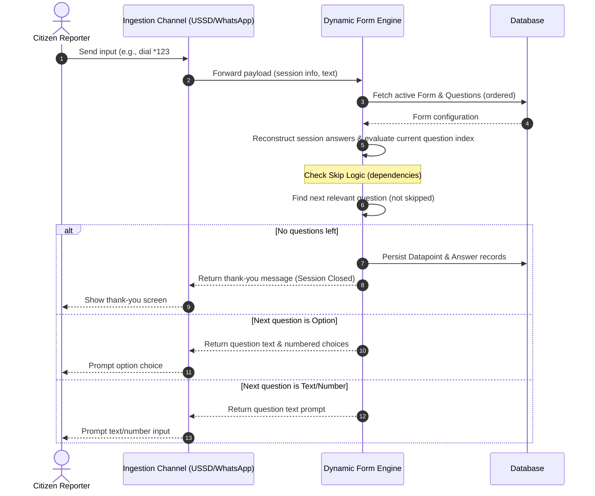

# PRD — Dynamic Form Support for USSD and WhatsApp Channels

> **Stage 2 of 3 — Documentation Hierarchy**
> Owner: PM + Design Lead | Target Location: `docs/prd/dynamic_forms_prd.md` | References: `docs/product_brief.md`
> Status: `Approved`

---

## 1. Overview

**One-liner**:
A dynamic, metadata-driven questionnaire engine for NBD's SMS/USSD and WhatsApp Channels that automatically renders forms, routes users through questions based on defined orders, and evaluates skip-logic dependencies in real time.

**Brief / Problem Reference**:
Ref: `docs/product_brief.md`.

**What we are building** (What):
Currently, the USSD and WhatsApp channels rely on hardcoded loops mapping specifically to the pollution alert form. This project introduces a generic, metadata-driven questionnaire engine that preserves the existing welcome, language selection, and data consent gates, but makes all subsequent questionnaire steps fully dynamic. The engine dynamically traverses any form's questions in `Question.order` sequence, handles complex interactive prompts (such as multi-level location cascades, text inputs, number boundaries, and media attachments), and automatically skips questions whose dependency conditions are not met.

**Why now** (Strategic context):
As NBD scales, new monitoring programs will require custom survey parameters. Manually editing hardcoded code for each new question is a significant maintenance bottleneck that delays field deployment and increases regression risk.

---

## 2. Goals & Success Metrics

| Goal | Success Metric | Baseline | Target | Owner |
|------|---------------|----------|--------|-------|
| Eliminate code updates for forms | Time to deploy a new question on USSD/WhatsApp | 1-2 developer days | 0 days (instant database seed) | PM |
| Maintain low-bandwidth compatibility | USSD session timeout/disconnect rate | < 10% | < 5% | Eng |
| Correct data ingestion | Percentage of answers matching database schemas | 100% | 100% | QA |

**Anti-Goals**:
- We are not building a web-based form designer UI in this phase.
- We are not changing KoboToolbox ingestion patterns (Kobo uses its own parser).
- We are not supporting repeatable question groups on USSD/WhatsApp (reserved for Webforms/Kobo).

---

## 3. Target Users & Personas

| Persona | Job-to-be-Done | Key Frustration | v1 Priority |
|---------|---------------|-----------------|-------------|
| Citizen Reporter | Quickly reports a pollution alert using a feature phone (USSD) or WhatsApp. | Confusing multi-step menus or system crash when new questions are added. | Primary |
| System Admin | Seeds/modifies questions in the database. | Needs to write Python code and redeploy containers just to add a single question. | Secondary |

---

## 4. User Stories

| ID | User Story | Priority (MoSCoW) | FR Reference |
|----|-----------|-------------------|--------------|
| US-001 | As a **Citizen Reporter**, I want the USSD menu or WhatsApp bot to ask me questions in the correct order, so that I can submit my environmental report successfully. | Must Have | FR-001, FR-004 |
| US-002 | As a **Citizen Reporter**, I want the system to skip questions that are not relevant to me (e.g., asking about fish species only if I reported a fish kill), so that I don't waste time on irrelevant questions. | Must Have | FR-002 |
| US-003 | As a **System Admin**, I want to add or modify questionnaire fields in the database and have them instantly reflected on USSD and WhatsApp without writing code, so that I can launch new survey campaigns rapidly. | Must Have | FR-001, FR-005 |

---

## 5. Functional Requirements

| ID | Requirement | User Story | Priority |
|----|-------------|------------|----------|
| **FR-001** | The backend MUST retrieve the active version of the form (e.g. `Pollution Reporting Form` or a configured form target) and extract questions ordered by `Question.order` ascending. | US-001, US-003 | Must Have |
| **FR-002** | The system MUST evaluate `Question.dependency` conditions. If a question's dependencies evaluate to `False` based on current session answers, the question MUST be silently skipped. | US-002 | Must Have |
| **FR-003** | The USSD router MUST remain stateless by reconstructing the questionnaire traversal path from the concatenated inputs (`text` variable delimited by `*`). | US-001 | Must Have |
| **FR-004** | The WhatsApp service MUST use a database-backed session state (`whatsapp_sessions`) to persist answers in a JSON field (`answers`) and track progress dynamically via the current question reference. | US-001 | Must Have |
| **FR-005** | The system MUST parse different question types dynamically:  - **`option`**: Show numbered choice menu. - **`cascade`**: Render multi-step hierarchy (e.g. Region -> Sub-County). - **`image`/`attachment`**: Prompt for media attachment (WhatsApp only; USSD skips or degrades gracefully). - **`number`/`input`/`text`**: Prompt for text input. | US-001, US-003 | Must Have |
| **FR-006** | Upon completing all questions, the system MUST persist the collected answers as a `Datapoint` and set its status to `PENDING`. | US-001 | Must Have |

---

## 6. Non-Functional Requirements

| Category | Requirement | Metric |
|----------|-------------|--------|
| **Performance** | USSD response generation time (including PostGIS lookup & dynamic evaluation) | < 300ms (p95) to prevent Telco gateway timeouts |
| **Security** | Session validation | Sanitize inputs; validate option boundaries; restrict session lifetime to 24h |
| **Maintainability** | Dynamic schema integrity | Adding or removing a question must not break database model integrity or trigger Alembic runs. |

---

## 7. User Flows & Wireframes

### Happy Path Sequence (Traversing Dynamic Questionnaire)

---

## 8. Scope

**v1 — In Scope**:
- Dynamic question ordering based on `Question.order`.
- Support for `option`, `cascade`, `text`, `number`, and `image` (WhatsApp only) question types.
- Skip logic dependency rule checking:
  - Supports `AND` / `OR` rules.
  - Checks if a previous question's answer matches the target value specified in `Question.dependency`.
- Stateless USSD path reconstruction.
- Database session state updates for WhatsApp (`whatsapp_sessions` schema).

**v1 — Explicitly Out of Scope**:
- Complex calculations or spreadsheet formulas inside the USSD/WhatsApp flow (e.g., dynamic score previews).
- Repeatable sub-groups (only linear question groupings are supported).
- Multi-select option questions in USSD (feature phones can only easily input a single number choice per screen).

---

## 9. Assumptions & Constraints

**Assumptions**:
- Forms targeted by USSD and WhatsApp are flat (no nested nested groups or repeatable structures).
- Telco/WhatsApp gateways provide persistent sessionId/phoneNumber pairs.

**Open Questions**:
- **OQ-1**: How should we represent `location_id` cascade values in the dynamic engine? Since `location_id` is a `cascade` type, the engine needs a specialized handler to format Region -> Sub-County choices.
- **OQ-2**: What should happen if a dynamic question is of type `image` or `attachment` in the USSD channel? USSD does not support media; we assume we should either skip it or prompt the user to input a text placeholder.

---

## 10. Change Log

| Version | Date | Author | Changes |
|---------|------|--------|---------|
| 0.1 | 2026-06-22 | Antigravity | Initial draft for dynamic USSD/WhatsApp forms |

---

## Exit Criterion

> [!IMPORTANT]
> This PRD MUST be signed off by both the Engineering Lead and Design Lead before LLD begins.
