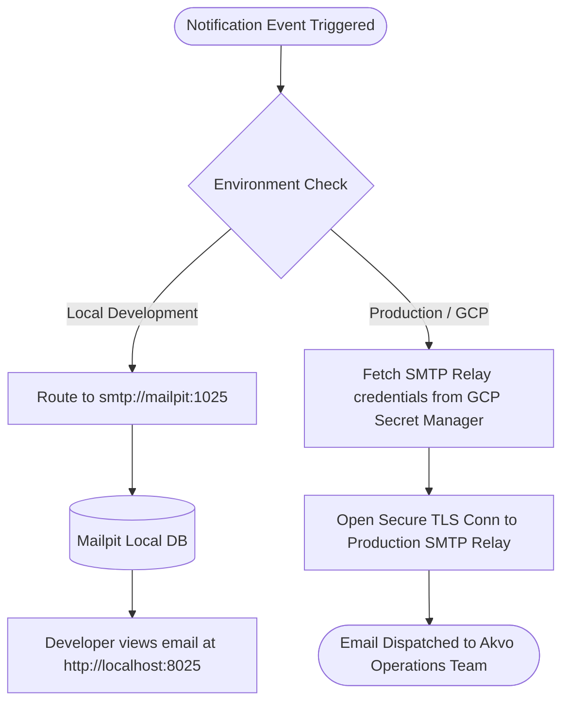

# PRD — SMTP Relay & Local Email Testing (Mailpit) Setup

> **Stage 2 of 3 — Documentation Hierarchy**
> Owner: PM + Winston (Architect) | Target Location: `docs/prd/email_testing_relay_prd.md` | References: `docs/product_brief.md`
> Status: `Approved`

---

## 1. Overview

**One-liner**:
A secure, unified mail transport subsystem for the FastAPI backend supporting isolated local email inspection via Mailpit and production SMTP relay using credentials securely retrieved from GCP Secret Manager.

**What we are building** (What):
We are building a robust email sending and local testing infrastructure.
1. **Local Development**: Integrates `mailpit` as a new service in `docker-compose.yml` to intercept all local emails, exposing an SMTP endpoint (port 1025) and a browser-based inbox viewer (port 8025) without sending anything to the public internet.
2. **Production/Staging**: Configures the FastAPI backend using `fastapi-mail` (or equivalent async mail library) to fetch SMTP host, port, username, and password from GCP Secret Manager environment injection, utilizing secure TLS/SSL for transmission to a real SMTP relay service (e.g., SendGrid/AWS SES).
3. **Asynchronous Dispatch**: Implements email sending via FastAPI's `BackgroundTask` to ensure the main HTTP threads are never blocked by SMTP socket handshakes.

**Why now** (Strategic context):
As we implement the KoboToolbox ingest pipeline and admin notification flows, developers need a safe environment to test alerts without accidentally spamming stakeholders or real users. At the same time, the production deployment requires secure, zero-hardcoded-credential integration with enterprise mail relays.

---

## 2. Goals & Success Metrics

| Goal | Success Metric | Baseline | Target | Owner |
|------|---------------|----------|--------|-------|
| Prevent accidental email leaks | Zero emails sent to real users from local development | N/A | 100% block rate (local) | Developer / Tester |
| Improve developer feedback loop | Time to view a generated email during local testing | >2 mins (checking real spam/logs) | < 5 seconds (Mailpit UI) | Developer |
| Secure production configuration | Zero email service credentials committed to git | N/A | 100% compliance | Architect |
| Non-blocking email dispatch | API response latency when triggering email alerts | >1s (synchronous SMTP) | < 200ms (asynchronous queue) | Developer |

**Anti-Goals**:
- Implementing an email template builder or WYSIWYG editor in the frontend.
- Hosting our own SMTP server in production (we will rely on standard relays like SendGrid, Mailgun, or AWS SES).
- Integrating user-facing inbox features on the public portal.

---

## 3. Target Users & Personas

| Persona | Job-to-be-Done | Key Frustration | v1 Priority |
|---------|---------------|-----------------|-------------|
| Amelia (Developer) | Test and inspect email notifications locally | Mismatch of templates, slow mail delivery, accidental spamming of real addresses | Primary |
| Winston (Architect) | Ensure production environment is highly secure and credentials are kept out of source code | Secret leaks in repositories or insecure configuration storage | Primary |
| Murat (Tester) | Verify automated alerts under system errors | Hard to assert if emails are fired without executing full external checks | Secondary |

---

## 4. User Stories

| ID | User Story | Priority (MoSCoW) | FR Reference |
|----|-----------|-------------------|--------------|
| US-001 | As a developer, I want all locally triggered emails to be intercepted by a local test mailbox so that I never spam real contacts. | Must Have | FR-001, FR-002 |
| US-002 | As a developer, I want a web dashboard to preview HTML and text emails locally so that I can refine formatting quickly. | Must Have | FR-002 |
| US-003 | As a backend engineer, I want the system to send emails asynchronously so that email sending does not block API requests. | Must Have | FR-004 |
| US-004 | As an administrator/ops engineer, I want production emails to be routed via a secure SMTP relay using variables loaded from Secret Manager. | Must Have | FR-003 |

---

## 5. Functional Requirements

| ID | Requirement | User Story | Priority |
|----|-------------|------------|----------|
| FR-001 | The system MUST include a `mailpit` container in the local `docker-compose.yml` configured to bind to ports `1025` (SMTP) and `8025` (Web UI/HTTP). | US-001 | Must Have |
| FR-002 | The backend application MUST route all emails to `smtp://mailpit:1025` when the environment is configured as local/development. | US-001, US-002 | Must Have |
| FR-003 | The backend application MUST use secure TLS/SSL SMTP connections and retrieve SMTP credentials (`SMTP_HOST`, `SMTP_PORT`, `SMTP_USERNAME`, `SMTP_PASSWORD`) from environment variables injected by GCP Secret Manager when running in production/staging. | US-004 | Must Have |
| FR-004 | The backend application MUST send emails asynchronously using FastAPI's `BackgroundTask` or a thread-pool executor. | US-003 | Must Have |
| FR-005 | The email sending utility MUST accept parameters for `to`, `subject`, `html_content`, and optional `text_content`. | US-002 | Must Have |

---

## 6. Non-Functional Requirements

| Category | Requirement | Metric |
|----------|-------------|--------|
| **Performance** | API response time when triggering notifications | < 150ms (achieved via async execution) |
| **Availability** | Local Mailpit UI response time | < 500ms on first-paint |
| **Security** | Production credentials validation | Checked during container startup; fail-fast if variables are missing in production |
| **Topology** | Local compose topology | 6-container topology (nginx, backend, worker, frontend, db, mailpit) |
| **Data Privacy** | PII protection | Avoid logging the recipient email address in plain-text logs; mask or use IDs where possible |

---

## 7. User Flows & Wireframes

### The Notification Lifecycle

---

## 8. Scope

**v1 — In Scope**:
- Adding the `axllent/mailpit` container definition to `docker-compose.yml`.
- Implementing `send_email` utility within the FastAPI backend utilizing `fastapi-mail` or similar async library.
- Configuring environment-based switching logic:
  - If `ENVIRONMENT=development`, direct emails to Mailpit SMTP without authentication.
  - If `ENVIRONMENT=production` or `ENVIRONMENT=staging`, direct emails to SMTP Relay using authentication/TLS.
- Integration of `BackgroundTask` in FastAPI endpoints to trigger the sending asynchronously.
- Basic test routes to verify email functionality (e.g. `/api/v1/test/email`).

**v1 — Explicitly Out of Scope**:
- Complex email templates (e.g. Jinja2/MJML compilation in v1; plain text and simple HTML strings are sufficient).
- Frontend subscription management page.
- Direct integration with GCP Secret Manager SDK in the Python code (we assume secrets are injected as environment variables at the container level by GCP runtimes, keeping code clean).

---

## 9. Assumptions & Constraints

**Assumptions**:
- Production secrets will be injected as standard environment variables (`SMTP_HOST`, `SMTP_PORT`, `SMTP_USERNAME`, `SMTP_PASSWORD`) at container deployment time.
- Standard port 1025 for SMTP and 8025 for Mailpit HTTP UI do not conflict with host processes on developer machines.

**Open Questions**:
- Do we have a preferred library for email delivery? `fastapi-mail` is recommended as it aligns with our FastAPI async stack.
- Should we define a fallback email mechanism if the SMTP relay is down?

---

## 10. Epic & Ballpark Estimation

| Component | Complexity | Ballpark Estimate | Assumptions |
|-----------|------------|-------------------|-------------|
| Mailpit Docker Integration | Simple | 0.2 Day | Port configuration is straightforward |
| FastAPI Mail Utility Development | Medium | 0.5 Day | Integrating `fastapi-mail` with dynamic environment settings |
| Async Routing & Test Endpoint | Simple | 0.3 Day | Implementing `BackgroundTask` and verification route |
| Documentation Updates | Simple | 0.2 Day | Updating `README.md` and LLDs |

---

## Exit Criterion

> This PRD must be verified by the user to proceed to research or implementation.
