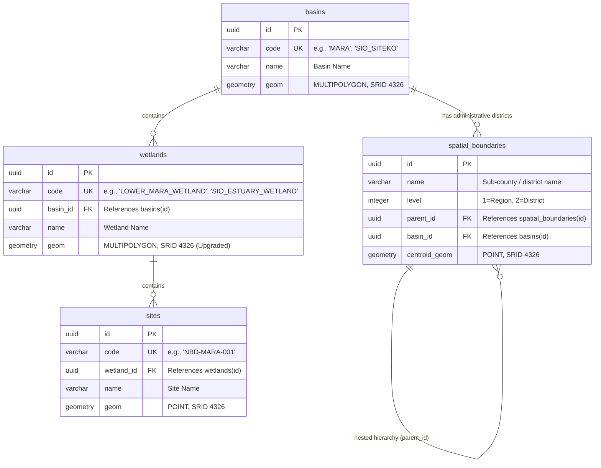

# Product Requirements Document (PRD) — Spatial GeoJSON Ingestion Pipeline

## I. Overview & Goal

### Problem Statement
The platform currently uses rough bounding boxes/rectangles for the spatial reference boundaries of our target basins and wetlands (e.g., Mara Basin, Sio-Siteko Basin). To enable high-accuracy monitoring, reporting, and map visualizations, we must replace these placeholders with the official spatial boundaries provided by the transboundary management agencies in GeoJSON format.

These files contain complex geographical shapes (`MultiPolygon` and `Polygon` geometries). We need to securely import these geometries into our Postgres/PostGIS database on startup, upgrading our existing data structure constraints where necessary to handle multi-part spatial shapes (e.g., wetlands with separate sub-regions).

### Core Metric
* **Seeding Success**: 100% of the geometries from the official GeoJSON files are successfully ingested and match the spatial boundaries.
* **Query Accuracy**: Spatial point-in-polygon queries (e.g. verifying which wetland/basin a report site belongs to) resolve with precise real-world accuracy.

---

## II. Entity-Relationship & Schema Diagram

The Layer A (Spatial Reference) tables are related hierarchically:

---

## III. Requirements (Scope Guardrails)

### Must-Have
1. **Geometry Support**:
   * Support importing `MultiPolygon` geometries directly.
   * Upgrade the `wetlands.geom` type from `POLYGON` to `MULTIPOLYGON` in the database and models to support wetlands with multi-part geometry (e.g., `sio-siteko-wetland.geojson`).
   * Support promoting single `Polygon` geometries (found in `sio-basin.geojson` and `mara-wetland.geojson`) to `MultiPolygon` inside the seeder.
2. **GeoJSON File Mapping**:
   * `mara-basin.geojson` -> geometry for Basin `"MARA"`
   * `sio-basin.geojson` -> geometry for Basin `"SIO_SITEKO"`
   * `mara-wetland.geojson` -> geometry for Wetland `"LOWER_MARA_WETLAND"`
   * `sio-siteko-wetland.geojson` -> geometry for Wetland `"SIO_ESTUARY_WETLAND"`
3. **Seeder Idempotency**:
   * Running the seeder multiple times must update the geometries of existing records instead of throwing duplicate key errors or creating duplicate rows.
4. **Coordinate System (SRID)**:
   * Enforce WGS 84 (SRID 4326) on all imported spatial geometries.

### Nice-to-Have
* Verification checks in the seeder console logs detailing the area and boundary extent of loaded shapes.

### Out of Scope
* Parsing dynamic coordinate files uploaded by admin users in the portal (only static file seeding is in scope for this feature).

---

## IV. Acceptance Criteria

### User Acceptance Criteria (UAC)
* **UAC 1**: On system startup or running the DB seed command, the correct high-fidelity spatial geometries for the Mara Basin, Sio-Siteko Basin, Lower Mara Wetland, and Sio Estuary Wetland are populated in the database.
* **UAC 2**: Existing monitoring sites and administrative boundaries remain correctly mapped to their parent basins and wetlands.

### Technical Acceptance Criteria (TAC)
* **TAC 1 (Alembic Migration)**: Provision an Alembic migration script to modify `wetlands.geom` to type `MULTIPOLYGON`.
* **TAC 2 (Seeder Helper)**: Modify `seed_spatial` function to read geometries from the 4 GeoJSON files, correctly map them to the corresponding codes, cast coordinates to `MultiPolygon` where necessary, and insert them into the database.

---

## V. Epic & Ballpark Estimation

### Component Breakdown
1. **Database Migration**: Create an Alembic migration script to alter the `wetlands.geom` column type from `POLYGON` to `MULTIPOLYGON`.
   * *Complexity*: Simple
   * *Estimate*: 1 - 2 hours
2. **SQLAlchemy Model Updates**: Modify the `Wetland` model `geom` type mapping in `backend/app/models/spatial.py`.
   * *Complexity*: Simple
   * *Estimate*: 0.5 hours
3. **Spatial Seeder Logic**: Refactor `spatial_seeder_helper.py` to parse GeoJSON files, map them to basin/wetland codes, handle Polygon-to-MultiPolygon promotion, and flush them to the database.
   * *Complexity*: Medium
   * *Estimate*: 3 - 4 hours
4. **Testing & QA**: Run existing tests and verify that the spatial bounds seeding behaves idempotently without errors.
   * *Complexity*: Simple
   * *Estimate*: 1 - 2 hours

### Summary Estimate
* **Total Estimate**: ~6 - 8 hours (~1 developer day)
* **Assumptions**:
  * The provided GeoJSON files are structurally valid and coordinates use WGS 84 (SRID 4326).
  * No external frontend changes are required for this backend-only ingestion task.

