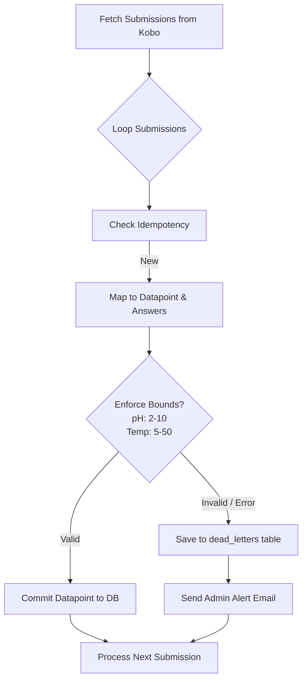

# PRD — KoboToolbox Payload Mapper & Dead-Letter Queue (DLQ)

> **Stage 2 of 3 — Documentation Hierarchy**
> Owner: PM + Design Lead | Target Location: `docs/prd/kobo_dlq_prd.md` | References: `docs/prd/kobotoolbox_integration_prd.md`, `docs/prd/dead_letter_prd.md`
> Status: `Draft`

---

## 1. Overview

**One-liner**:
Ensures high-fidelity citizen science survey ingestion from KoboToolbox with strict parameter bounds validation, schema mismatch resilience, and automatic email alerting via a Dead-Letter Queue (DLQ).

**Brief / Problem Reference**:
Complements the existing Kobo integration by adding validation constraints and error boundaries to prevent corrupt data entry while maintaining 100% data durability.

**What we are building**:
We are implementing a payload mapping validator that:
1. Validates citizen science numerical parameters (pH bounds: 2-10, Water Temperature bounds: 5-50°C).
2. Catches any schema mismatch or mapping exception during ingestion.
3. Quarantines failed submissions in the `dead_letters` database table.
4. Alerts administrators via email about the malformed payload, all without interrupting the sync engine's progress.

**Why now**:
As we begin ingesting citizen data, older versions of Kobo forms or manual input mistakes could crash the sync engine or pollute the database with invalid metrics.

---

## 2. Goals & Success Metrics

| Goal | Success Metric | Baseline | Target | Owner |
|------|---------------|----------|--------|-------|
| Database Integrity | Percentage of active records violating domain boundaries | >0% | 0% | PM/Dev |
| Sync Resilience | Synchronizations interrupted by bad submissions | >0% | 0% | PM/Dev |
| Alerting & Monitoring | Admin notification delay for malformed surveys | N/A | < 5 mins | PM/Dev |

**Anti-Goals**:
- Building an interactive admin UI for fixing and re-submitting DLQ items (v1 will only store and notify).
- Schema auto-update based on Kobo payloads.

---

## 3. Target Users & Personas

| Persona | Job-to-be-Done | Key Frustration | v1 Priority |
|---------|---------------|-----------------|-------------|
| System Administrator / Operations | Monitor data quality and fix synchronization discrepancies quickly | "Silent sync failures or bad data polluting the public charts" | Primary |

---

## 4. User Stories

| ID | User Story | Priority (MoSCoW) | FR Reference |
|----|-----------|-------------------|--------------|
| US-3B.1 | As an administrator, I want malformed submissions to be quarantined in a dead-letter queue so that we do not lose citizen contributions. | Must Have | FR-3B.2, FR-3B.3 |
| US-3B.2 | As an administrator, I want to receive email alerts when a submission fails validation so that I can immediately investigate. | Must Have | FR-3B.4 |
| US-3B.3 | As a user, I want the ingestion sync to continue processing valid records even if one submission is corrupt. | Must Have | FR-3B.1 |

---

## 5. Functional Requirements

| ID | Requirement | User Story | Priority |
|----|-------------|------------|----------|
| FR-3B.1 | **Bound Validation**: The system MUST validate incoming numeric values for designated questions (pH: 2-10 inclusive, Water Temperature: 5-50°C inclusive). | US-3B.1 | Must Have |
| FR-3B.2 | **Exception Quarantine**: Any exception during mapping or bound validation MUST quarantine the submission in the `dead_letters` table with `source_system='kobotoolbox'`. | US-3B.1 | Must Have |
| FR-3B.3 | **Graceful Ingest Progression**: A validation error in one payload MUST NOT stop the rest of the sync process. | US-3B.3 | Must Have |
| FR-3B.4 | **Automated Admin Alert**: When a payload fails ingestion, the system MUST trigger an email alert to the configured ops team email (`ADMIN_EMAIL` or similar). | US-3B.2 | Must Have |

---

## 6. Non-Functional Requirements

| Category | Requirement | Metric |
|----------|-------------|--------|
| **Reliability** | Zero loss of raw payloads on mapping/validation failures | 100% data durability in DLQ |
| **Performance** | Email sending must not block or significantly delay the main sync task | Non-blocking execution / Background tasks |
| **Security** | PII fields inside the dead letter payload must be stored securely | Standard DB access restrictions |

---

## 7. Logic Flow

---

## 8. Scope

**v1 — In Scope**:
- Bounds validation logic during sync for pH and Water Temperature.
- Catching mapping and validation errors per submission.
- Saving raw payload, source system (`'kobotoolbox'`), and error details to the `dead_letters` table.
- Email sending to all active users with the `'Admin'` role.

**v1 — Explicitly Out of Scope**:
- Re-trying or reprocessing tools from the Admin dashboard.
- Validating non-numeric field types.

---

## 9. Assumptions & Constraints

**Assumptions**:
- SMTP service (Mailpit in development, standard SMTP in production) is fully configured and functional.
- The questions `ph` and `water_temp` (or configured variable names) are map-able from Kobo submissions.

**Open Questions**:
- Should the system alert admins once per failed submission, or aggregate them? (Decision: Aggregated email at the end of the sync run listing all failed payloads and errors).
