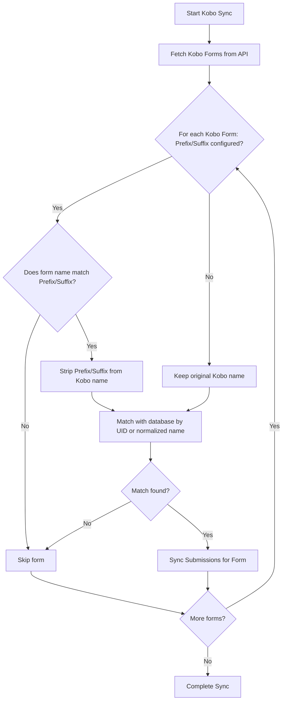

# PRD — Kobo Forms Environment Separation

## 1. Overview & Goal

- **Problem Statement**: Currently, the Kobo synchronization service queries KoboToolbox forms and matches them to the database by asset ID or form name. In multi-environment setups (production, staging, development), sync tasks on staging/dev environments can accidentally fetch, link, or process live production Kobo forms (and vice versa) if they share similar names or if the asset IDs are not isolated.
- **Goal**: Isolate Kobo form synchronization across different deployment environments so that development/test environments only synchronize with staging/test Kobo forms, and the production environment only synchronizes with production Kobo forms.
- **Core Metric**: 0% cross-contamination of Kobo submission data between production and non-production environments.

---

## 2. Requirements (Scope Guardrails)

### Must-Have

- **Environment-Specific Name Prefix/Suffix Filter**:
  - The Kobo synchronization service must support filtering Kobo forms based on an optional name prefix/suffix pattern configured via environment variables (e.g., `KOBO_FORM_NAME_SUFFIX="[TEST]"`).
- **Environment-Specific Asset ID Mappings**:
  - Provide a way to override or scope Kobo Asset IDs per environment (e.g., setting distinct Kobo UIDs in the database seeds or environment variables).
- **Graceful Skipping**:
  - Kobo forms that do not match the environment's criteria must be skipped silently without throwing errors or interrupting the sync pipeline.

### Nice-to-Have

- A debug log showing which Kobo forms were skipped due to environment prefix/suffix mismatches.

### Out of Scope

- Creating or editing Kobo forms programmatically from the backend.
- Managing multiple Kobotoolbox accounts within a single environment instance.

---

## 3. Proposed Solution & Architecture

### Environment Variable Options

We will introduce two optional environment variables in `.env`:

1. `KOBO_FORM_NAME_PREFIX`: Only sync Kobo forms whose names start with this prefix (e.g. `Dev_` or `Test_`).
2. `KOBO_FORM_NAME_SUFFIX`: Only sync Kobo forms whose names end with this suffix (e.g. ` [TEST]` or `_dev`).

If these variables are set:

- When matching forms by name, the sync service will strip the prefix/suffix before matching against `Form.name`.
- Any form on Kobo that does _not_ match the prefix/suffix criteria will be skipped.

### Mermaid Flowchart

---

## 4. Acceptance Criteria

### User Acceptance Criteria (UAC)

- **Given** the backend is configured with `KOBO_FORM_NAME_SUFFIX=" [TEST]"`,
  - **When** the Kobo sync service runs,
  - **Then** only forms on Kobo named like `Physico-Chemical Sampling [TEST]` are matched and synchronized. A form named `Physico-Chemical Sampling` (without the suffix) is skipped.

- **Given** the backend has no prefix/suffix configured,
  - **When** the Kobo sync service runs,
  - **Then** all forms are evaluated for matching as they currently are.

### Technical Acceptance Criteria (TAC)

- Prefix/suffix matching must be case-insensitive and trim surrounding whitespaces.
- The Kobo Asset ID updates (`db_form.kobo_asset_id = uid`) must only trigger if the name-matching constraints are fully satisfied.

---

## 5. Ballpark Estimation

- **Component Breakdown**:
  - **Backend Configuration**: Add environment config variables (`app/config/` and `.env.example`). (Simple, 1h)
  - **Sync Service Refactoring**: Update `_sync_kobo_submissions_core` in `kobo.py` to filter and map based on prefixes/suffixes. (Medium, 2-3h)
  - **Unit Tests**: Implement test cases with mocked Kobo API responses simulating different environment settings. (Medium, 2h)
- **Total Estimate**: ~0.5 - 1 developer day.
