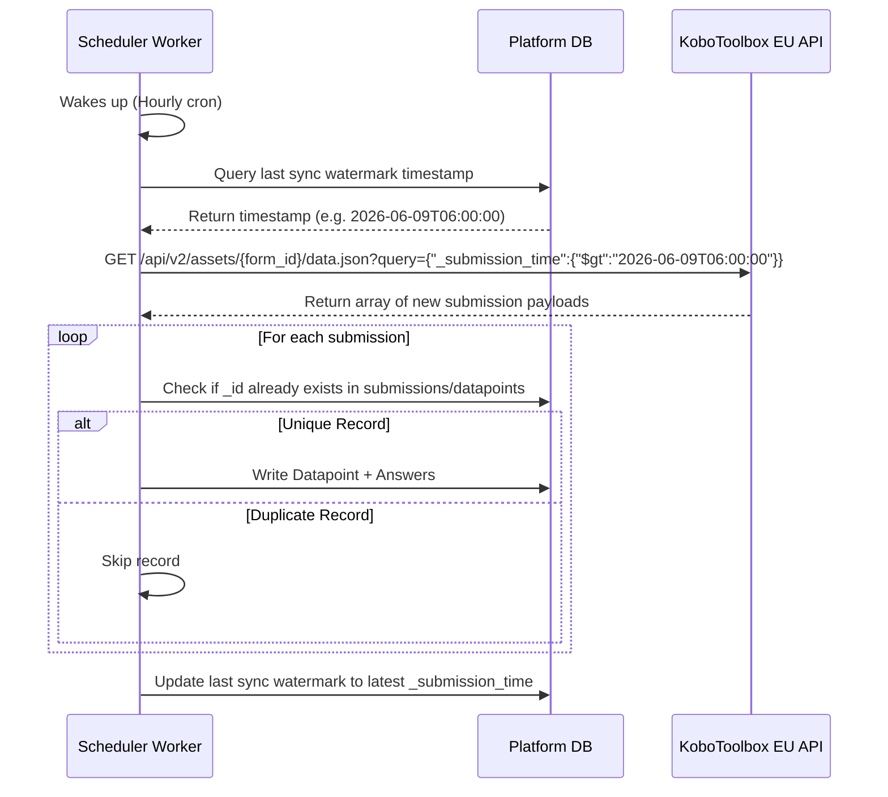

# PRD — KoboToolbox API Connector & Hourly Watermark Engine

> **Stage 2 of 3 — Documentation Hierarchy**
> Owner: PM + Engineering Lead | Target Location: `docs/prd/kobo_watermark_prd.md` | References: `docs/prd/kobotoolbox_integration_prd.md`
> Status: `Approved`

---

## I. Overview & Goal

### Problem Statement
The NBD platform requires structured citizen science environmental survey data from KoboToolbox. To ingest this data reliably without overloading the KoboToolbox server, causing race conditions, or processing duplicate records, the background worker needs a high-frequency polling mechanism configured with a precise watermark.

Instead of daily imports or generic, unbounded polls, the system must perform hourly data fetches using Kobo's advanced search query APIs, applying a cursor filter based explicitly on the `_submission_time` parameter.

### Core Metric
* **Zero Duplicate Ingestions**: 0% duplicate rates for ingested submissions.
* **Polling Efficiency**: Only pull records submitted since the last successful sync window.
* **Near Real-time Sync**: Latency between Kobo submission and NBD ingestion under 60 minutes.

---

## II. User Stories & Flows

### Personas
* **Background Ingestion Engine (System)**: Needs to wake up, check its cursor, query the Kobo API, and ingest only new surveys.
* **System Administrator**: Needs to ensure that all data is flowing and no surveys are lost or duplicated.

### UAC 3A.1 (Hourly Pull & Sync)
* Given the background worker wakes up on an hourly interval.
* When it checks the database for the last successful synchronization watermark.
* Then it queries Kobo's data API filtering for `_submission_time` greater than that watermark.
* And it stores the new records and updates the watermark to the latest timestamp found.

---

## III. Requirements (Scope Guardrails)

### Must-Have
* **FR-3A.1 (Hourly Trigger)**: The APScheduler worker wakes up every 60 minutes.
* **FR-3A.2 (Watermark Storage)**: The system persists the last sync watermark in a dedicated `sync_watermarks` database table.
* **FR-3A.3 (Watermark Query)**: The HTTP request to KoboToolbox specifies a JSON query filter: `{"_submission_time": {"$gt": "LAST_WATERMARK"}}`.
* **FR-3A.4 (Idempotency)**: The sync logic guards against duplicate ingestions by using Kobo's unique `_id` or `_uuid` as an idempotency key.
* **FR-3A.5 (API Fallback)**: If no previous watermark exists, it defaults to querying the last 60 minutes.
* **FR-3A.6 (Manual Script Trigger)**: The system MUST support running the synchronization manually from the container via a dedicated python script command.

### Nice-to-Have (v2)
* Support manual trigger of sync window via admin panel.
* Dynamic retry with exponential backoff for transient Kobo API timeouts (504 Gateway Timeout).

### Out of Scope
* Automatic schema evolution of Kobo forms.
* Mapping values to different field types (handled by separate parser service).

---

## IV. Architecture Design

### Data Flow / Logic Flow

---

## V. Acceptance Criteria

### UAC 3A.1
* Given a citizen scientist submits a survey on KoboCollect.
* When the background task executes at its scheduled 60-minute mark.
* Then the survey is retrieved from Kobo, parsed, and successfully persisted.
* And subsequent executions do not re-ingest the same survey.

### TAC 3A.1
* The HTTP request to Kobo EU API MUST include a `query` parameter matching Kobo's MongoDB-style query specification (e.g., `{"_submission_time": {"$gt": "..."}}`).
* The database updates the watermark state within the same transaction as the ingested records.

---

## VI. Edge Cases & Errors

| Scenario | Behavior |
|---|---|
| Kobo API is down / returns 5xx | Catch exception, log warning, do NOT update the watermark. Retry on the next hourly run. |
| No submissions in the interval | Successfully complete execution, leave watermark unchanged. |
| System restarts | Watermark is read from persistent storage (DB settings or latest submission); no data gap or duplication occurs. |

---

## VII. Epic & Ballpark Estimation

### Component Breakdown

* **Watermark Persistence & Query Logic**: Simple | 2h
* **Scheduler cron job hook (60 mins)**: Simple | 1h
* **Mocked integration tests for cursor queries**: Medium | 2h

**Total Estimate**: **~5 hours**
