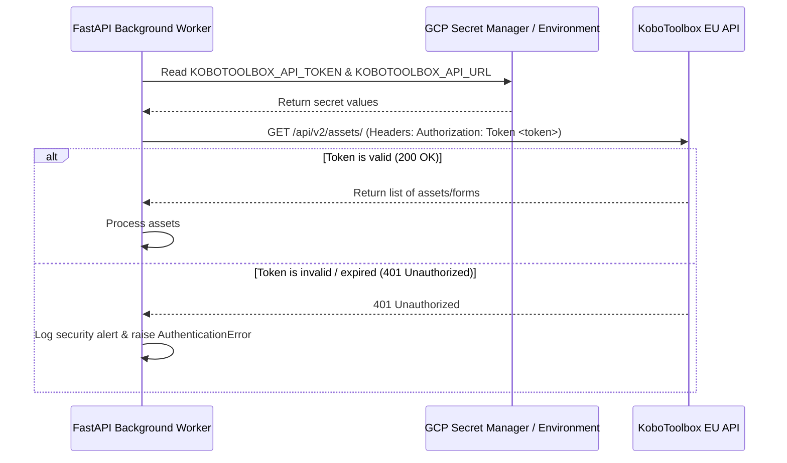

# PRD — KoboToolbox Cloud Infrastructure & Authentication Integration

> **Stage 2 of 3 — Documentation Hierarchy**
> Owner: PM + DevOps Lead | Target Location: `docs/prd/kobotoolbox_integration_prd.md` | References: `docs/product_brief.md`
> Status: `Approved`
> Sign-off: Engineering Lead: _[Name, Date]_ | Design Lead: _[Name, Date]_

---

## 1. Overview

**One-liner**:
Securely provision the NBD project workspace on the KoboToolbox EU public cloud and integrate persistent token-based authentication into the FastAPI background worker.

**Brief / Problem Reference**:
`docs/product_brief.md`

**What we are building** (What):
A secure authentication bridge between our FastAPI backend background worker and the KoboToolbox EU public cloud instance (`https://eu.kobotoolbox.org`). This involves registering the workspace, generating a persistent API access token, storing this token in GCP Secret Manager, and updating the Docker Compose and FastAPI worker configuration to securely inject and use this credential to authenticate all data pulls.

**Why now** (Strategic context):
The NBD platform depends on structured environmental sampling data uploaded by citizen scientists using KoboCollect. To automate data ingestion and moderation workflows, the backend must poll KoboToolbox periodically. This integration is the baseline requirement to enable secure, unblocked communication between our ingestion pipelines and the KoboToolbox data repository without risking credential exposure.

---

## 2. Goals & Success Metrics

| Goal | Success Metric | Baseline | Target | Owner |
|------|---------------|----------|--------|-------|
| Prevent unauthorized repository access | API endpoint authentication error rate for polling | N/A | 0% (Zero 401 Unauthorised errors on correct config) | DevOps |
| Zero hardcoded secrets in source control | Static analysis secrets detection rate | 0 secrets in repo | 0 secrets in repo (Verified via git audits) | DevOps |
| Seamless integration with EU servers | Polling connection establishment time | N/A | < 1000ms per request | Dev |

**Anti-Goals**:
- Implementing the detailed parsing, transformation, or mapping logic for specific forms (this is handled in separate feature-specific data pipelines).
- Custom database schema modifications for the ingested records.
- Creating frontend visualization interfaces for KoboToolbox forms.

---

## 3. Target Users & Personas

| Persona | Job-to-be-Done | Key Frustration | v1 Priority |
|---------|---------------|-----------------|-------------|
| DevOps Engineer / Platform Admin | Safely provision the cloud accounts, configure access tokens, and inject secrets without violating security policies. | Credential leaks, complex manual bootstrap steps. | Primary |
| Backend Developer | Write background task handlers that poll external APIs securely using standard environment variables. | Hardcoded configurations, lack of clear documentation on test vs production tokens. | Secondary |

---

## 4. User Stories

| ID | User Story | Priority (MoSCoW) | FR Reference |
|----|-----------|-------------------|--------------|
| US-001 | As a **Platform Administrator**, I want to register a dedicated project account on the KoboToolbox EU server so that our data is physically resident in the EU region. | Must Have | FR-001 |
| US-002 | As a **DevOps Engineer**, I want to generate a persistent read-only API token for the workspace so that the background worker has the minimum necessary privileges to read form submissions. | Must Have | FR-002 |
| US-003 | As a **Security Architect**, I want to store the API token in GCP Secret Manager and mount it dynamically into the FastAPI container so that the secret is never hardcoded in git. | Must Have | FR-003 |
| US-004 | As a **Backend Developer**, I want the background worker to use this secret token to authenticate requests to the KoboToolbox API, ensuring the system can fetch submissions without authentication errors. | Must Have | FR-004, FR-005 |

---

## 5. Functional Requirements

| ID | Requirement | User Story | Priority |
|----|-------------|------------|----------|
| FR-001 | The workspace MUST be registered on the KoboToolbox European Union public cloud server (`https://eu.kobotoolbox.org`). | US-001 | Must Have |
| FR-002 | A dedicated, read-only API token MUST be generated from the registered account's account settings interface. | US-002 | Must Have |
| FR-003 | The API token MUST be stored under a secret named `kobotoolbox_api_token` in GCP Secret Manager (or simulated via local environment configuration `.env` file). | US-003 | Must Have |
| FR-004 | The FastAPI background worker container configuration MUST load `KOBOTOOLBOX_API_TOKEN` and `KOBOTOOLBOX_API_URL` from the environment. | US-003, US-004 | Must Have |
| FR-005 | The background worker's scheduled pull function MUST include the API token in the `Authorization: Token <token>` header on all requests to `https://eu.kobotoolbox.org/api/v2/`. | US-004 | Must Have |

---

## 6. Non-Functional Requirements

| Category | Requirement | Metric |
|----------|-------------|--------|
| **Security** | API tokens must not be logged or exposed in stack traces | 100% compliance |
| **Security** | Secrets must be kept outside git repository boundaries | Verified via `.gitignore` and pre-commit checks |
| **Performance** | Authentication headers must be cached in-memory per worker execution run | No redundant token regeneration calls |
| **Reliability** | The background worker must handle connection timeouts gracefully and retry on 5xx errors | Exponential backoff up to 3 retries |

---

## 7. User Flows & Wireframes

### Primary Authentication Flow

---

## 8. Scope

**v1 — In Scope**:
- Creating accounts and obtaining the token on `https://eu.kobotoolbox.org`.
- GCP Secret Manager / local `.env` setup instructions.
- Integrating authentication header creation logic in FastAPI worker (`app/scheduler.py`).
- Integration tests demonstrating successful token injection and simulated API calls.

**v1 — Explicitly Out of Scope**:
- Designing user-facing web pages to manage KoboToolbox credentials.
- Automating account registration on KoboToolbox (this is a one-time manual administrative task).
- Full parsing pipelines for all four monitoring forms.

---

## 9. Assumptions & Constraints

**Assumptions**:
- The KoboToolbox EU public tier remains free or fits within budget limits.
- DevOps team has appropriate permissions in the GCP project to create secrets in Secret Manager.

**Open Questions**:
- Do we need to set up a fallback URL in case the EU server encounters downtime? (Out of scope for v1, standard monitoring alerts should suffice).
- Is there an ip-whitelisting mechanism on KoboToolbox that we need to configure for our FastAPI worker IP? (Currently public cloud tier does not enforce ip-whitelisting by default for token access).

---

## 10. Change Log

| Version | Date | Author | Changes |
|---------|------|--------|---------|
| 0.1 | 2026-06-03 | DevOps / Platform Admin | Initial draft of planning requirements. |

---

## 11. Epic & Ballpark Estimation

### Component Breakdown & Complexity Assessment

| Component | Task Description | Complexity | Ballpark Estimate (Dev-Days) |
|-----------|------------------|------------|------------------------------|
| **Infrastructure** | Register EU KoboToolbox workspace, generate read-only token | Simple | 0.5 Day |
| **Secrets Management** | Provision token in GCP Secret Manager, configure access rights | Simple | 0.5 Day |
| **Backend Integration** | Update FastAPI background worker configuration and scheduler logic (`app/scheduler.py`) to inject and utilize token | Medium | 1.0 Day |
| **QA / Integration Tests**| Develop automated mock integration test suite for worker polling | Simple | 0.5 Day |

### Key Assumptions & Dependencies
- Free-tier KoboToolbox EU public cloud account limits are sufficient for v1 polling frequencies.
- Dev team has active GCP administrator/editor credentials to create secrets.

---

## Exit Criterion

> [!IMPORTANT]
> This PRD MUST be signed off by both the Engineering Lead and Design Lead before LLD begins. No tickets may be created until this is complete.

**Sign-off Checklist**:
- [ ] All functional requirements are testable and unambiguous
- [ ] All user stories have acceptance criteria (at story level)
- [ ] Engineering Lead has reviewed feasibility
- [ ] Design Lead has reviewed user flows and wireframes
- [ ] Open questions from Brief are resolved or tracked
- [ ] Scope boundary is agreed upon by all leads

