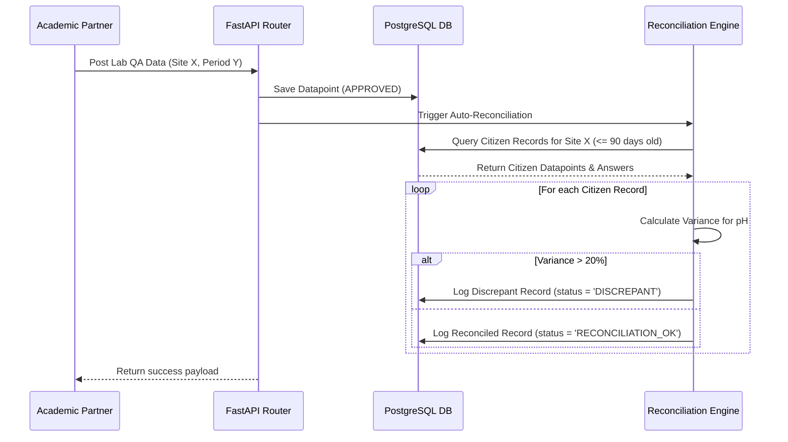

# PRD — Lab QA Auto-Reconciliation Engine (Data Validation)

> **Stage 2 of 3 — Documentation Hierarchy**
> Owner: John (PM) | Target Location: `docs/prd/lab_qa_auto_reconciliation_prd.md` | References: `docs/prd/webforms_ingestion_prd.md`, `docs/prd/dynamic_datapoints_prd.md`
> Status: `Under Review`

---

## 1. Overview & Goal

**Problem Statement**:
Citizen scientists perform field measurements (such as pH, Temperature, and Dissolved Oxygen) using low-cost portable test kits. Over time, physical kits can degrade, or citizen scientists can introduce systematic human errors. We have no automated feedback loop to verify the quality of their data.

**Solution**:
Implement a background reconciliation engine that triggers when a Lab QA report (submitted by academic partners using professional laboratory equipment) is approved. The engine matches the lab results with historical citizen scientist data submitted for the same site within a 90-day window. It compares key chemical parameters (like pH) and, if the variance exceeds a configurable threshold, flags the corresponding citizen scientist as needing retraining.

---

## 2. 5W1H Analysis

* **Who**:
  - **Academic Lab Partners** (e.g., Makerere University): Provide professional control data (Lab QA).
  - **Citizen Scientists**: Collect field readings (Sampling Records).
  - **Admin / Trainers**: View citizen profiles flagged for retraining.
* **What**: Auto-Reconciliation engine that runs variance checks on overlapping parameters (pH, Temperature, Dissolved Oxygen) between Lab QA and Sampling Records.
* **Where**:
  - Backend: A new service module `app/services/reconciliation.py` and database schema additions.
* **When**: Triggers asynchronously when a Lab QA report transitions to or is created in `APPROVED` status.
* **Why**: Automated data quality assurance without manual audit overhead, helping identify malfunctioning field kits or training gaps.
* **How**:
  1. For each incoming approved Lab QA datapoint, find the corresponding `site_id` and `created_at` timestamp.
  2. Query database for Citizen Scientist `SamplingRecord`s (or `Datapoint`s) submitted for the same `site_id` within a 90-day window (3 months).
  3. Compare parameters:
     - pH
     - Temperature (if available)
     - Dissolved Oxygen (if available)
  4. Calculate variance:
     $$\text{Variance \%} = \frac{|\text{Citizen Value} - \text{Lab Value}|}{\text{Lab Value}} \times 100$$
  5. If the variance of any parameter exceeds the configured threshold (default: `20%`):
     - Toggle `needs_retraining = True` on the `Citizen` profile associated with the sampling record.
     - Log a reconciliation audit record.

---

## 3. Requirements (Scope Guardrails)

### Must-Have
- **Database Schema Updates**:
  - Create a `reconciliation_log` table storing details of comparison (citizen_id, citizen_datapoint_id, lab_datapoint_id, parameter_name, citizen_value, lab_value, calculated_variance, status, and reconciled_at).
- **Dynamic User Flag**:
  - Add a hybrid property/dynamic resolver in the `Citizen`/`User` model to calculate `needs_retraining` on the fly based on the existence of any active `'DISCREPANT'` logs in `reconciliation_log` for that user. No database column is added to the user table.
- **Trigger Pipeline**:
  - Hook into Lab QA submission approval. When `submit_lab_qa` creates an approved datapoint, invoke the reconciliation engine.
- **Reconciliation Engine**:
  - Match lab results with citizen sampling records at the same `site_id` within a 90-day window (historical matching).
  - Safely handle division by zero (e.g. if lab value is `0` or null).
  - Log comparison records in `reconciliation_log`.
- **Configurability**:
  - Add configuration setting `RECONCILIATION_VARIANCE_THRESHOLD = 20.0` (as percentage) to environment variables / config.

### Nice-to-Have
- Admin endpoint or dashboard tab displaying flagged citizen scientists and their specific reconciliation variance audit trail.
- Email alert sent to trainers when a citizen scientist is flagged.

### Out of Scope
- Automatic correction or deletion of anomalous citizen data.
- Multi-parameter statistical regression analysis.

---

## 4. Architecture Design

### Data Flow / Logic Flow

---

## 5. Acceptance Criteria

### User Acceptance Criteria (UAC)
- **UAC-1**: When Makerere University submits a Lab QA report for Site A with `pH = 7.0`, and citizen John Doe submitted a sampling record for Site A 45 days ago with `pH = 9.0`, John Doe's profile is dynamically resolved as needing retraining (`needs_retraining = true`).
- **UAC-2**: If the citizen's pH reading was `7.5` (within 20% variance of `7.0`), John Doe's profile `needs_retraining` remains `false`.
- **UAC-3**: Historical records older than 90 days are excluded from reconciliation checks.

### Technical Acceptance Criteria (TAC)
- **TAC-1**: The database migration creates the `reconciliation_log` table with indices on `citizen_id` and status.
- **TAC-2**: Implement reconciliation query matching `site_id` and timestamp delta `abs(lab.created_at - citizen.created_at) <= 90 days`.
- **TAC-3**: The variance calculation handles potential division by zero errors by skipping comparison if the lab value is `0`.
- **TAC-4**: The `Citizen` schema/model dynamically evaluates `needs_retraining` via an optimized subquery on the `reconciliation_log` table.

---

## 6. Epic & Ballpark Estimation

### Component Breakdown & Estimates

1. **DB Migration & Model Update**:
   - Add `needs_retraining` to Citizen model and create `ReconciliationLog` model/migration.
   - *Complexity*: Simple | *Ballpark Estimate*: 2 hours
2. **Reconciliation Service Implementation**:
   - Write the engine comparing parameters and marking flags.
   - *Complexity*: Medium | *Ballpark Estimate*: 6 hours
3. **Internal Router Integration**:
   - Call reconciliation task when Lab QA reports are ingested.
   - *Complexity*: Simple | *Ballpark Estimate*: 2 hours
4. **Unit & Integration Testing**:
   - Write unit tests covering exact matches, out-of-range dates, zero division, and threshold triggers.
   - *Complexity*: Medium | *Ballpark Estimate*: 4 hours

**Total Ballpark Estimate**: **~14 developer hours** (approx. 2 developer days)
