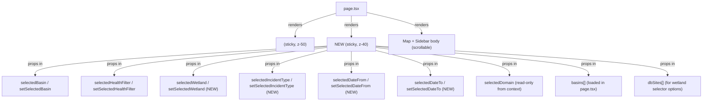

# PRD — Map Filter Bar Component

* **Stage 2 of 3 — Documentation Hierarchy**
* **Initiative**: Map Filter Bar — Fixed Sub-Header Filter Component
* **Owner**: John (Product Manager) & Sally (UX Designer)
* **Status**: Draft — Pending Approval
* **Related Docs**:
  - [Domain Selector & Dashboard PRD](./domain_selector_dashboard_prd.md)
  - [Pollution Choropleth PRD](./pollution_choropleth_prd.md)

---

## I. Overview & Goal

### Problem Statement

All map filters (basin selector, domain selector, health/severity toggle, search input) are currently embedded deep inside a collapsible left sidebar panel in `page.tsx`. This creates three problems:

1. **Discoverability**: Filters are hidden below the fold on mobile and behind a collapsed panel — users can't see what filters are active.
2. **Accessibility**: The search input is being removed (as requested), and the domain selector is moving to the header; the remaining filters need a permanent, visible home.
3. **Cluttered sidebar**: The sidebar's primary purpose is the data list (sites/incidents). Mixing filters in the same panel creates cognitive load and reduces list visible area.

**Request**: Extract all map filters into an independent `MapFilter` component rendered as a **fixed sub-header bar** directly below `SiteHeader`. The filter bar is **domain-aware** (different filters for Wetland vs. Pollution domains), **responsive** (horizontal row on desktop, collapsible on mobile), and **sticky** (remains visible during scroll alongside the site header).

### Core Metric

- **Before**: Filters are buried in a collapsible sidebar — zero visibility on page load on mobile.
- **After**: 100% of users see their active filter state at all times regardless of sidebar state, screen size, or scroll position.

---

## II. 5W1H Analysis

| Dimension | Details |
|---|---|
| **Who** | All public portal users on both mobile and desktop |
| **What** | A new `MapFilter` component — a fixed sub-header bar with domain-aware filter controls: basin selector, domain-specific filters (wetland status / pollution incident type + date range). Search input is removed entirely. |
| **Where** | `src/components/ui/map-filter.tsx` (new), rendered in `src/app/page.tsx` between `<SiteHeader>` and the map/sidebar body; state lifted to `page.tsx` via props/callbacks |
| **When** | Always visible on the portal page (`/`). Activated on every page load. Filters fire on change (no submit button needed). |
| **Why** | The sidebar is becoming purely a data list. Filters should live in a persistent, always-visible control area. Removing search simplifies the UX and focuses the filter set on what's most useful for map-based decision-making. |
| **How** | On desktop: filters render horizontally in a single row. On mobile: basin selector shown by default; remaining filters hidden behind a "More filters" chevron toggle (collapsible). The entire row sticks below the site header using `sticky` CSS. |

---

## III. User Stories & Flows

### Personas

- **Mobile field reporter**: Arrives on the portal on a phone. Sees the basin selector immediately — can switch to SIO or MARA in one tap. Can expand remaining filters with one more tap.
- **Desktop decision-maker**: Sees all filters in a horizontal bar at a glance — basin, wetland/site status, or date range for pollution. Changes instantly update the map.

### User Flows

#### Flow A — Desktop, Wetland Domain (Default)
```
Page loads → MapFilter bar appears below SiteHeader (sticky)
Wetland domain active → bar shows:
  [Basin: MARA ▾]  [Wetland: All ▾]  [Status: All | Critical | At Risk | Healthy]
User changes basin → map recentres, choropleth/markers update
User selects "Critical" → site list + map markers filter to health class D/E only
```

#### Flow B — Desktop, Pollution Domain
```
User selects "Pollution Reports" from domain dropdown (in SiteHeader)
→ MapFilter bar swaps to pollution controls:
  [Basin: MARA ▾]  [Incident Type: All ▾]  [From: ----]  [To: ----]
User picks "Fish or animal kills" from Incident Type → incident list + choropleth filter
User picks date range → further filters by incident.created_at
```

#### Flow C — Mobile, Default Load
```
Page loads → MapFilter bar shows only:
  [Basin: MARA ▾]  [⊕ More filters]
User taps "More filters" chevron → collapsible panel drops below:
  (Wetland domain) Wetland selector + Status toggle
  (Pollution domain) Incident Type dropdown + Date From/To inputs
```

#### Flow D — Domain Switch Clears Filters
```
User is in Pollution domain with "Fish or animal kills" filter active
→ Switches to Wetland domain (header dropdown)
→ MapFilter resets all domain-specific filters to "All" / empty
→ Basin selector value is preserved
```

---

## IV. Scope Guardrails

### Must-Have

1. **New `MapFilter` component** at `src/components/ui/map-filter.tsx` — self-contained, no inline JSX in `page.tsx`.
2. **Position**: Rendered in `page.tsx` directly between `<SiteHeader>` and the map+sidebar body. Both `SiteHeader` and `MapFilter` must be **sticky** (scroll doesn't hide them).
3. **Fixed/Sticky Behaviour**: The combined `SiteHeader` (h-16) + `MapFilter` bar sticks to the top of the viewport at all times. Page content scrolls beneath.
4. **Remove Search Input**: The `<Input>` search field in `page.tsx` L482–488 is removed entirely. The `searchQuery` state and its filtering logic in `filteredSites` (L270–276) are also removed.
5. **Remove DomainSelector from sidebar**: The `<DomainSelector>` at L443–446 in `page.tsx` is removed (it moves to the SiteHeader as part of Feedback #1). This PRD does not implement that — only removes the sidebar stub.

#### Wetland Domain Filters (Must-Have)
6. **Basin Selector** — same `<Dropdown>` component, driven by `basins` API data. Controlled by `selectedBasin`.
7. **Wetland Selector** — dropdown: `All Wetlands` (default) + individual wetland site names. Controlled by new `selectedWetland` state. Filters the site list to a single site when chosen.
8. **Site Status Toggle** — horizontal pill toggle: `All | Critical | At Risk | Healthy`. Controlled by `selectedHealthFilter`. (Same logic as existing; just moved.)

#### Pollution Domain Filters (Must-Have)
9. **Basin Selector** — same as #6.
10. **Incident Type Dropdown** — options derived from the `incident_type` question options (static list from form seed):

    | Value | Label |
    |---|---|
    | `` (empty) | All types |
    | `1` | Water colour (darker/murkier) |
    | `2` | Smell (bad odour) |
    | `3` | Fish or animal kills |
    | `4` | Storm event |
    | `5` | High water level |
    | `6` | Low water level |

    Controlled by new `selectedIncidentType` state (`""` = All).

11. **Date Range Filter** — two date `<input type="date">` fields: From / To. Controlled by `selectedDateFrom` and `selectedDateTo` (`""` = no filter). Filters incidents where `incident.created_at` falls within the range (inclusive).

#### Mobile Behaviour (Must-Have)
12. **Basin selector always visible** on mobile — never hidden in the collapsible section.
13. **"More filters" toggle** — a chevron button that expands/collapses the domain-specific filters on mobile.
14. **Default collapsed** — the "More filters" section is collapsed on mobile on page load and on domain switch.

#### Responsive Layout (Must-Have)
15. **Desktop** (`md:` breakpoint and above): all filters in a single horizontal row, space-x gap between them.
16. **Mobile** (below `md:`): basin selector + chevron button in the top row; domain-specific filters in a collapsible section below.

### Nice-to-Have (Deferred)
- Active filter count badge on the "More filters" button (e.g., "Filters (2)").
- "Clear all filters" button that resets all domain-specific filters.
- Animated smooth expand/collapse on mobile filter panel.

### Out of Scope
- Persisting filter state to URL query params or localStorage.
- Any filter applied on the Wetland choropleth (that feature does not exist; wetland uses markers).
- Backend filtering — all filtering is client-side.
- Removing the basin selector from the sidebar (it's already being removed as part of this PRD; the sidebar only shows the data list after this work).
- Any change to `SiteHeader` itself (handled separately in Domain Selector Feedback #1).
- Changing the `<MapLegend>` component.

---

## V. Architecture & Data Flow

### Component Structure



### State Changes in `page.tsx`

| State Variable | Change | Notes |
|---|---|---|
| `selectedBasin` | Keep — passed to MapFilter | unchanged |
| `selectedHealthFilter` | Keep — passed to MapFilter | unchanged |
| `searchQuery` | **Remove** | search input eliminated |
| `selectedWetland` | **Add** `useState("")` | `""` = all wetlands |
| `selectedIncidentType` | **Add** `useState("")` | `""` = all types |
| `selectedDateFrom` | **Add** `useState("")` | `""` = no start filter |
| `selectedDateTo` | **Add** `useState("")` | `""` = no end filter |

### Filter Logic Changes in `page.tsx`

#### `filteredSites` (Wetland domain)
- **Remove** search query filter block (L270–276).
- **Add** wetland filter: if `selectedWetland !== ""`, keep only `site.id === selectedWetland` (or `site.code === selectedWetland`).

#### `filteredIncidents` (Pollution domain)
- **Add** incident type filter: if `selectedIncidentType !== ""`, keep only incidents where `answers.find(a => a.name === "incident_type")?.options?.[0] === selectedIncidentType`.
- **Add** date range filter: if `selectedDateFrom !== ""`, keep incidents with `new Date(incident.created_at) >= new Date(selectedDateFrom)`; if `selectedDateTo !== ""`, keep incidents with date `<= end of selectedDateTo`.

### Sticky Layout Strategy

```
┌──────────────────────────────────────┐  ← sticky top-0 z-50 (h-16)
│             SiteHeader               │
├──────────────────────────────────────┤  ← sticky top-16 z-40
│             MapFilter bar            │
├──────────────────────────────────────┤
│   Map (absolute fill)  │  Sidebar   │  ← scrolls if needed
│                        │  list      │
└──────────────────────────────────────┘
```

The `<main>` element uses `flex flex-col`. `SiteHeader` is `sticky top-0 z-50 shrink-0`. `MapFilter` is `sticky top-16 z-40 shrink-0`. The map+sidebar body is `flex-1 overflow-hidden`.

### MapFilter Props Interface

```ts
interface MapFilterProps {
  // Domain (read from context or passed as prop)
  domain: MonitoringDomain;
  // Basin
  basins: { value: string; label: string }[];
  selectedBasin: string;
  onBasinChange: (val: string) => void;
  // Wetland (Wetland domain only)
  wetlandOptions: { value: string; label: string }[]; // derived from dbSites
  selectedWetland: string;
  onWetlandChange: (val: string) => void;
  // Site status (Wetland domain only)
  selectedHealthFilter: string;
  onHealthFilterChange: (val: string) => void;
  // Incident type (Pollution domain only)
  selectedIncidentType: string;
  onIncidentTypeChange: (val: string) => void;
  // Date range (Pollution domain only)
  selectedDateFrom: string;
  onDateFromChange: (val: string) => void;
  selectedDateTo: string;
  onDateToChange: (val: string) => void;
}
```

---

## VI. Acceptance Criteria

### User Acceptance Criteria (UAC)

- **UAC-1 (Sticky Bar)**: The MapFilter bar stays visible at all times during page scroll, positioned directly below `SiteHeader`.
- **UAC-2 (Wetland Filters)**: When Wetland domain is active, the filter bar shows: Basin selector, Wetland selector dropdown, Status pill toggle (All | Critical | At Risk | Healthy).
- **UAC-3 (Pollution Filters)**: When Pollution domain is active, the filter bar shows: Basin selector, Incident Type dropdown (6 options + All), Date From input, Date To input.
- **UAC-4 (Basin Selector)**: Changing the basin updates the map view and filters the data accordingly.
- **UAC-5 (Wetland Selector)**: Selecting a specific wetland filters the site list to that site only. Selecting "All Wetlands" restores the full filtered list.
- **UAC-6 (Incident Type Filter)**: Selecting an incident type filters the incident list and choropleth counts to only that incident type. Selecting "All types" restores all.
- **UAC-7 (Date Range Filter)**: Setting Date From and/or Date To filters incidents by `created_at`. Partial dates (only From or only To) are valid.
- **UAC-8 (Domain Switch Resets)**: Switching domain clears all domain-specific filters (wetland/incident type/date range). Basin is preserved.
- **UAC-9 (Mobile — Basin Always Visible)**: On mobile screens, the Basin selector is always shown in the filter bar without needing to expand.
- **UAC-10 (Mobile — Collapsible)**: On mobile, domain-specific filters are hidden by default behind a "More filters" toggle. Tapping it expands them.
- **UAC-11 (Desktop — Horizontal)**: On desktop (≥ md breakpoint), all filters appear in a single horizontal row.
- **UAC-12 (No Search Input)**: The search text input is removed from the portal entirely. No search functionality exists anywhere on the page.
- **UAC-13 (Sidebar Clean)**: The sidebar no longer contains DomainSelector, basin dropdown, status toggles, or search input — only the site/incident list.

### Technical Acceptance Criteria (TAC)

- **TAC-1**: `MapFilter` is a standalone client component in `src/components/ui/map-filter.tsx` with typed props. No inline filter logic in `page.tsx`.
- **TAC-2**: `searchQuery` state and its filter logic (`filteredSites` search block) are fully removed from `page.tsx`.
- **TAC-3**: New state variables (`selectedWetland`, `selectedIncidentType`, `selectedDateFrom`, `selectedDateTo`) are typed: `string`, default `""`.
- **TAC-4**: `MapFilter` renders as `sticky top-16 z-40` in the page layout.
- **TAC-5**: The existing `<Dropdown>` component is reused for Basin and Incident Type; no new dropdown primitive needed.
- **TAC-6**: Date range inputs use native `<input type="date">` for minimal bundle impact (YAGNI — no date-picker library).
- **TAC-7**: Domain switch triggers `setSelectedWetland("")`, `setSelectedIncidentType("")`, `setSelectedDateFrom("")`, `setSelectedDateTo("")` in `handleDomainChange`.
- **TAC-8**: All existing `__tests__/` pass. New tests added for `MapFilter` component.
- **TAC-9**: `wetlandOptions` are derived from `dbSites` in `page.tsx` as `[{ value: site.code, label: site.name }, ...]` — no new API call. Since `dbSites` is already fetched with `getSites({ basin: selectedBasin })`, the wetland options are **automatically scoped to the active basin** with no additional filtering logic. When the basin changes and `dbSites` reloads, the wetland selector options update automatically, and `selectedWetland` resets to `""` (handled in `onBasinChange`).
- **TAC-10**: Incident type options are a **static constant** in `map-filter.tsx` (not fetched from API) — matches the 6 options in the form seed exactly.

---

## VII. Edge Cases & Errors

| Case | Behaviour |
|---|---|
| `basins` API returns empty | Basin selector shows empty dropdown; no crash |
| `dbSites` is empty (loading) | Wetland selector shows "All Wetlands" only |
| Date From > Date To | No validation error shown — just returns 0 results naturally |
| Domain switch with date filter active | Date filters cleared; no stale filtered state |
| User resizes from mobile to desktop | Filter bar switches layout; collapsed state does not persist |
| No incidents match date + type filters | Pollution list shows empty state; map shows grey choropleth |
| `selectedWetland` site is removed from API response | Filter resets to "All Wetlands" (stale value yields 0 results, functionally equivalent) |

---

## VIII. Visual Design Specification

### Desktop Layout (≥ md breakpoint)

```
[Basin: MARA ▾] | [Wetland: All ▾] | [All] [Critical] [At Risk] [Healthy]
                                      ← Wetland domain ─────────────────►

[Basin: MARA ▾] | [Type: All types ▾] | [From: date] [To: date]
                                         ← Pollution domain ────────────►
```

### Mobile Layout (< md breakpoint)

**Collapsed:**
```
[Basin: MARA ▾]                        [⊕ More filters (2)]
```

**Expanded:**
```
[Basin: MARA ▾]                        [⊕ More filters (2)]
─────────────────────────────────────────────────────────────
[Wetland: All ▾]
[All] [Critical] [At Risk] [Healthy]
```

### Styling

- Container: `bg-white border-b border-slate-100 px-4 py-2 shadow-sm`
- Desktop row: `flex items-center gap-3 flex-wrap`
- Mobile toggle button: `flex items-center gap-1 text-xs text-slate-500 font-medium`
- Status pills: reuse existing `bg-slate-100 p-1 rounded-lg` pattern
- Date inputs: `border border-slate-200 rounded-md px-2 py-1 text-sm text-slate-700 bg-slate-50`
- Separator between groups: `hidden md:block w-px h-5 bg-slate-200`

---

## IX. Epic & Ballpark Estimation

| Component | Complexity | Estimate |
|---|---|---|
| `MapFilter` component (desktop layout, both domains) | Medium | 2.5 h |
| Mobile collapsible behaviour + "More filters" toggle | Medium | 1.5 h |
| New state: `selectedWetland`, `selectedIncidentType`, `selectedDateFrom`, `selectedDateTo` in `page.tsx` | Simple | 0.5 h |
| `filteredSites` wetland filter logic | Simple | 0.5 h |
| `filteredIncidents` incident type + date range filter logic | Simple | 1 h |
| Remove search input + `searchQuery` state | Simple | 0.25 h |
| Remove sidebar DomainSelector + basin + status filters | Simple | 0.25 h |
| Sticky layout wiring (`top-16 z-40`) | Simple | 0.25 h |
| Unit tests (`MapFilter` renders correct filters per domain, filter callbacks fire) | Medium | 1.5 h |
| QA (both domains, mobile + desktop, sticky scroll test) | Simple | 1 h |
| **Total** | | **~9.25 hours / ~1.5 Story Points** |

### Assumptions

- The `<Dropdown>` component at `src/components/ui/dropdown.tsx` is reusable as-is for Basin and Incident Type selectors.
- Native `<input type="date">` is sufficient for date filtering (no third-party date picker library).
- The `SiteHeader` is already `sticky top-0 z-50 h-16` — the `MapFilter` sits at `sticky top-16 z-40` without any layout changes to `SiteHeader`.
- Wetland sites for the Wetland selector are sourced from `dbSites` already loaded in `page.tsx` — no additional API call.
- Incident type options are static (6 options from the form seed) and do not need an API call to enumerate.
- `handleDomainChange` in `page.tsx` is extended to reset all new filter states.
- The sidebar filter section (L441–489 in `page.tsx`) is removed entirely; the sidebar starts directly at the site/incident list.
