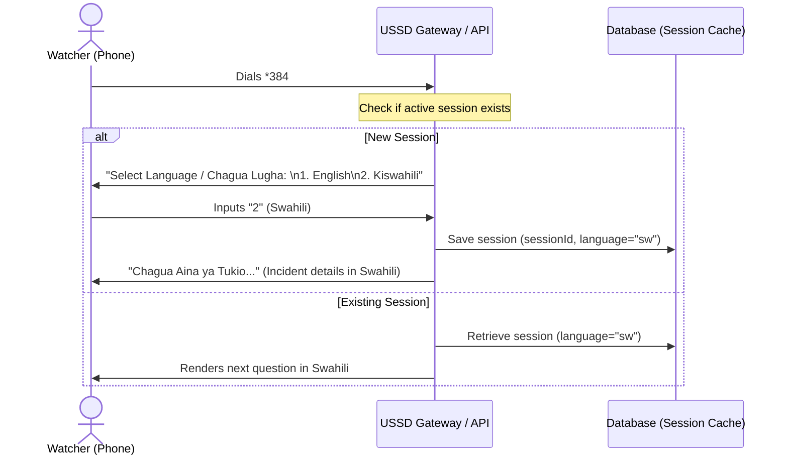

# Product Requirements Document (PRD) — Multilingual Questionnaire Support (Swahili & English)

## I. Overview & Goal

### Problem Statement
The NBD platform collects citizen science data across Kenya, Uganda, and Tanzania. Currently, all questionnaires (USSD menus, WhatsApp chat trees, and KoboToolbox web/mobile forms) are hardcoded in English. This creates a barrier to entry for local observers and watchers whose primary or preferred language is Swahili (Kiswahili), reducing engagement and data quality.

### Core Metric
*   **Target**: Increase citizen science participation in Swahili-speaking regions by 30% within 3 months of launch.
*   **Quality**: Reduce invalid/empty submissions from Swahili-majority regions by 15% due to improved comprehension.

---

## II. User Stories & Flows

### User Personas
*   **Alice (Citizen Scientist / Watcher)**: Speaks Swahili as her primary language. She needs to submit water quality observations via WhatsApp or USSD in Swahili so she can answer accurately without translation friction.
*   **Bob (Admin / Coordinator)**: Needs to create forms and view submissions. He needs to see both Swahili and English labels in the admin dashboard.

### User Journeys

#### A. USSD Language Selector Flow


#### B. WhatsApp Language Selector Flow
*   **Welcome Interaction**: On first contact, the WhatsApp webhook returns an interactive Button Template:
    *   *Body*: "Welcome to NBD Citizen Portal. Please select your language to continue. / Karibu kwenye NBD Citizen Portal. Chagua lugha ili kuendelea."
    *   *Buttons*: `English` | `Kiswahili`
*   **Session State**: Saves the selection in the `whatsapp_sessions` table (`language` column). All subsequent dynamic menu items are fetched and rendered using the Swahili translation fields.

#### C. API & Frontend Query Flow
*   The web/mobile frontend queries `/api/v1/forms/{id}?lang=sw` or passes header `Accept-Language: sw`.
*   The backend serializes the Form schema, substituting the standard fields with Swahili translations from the `translations` JSONB list where matching `"language": "sw"` is found.

---

## III. Requirements (Scope Guardrails)

### Must-Have
1.  **Flexible Translations Schema (`JSONB` Column)**:
    *   Instead of hardcoded column fields per language (like `label_sw`), add a single `translations` `JSONB` column to the `form`, `question_group`, `question`, and `option` tables.
    *   The `translations` JSONB schema will store list of translations matching the format:
        `[{"name": "Translated Name", "language": "sw"}]`
    *   Add `languages` `JSONB` column to `form` representing supported language codes (e.g. `["en", "sw"]`).
2.  **USSD Language Gate**:
    *   Enforce a language selection screen at the start of any new USSD session.
    *   Persist language preference in the USSD session payload.
3.  **WhatsApp Language Gate**:
    *   Add `language` column (`VARCHAR(5)`, default `"en"`) to the `whatsapp_sessions` database table.
    *   Prompt language choice on first message and update the session.
4.  **API Localization Engine**:
    *   Support `?lang=sw` query parameter and `Accept-Language` header in form retrieval endpoints.
    *   Provide default fallback to English (`"en"`) if Swahili translation is null or missing.
5.  **Seeder Updates**:
    *   Update form JSON seeders to include Swahili translations (`translations` list) for standard forms (Pollution Reporting, Monthly Sampling).

### Nice-to-Have
*   Automated translation fallback service using Cloud Translation API during form import.
*   Admin UI to edit translations lists.

### Out of Scope for v1
*   Multilingual support for other languages (e.g., Luganda).
*   Translating free-text qualitative answers submitted by users.

---

## IV. Technical Architecture & Database Changes

### Database Schema Migration
Alembic migration to add the following columns:
```sql
ALTER TABLE form ADD COLUMN translations JSONB;
ALTER TABLE form ADD COLUMN languages JSONB;

ALTER TABLE question_group ADD COLUMN translations JSONB;

ALTER TABLE question ADD COLUMN translations JSONB;

ALTER TABLE option ADD COLUMN translations JSONB;

ALTER TABLE whatsapp_sessions ADD COLUMN language VARCHAR(5) DEFAULT 'en' NOT NULL;
```

---

## V. Acceptance Criteria

### User Acceptance Criteria (UAC)
*   **UAC 1 (USSD Language Switch)**: Given a new USSD caller, when they dial the code, they are presented with a language selector first. When they choose "2", the remainder of the session (incident choice, sub-county list, confirmation) is rendered in Swahili.
*   **UAC 2 (WhatsApp Language Persist)**: Given a WhatsApp chat, when the user clicks "Kiswahili", the system saves their choice and renders all subsequent messages and button menus in Swahili.
*   **UAC 3 (Admin Dashboard Language)**: Given the forms API, when requested with `Accept-Language: sw`, the returning JSON payload substitutes standard labels with their Swahili translations.

### Technical Acceptance Criteria (TAC)
*   **Performance**: Language resolution logic must add less than 10ms overhead to USSD/WhatsApp webhook response cycles.
*   **Robustness**: If a translation is missing, the API must fall back to the default English value without throwing errors.

---

## VI. Edge Cases & Errors
*   **Session Expiry**: If a USSD/WhatsApp session expires, the language preference resets and must be prompted again.
*   **Incomplete Translations**: If only partial questions have translation entries configured, a hybrid form is rendered (Swahili where present, English fallback).
*   **Telco Encoding**: Ensure Swahili special characters are sanitised or formatted correctly to avoid breaking telco USSD displays.

---

## VII. Epic & Ballpark Estimation

| Component Breakdown | Complexity | Ballpark Estimate |
| :--- | :--- | :--- |
| **Database Migrations** (Schema updates for translations columns) | Simple | 0.5 Day |
| **USSD Menu Localization** (Language prompt, session state, translations) | Medium | 1.5 Days |
| **WhatsApp Menu Localization** (Interaction buttons, session state column) | Medium | 1.5 Days |
| **FastAPI Serialization Hook** (Dynamic language selection in serializers) | Simple | 1.0 Day |
| **Seeders Translation** (Translating forms seed files) | Simple | 0.5 Day |
| **QA / Integration Tests** (Testing multi-lingual flows) | Medium | 1.0 Day |
| **Total** | | **6.0 Days** |

### Assumptions
*   Swahili translations for standard forms will be provided by stakeholders or local language experts.
