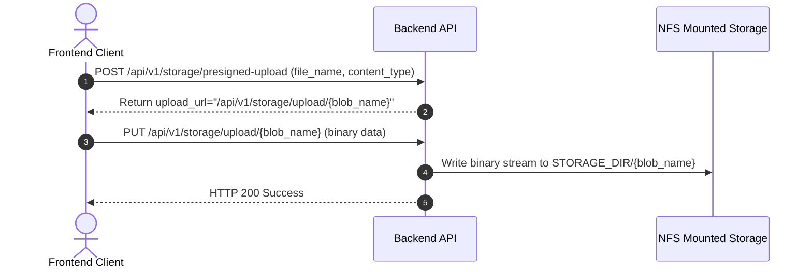
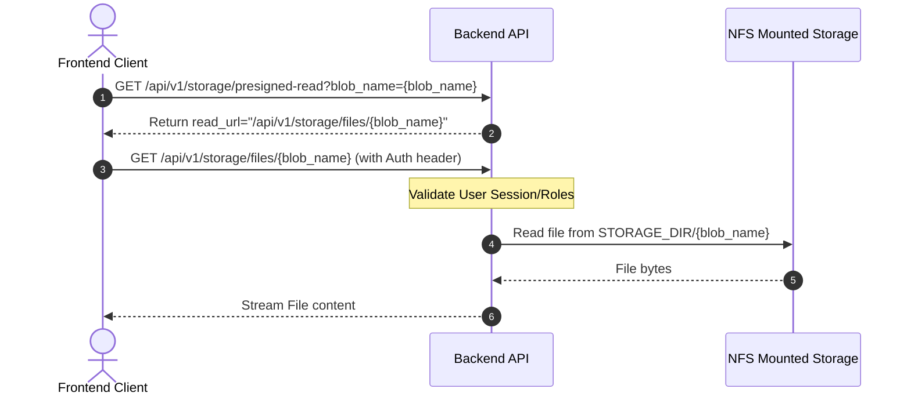

# PRD — NFS Storage Migration

> **Stage 2 of 3 — Documentation Hierarchy**
> Owner: Winston (Architect) + DevOps | Target Location: `docs/prd/nfs_storage_migration_prd.md` | References: `docs/prd/cloud_storage_prd.md`, `docs/prd/async_media_ingestion_prd.md`
> Status: `Under Review`

---

## 1. Overview & Goal

**Problem Statement**:
The current platform uses Google Cloud Storage (GCS) to store citizen-submitted environmental photos and media assets. This ties the project to the Akvo Google Cloud account and requires active GCP service credentials, creating a dependency bottleneck for handover to the client's self-hosted infrastructure.

**Solution**:
Migrate the storage mechanism from GCS to a Network File System (NFS) or a standard mounted directory. The application backend will serve as a proxy for both uploads and secure media serving, keeping the exact same API contracts (`/presigned-upload`, `/presigned-read`) so that frontend client code remains unchanged.

---

## 2. 5W1H Analysis

* **Who**:
  - **DevOps**: Deploys the application and mounts the NFS volume.
  - **Reviewer / Administrator**: Uploads and views citizen media.
* **What**: Replaces the GCS client SDK with local filesystem-based storage (`os`/`shutil` and FastAPI streaming) while maintaining API interface parity.
* **Where**:
  - Backend: `backend/app/services/storage.py` and `backend/app/routers/storage_router.py`.
  - Infrastructure: `docker-compose.yml` (mounting storage volumes).
* **When**: Executes on media upload (Kobo sync, WhatsApp Webhooks, Web Form uploads) and media retrieval.
* **Why**: Decouples the platform from GCP accounts and credential dependencies, allowing simple deployment on any virtual machine or bare-metal environment with mounted storage.
* **How**:
  1. The backend exposes a secure upload endpoint: `PUT /api/v1/storage/upload/{blob_name}`.
  2. The backend exposes a secure read endpoint: `GET /api/v1/storage/files/{blob_name}` (verifies authentication/roles).
  3. `StorageService` is refactored to generate local relative/absolute URLs pointing to these endpoints rather than Google Cloud presigned links.

---

## 3. Requirements (Scope Guardrails)

### Must-Have
- **API Parity**: `/presigned-upload` and `/presigned-read` endpoints must still return URLs that the frontend can interact with.
- **NFS Directory Configuration**: The storage directory path must be configurable via an environment variable `STORAGE_DIR` (e.g., `/var/nbd/storage` or `./data/storage`).
- **Secure File Serving**: File serving at `/api/v1/storage/files/{blob_name}` must require authentication matching the RBAC policy of the previous `/presigned-read` endpoint (e.g., Admin or Reviewer roles only).
- **Docker Compose Volumes**: Update compose specifications to mount a local directory representing the NFS target.
- **Robust Exception Handling**: Graceful handling of missing files (HTTP 404) and read/write permission errors (HTTP 500).

### Nice-to-Have
- Automated migration script to copy existing assets from the GCS bucket to the NFS mount during rollout.

### Out of Scope
- Dynamic resizing or optimization of images during upload.
- Supporting multiple active storage drivers concurrently (e.g., GCS and NFS active at the same time).

---

## 4. Architecture & Data Flow

### Upload Flow Comparison

### Read Flow Comparison

---

## 5. Acceptance Criteria

### User Acceptance Criteria (UAC)
* **UAC-1**: Citizen and admin media uploads work exactly as before without any changes to frontend code.
* **UAC-2**: Only authenticated Administrators and Reviewers can view or download files through the read URLs. Direct anonymous access to files is blocked.

### Technical Acceptance Criteria (TAC)
* **TAC-1**: Replaces `google-cloud-storage` dependency in the storage service with pure Python disk operations.
* **TAC-2**: Implements backend PUT router for uploads and GET router for downloads.
* **TAC-3**: Configures the storage directory dynamically via the `STORAGE_DIR` environment variable.
* **TAC-4**: All unit tests pass using mock directory endpoints.

---

## 6. Edge Cases & Errors

- **Missing Subdirectories**: The backend must automatically create intermediate directories (e.g., `development/kobo/`) inside `STORAGE_DIR` when saving a file.
- **File Not Found**: Requesting a non-existent file path must return a clean `HTTP 404 Not Found` response.
- **Disk Full / Write Permissions**: If the NFS server runs out of disk space or loses write permissions, the API must return a structured `HTTP 500` error and log the issue.

---

## 7. Epic & Ballpark Estimation

| Component | Task Description | Complexity | Ballpark Estimate (Hours) |
|-----------|------------------|------------|---------------------------|
| **Backend Storage Service** | Rewrite `StorageService` using filesystem paths and standard write streams | Simple | 3h |
| **Backend Storage Routers** | Implement `/upload/{blob_name}` and `/files/{blob_name}` FastAPI endpoints | Medium | 4h |
| **Docker Compose Config** | Bind-mount local directory paths to simulate NFS mounts | Simple | 1h |
| **Unit Verification** | Update and fix `backend/tests/test_storage.py` and pipeline tests | Medium | 4h |

---

## Exit Criterion
> This PRD must be approved by the user to proceed to LLD and implementation plan.
