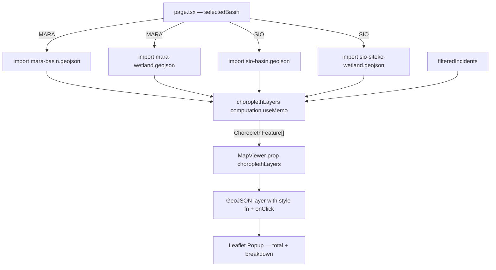
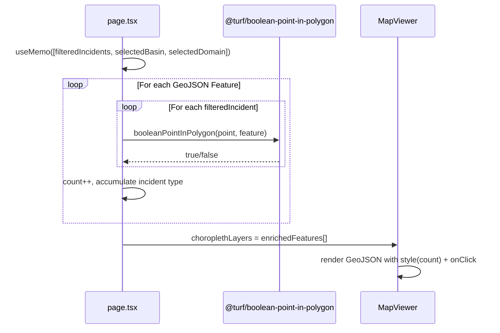

# PRD — Pollution Report Choropleth Map

* **Stage 2 of 3 — Documentation Hierarchy**
* **Initiative**: Pollution Report Choropleth — Sub-Country Shapefile Overlay
* **Owner**: John (Product Manager) & Sally (UX Designer)
* **Status**: Draft — Pending Approval
* **Related Docs**:
  - [Domain Selector & Dashboard PRD](./domain_selector_dashboard_prd.md)
  - [Final SDD §4.5](../Final_SDD.md#45-wetland-data-portal)

---

## I. Overview & Goal

### Problem Statement

When users switch to the **Pollution Reports** domain, the current map shows individual point markers for each pollution incident. This makes it impossible to see **geographic concentration patterns** — a decision-maker cannot instantly tell which sub-region of a basin has the highest incident density.

The request: replace the point-marker layer on the Pollution domain with a **choropleth map** rendered from the existing sub-country shapefiles. Each sub-region polygon is colour-shaded by its incident count. Clicking a polygon reveals a popup with the **total incidents** and a **breakdown by incident type**.

### Core Metric

- **Before**: Pollution domain shows individual point markers — no spatial density signal visible.
- **After**: 100% of portal users see a colour-graduated choropleth of incident density at a glance; zero point markers rendered in the Pollution domain.

---

## II. 5W1H Analysis

| Dimension | Details |
|---|---|
| **Who** | Public portal users (officials, NBD Secretariat, CSOs) viewing the Pollution Reports domain |
| **What** | Replace pollution point markers with a choropleth overlay using 4 local GeoJSON shapefiles; clicking a polygon shows incident count + type breakdown |
| **Where** | `src/components/ui/map-viewer.tsx` (choropleth rendering), `src/app/page.tsx` (data aggregation + props), `src/lib/api.ts` (no API change needed — data is client-side) |
| **When** | Active only when `selectedDomain === "pollution"`. Wetland domain is unaffected. |
| **Why** | Point markers are meaningless for density analysis; policymakers need to identify hotspots at a sub-regional level quickly. Shapefiles are already in the repo and don't require a backend call. |
| **How** | Bundle the 4 GeoJSON files as static JSON imports. For each GeoJSON Feature, count filtered incidents that fall within the polygon using a point-in-polygon test. Shade the polygon by count using a colour scale. Attach a Leaflet click handler to open an inline popup with the breakdown. |

---

## III. User Stories & Flows

### Personas
- **NBD Decision-Maker**: Needs to identify which sub-regions have the most pollution incidents to prioritise field response.
- **CSO Partner**: Cross-references pollution hotspots with wetland degradation patterns.
- **Public Portal Visitor**: Wants an at-a-glance spatial view without interpreting individual markers.

### User Flows

#### Flow A — Default Load (Pollution Domain Active)
```
User selects "Pollution Reports" from header dropdown
  -> Map: No point markers
  -> Map: Choropleth polygons rendered over basin area
     -> Zero incidents: polygon rendered in neutral grey fill
     -> 1–5 incidents: light amber fill
     -> 6–15 incidents: medium orange fill
     -> 16+ incidents: deep red fill
  -> Map Legend: Displays the graduated choropleth color scale gradient
  -> List panel / Sidebar: Empty state (No cards or photos shown since no sub-county is selected)
```

#### Flow B — Clicking a Choropleth Polygon
```
User clicks a sub-region polygon
  -> Right-hand details drawer slides open (no Leaflet popup)
  -> Drawer shows:
     - Sub-region name (from GeoJSON feature name)
     - Latest environmental status of the sub-county
     - Horizontal bar chart showing Report Count grouped by incident types, with the incident labels (e.g. "Oil Spill") and counts displayed inside the bars
  -> List panel / Sidebar: Populates with IncidentCards for the selected sub-county showing reported photos sorted by created_at ASC
```

#### Flow C — Basin Selector Changes
```
User changes basin selector (MARA → SIO)
  -> Active shapefiles switch to sio-basin.geojson + sio-siteko-wetland.geojson
  -> Choropleth re-calculates counts against new filtered incident set
  -> Drawer & list panel reset to empty state (unselected)
  -> Basin boundary outline remains (existing basinGeometry behaviour)
```

#### Flow D — Domain Switch Back to Wetland
```
User selects "Wetland Monitoring" from header dropdown
  -> Choropleth layer and legend removed
  -> Site markers re-appear
  -> Drawer closed and Wetland mode details drawer / site list fully restored
```

---

## IV. Scope Guardrails

### Must-Have
1. **No Point Markers on Pollution Domain**: The `markers` array passed to `MapViewer` must be empty (`[]`) when `selectedDomain === "pollution"`.
2. **Choropleth Layer in MapViewer**: `MapViewer` receives a new optional prop `choroplethLayers?: ChoroplethFeature[]` containing the enriched GeoJSON features with incident counts.
3. **4 Static Shapefiles** — bundled as static imports, selected by active basin:

   | Basin Selector | Shapefiles Used |
   |---|---|
   | `MARA` | `mara-basin.geojson` + `mara-wetland.geojson` |
   | `SIO` (or default) | `sio-basin.geojson` + `sio-siteko-wetland.geojson` |

4. **Point-in-Polygon Aggregation**: For each GeoJSON Feature polygon, compute the count of `filteredIncidents` whose `geo.coordinates` fall inside the polygon. Use an existing lightweight JS library (`@turf/boolean-point-in-polygon` from `@turf/turf`) or implement a simple ray-casting algorithm. Library preferred for accuracy.
5. **Colour Scale** (incident count → fill colour):

   | Count | Fill Colour | Label |
   |---|---|---|
   | 0 | `#f1f5f9` (slate-100) | No incidents |
   | 1–5 | `#fef3c7` (amber-100) | Low |
   | 6–15 | `#f97316` (orange-500) | Moderate |
   | 16+ | `#dc2626` (red-600) | High |

6. **Click Action & Details Drawer**:
   - Clicking a sub-county polygon opens a Details Drawer on the right side of the screen.
   - Shows the sub-county name and the latest environmental status of that selected sub-county.
   - Renders a horizontal bar chart displaying the "Report count by grouped incident types" for that sub-county, with both the incident labels (names) and count values rendered inside the bars.
7. **Hover Highlight**: On mouse-hover, polygon stroke weight increases to `3px` and opacity lifts slightly — provides clear interactive affordance.
8. **Basin Boundary Outline Preserved**: The existing `basinGeometry` outline (teal border) remains visible underneath the choropleth.
9. **Empty State**: If all polygons have 0 incidents, all render in neutral grey — no error state needed.
10. **Legend**: A map legend showing the choropleth color gradient scale for the density buckets (None / Low / Moderate / High) when the Pollution domain is active.
11. **Photo Card List**:
    - The card list in the sidebar/bottom list panel displays reported photos sorted by `created_at` ASC.
    - If no sub-county is selected, no photo cards are showed (empty/hidden card list). When a sub-county is selected, it only displays the photo cards for that selected sub-county.

### Nice-to-Have (Deferred)
- Animated transitions between choropleth states on basin change.
- Backend-computed spatial aggregation endpoint for performance at scale.

### Out of Scope
- Modifying the Wetland domain map in any way.
- Displaying point markers alongside choropleth on the Pollution domain.
- Server-side GeoJSON storage or PostGIS spatial queries.
- Adding new shapefiles beyond the 4 already in the repo.

---

## V. Architecture & Data Flow

### Static GeoJSON Import Strategy



### Point-in-Polygon Aggregation (Client-Side)



### New / Modified Components

| File | Change |
|---|---|
| `src/components/ui/map-viewer.tsx` | Add `choroplethLayers?: ChoroplethFeature[]` prop; render `<GeoJSON>` with dynamic `style` function + `onEachFeature` click handler; hide markers when `choroplethLayers` has data |
| `src/app/page.tsx` | Compute `choroplethLayers` in a `useMemo`; pass empty `markers=[]` when pollution domain; pass `choroplethLayers` to `<MapViewer>`; update `<MapLegend>` conditionally |
| `src/lib/types.ts` *(new or existing)* | Add `ChoroplethFeature` TypeScript type (GeoJSON Feature + computed `incidentCount: number` + `incidentBreakdown: Record<string, number>`) |

### New Dependencies

| Package | Purpose | Install |
|---|---|---|
| `@turf/boolean-point-in-polygon` | Point-in-polygon spatial test | `./dc.sh exec frontend yarn add @turf/boolean-point-in-polygon` |
| `@turf/helpers` | GeoJSON point helper | Bundled with turf |

> **Note**: `@turf/turf` (full bundle) is NOT required — only the specific sub-package to keep bundle size minimal (YAGNI).

---

## VI. Acceptance Criteria

### User Acceptance Criteria (UAC)

- **UAC-1 (No Markers)**: Given `selectedDomain === "pollution"`, zero point markers are rendered on the map.
- **UAC-2 (Choropleth Visible)**: Given the Pollution domain is active, coloured polygons covering the active basin's sub-regions are rendered on the map within 1 second of domain switch.
- **UAC-3 (Colour Scale)**: A polygon with 0 incidents is slate-grey; 1–5 incidents is amber; 6–15 is orange; 16+ is red.
- **UAC-4 (Click Popup)**: Given the user clicks a polygon, a Leaflet popup opens showing total incident count and per-type breakdown.
- **UAC-5 (Basin Switch)**: Given the user switches basin, choropleth polygons update to reflect the new basin's shapefiles and incident counts.
- **UAC-6 (Domain Switch to Wetland)**: Given the user switches to Wetland domain, choropleth disappears and site markers reappear.
- **UAC-7 (Legend)**: When Pollution domain is active, the map legend shows the 4 colour buckets (None / Low / Moderate / High). When Wetland domain is active, the existing health-class legend is shown.
- **UAC-8 (Hover Effect)**: Hovering over a polygon increases its border weight and slightly brightens its fill.

### Technical Acceptance Criteria (TAC)

- **TAC-1**: `choroplethLayers` typed as `ChoroplethFeature[]` — each element extends GeoJSON `Feature` with `incidentCount: number` and `incidentBreakdown: Record<string, number>`.
- **TAC-2**: `choroplethLayers` computation is wrapped in `useMemo([filteredIncidents, selectedBasin, selectedDomain])`.
- **TAC-3**: GeoJSON files imported as static JSON — no runtime HTTP fetch.
- **TAC-4**: `@turf/boolean-point-in-polygon` used for point-in-polygon test — no custom geometry code.
- **TAC-5**: Choropleth layer uses Leaflet's `onEachFeature` callback for hover and click — no custom D3 or canvas rendering.
- **TAC-6**: All existing `__tests__/` continue to pass.
- **TAC-7**: Bundle size impact from `@turf/boolean-point-in-polygon` is < 20 KB gzipped (confirmed by Turf's modular architecture).

---

## VII. Edge Cases & Errors

| Case | Behaviour |
|---|---|
| Incident has no `geo` coordinates (null/undefined) | Skip from point-in-polygon test; does not crash |
| Incident `geo.coordinates` is `[0, 0]` | Likely invalid — falls outside all polygons; counted as unattributed; not rendered on map |
| Basin has no matching incidents | All polygons render in neutral grey; empty state shown in sidebar list |
| GeoJSON feature has no `name` property | Fallback label: "Sub-region N" (feature index) |
| `selectedBasin` is not `MARA` or `SIO` | Default to SIO shapefiles; no crash |
| Turf import fails (tree-shaking edge case) | Console error logged; map falls back to empty polygon set; no crash |

---

## VIII. Analytics & Telemetry

| Event | Properties | When |
|---|---|---|
| `choropleth_polygon_clicked` | `{ basin, incidentCount, topIncidentType }` | User clicks a polygon |
| `domain_switch` | `{ from, to }` | Existing event (no change) |

> Analytics implementation deferred to Phase 2 — only the event spec is defined here.

---

## IX. Rollout & Rollback Plan

### Rollout
- Deploy to staging; QA both basins (MARA + SIO) in Pollution domain.
- Feature is purely additive within Pollution domain; Wetland domain is unaffected.
- No backend changes; no database migration; no API contract change.

### Rollback
- Revert `map-viewer.tsx` and `page.tsx` changes.
- Remove `@turf/boolean-point-in-polygon` from `package.json`.
- Restore `markers` pass-through logic in Pollution domain.

---

## X. Epic & Ballpark Estimation

| Component | Complexity | Estimate |
|---|---|---|
| Install + type `@turf/boolean-point-in-polygon` | Simple | 0.5 h |
| `ChoroplethFeature` TypeScript type | Simple | 0.5 h |
| `choroplethLayers` useMemo in `page.tsx` (point-in-polygon aggregation) | Medium | 2 h |
| `MapViewer` choropleth rendering (style fn, hover, click popup) | Medium | 2.5 h |
| Basin → shapefile selection logic | Simple | 0.5 h |
| `MapLegend` domain-aware switch | Simple | 0.5 h |
| No-marker guard (`markers=[]` when pollution) | Simple | 0.25 h |
| Unit tests (choropleth aggregation logic, MapViewer rendering) | Medium | 1.5 h |
| QA smoke test (both basins, both domains) | Simple | 1 h |
| **Total** | | **~9.25 hours / ~1.5 Story Points** |

### Assumptions
- `@turf/boolean-point-in-polygon` resolves correctly from Yarn in the Docker frontend container.
- All 4 GeoJSON files are already in the `backend/app/seeds/spatial/` directory and can be imported directly as static JSON (Next.js supports JSON imports natively).
- Incident `geo` field exists on `IncidentSummary` with `{ type: "Point", coordinates: [lng, lat] }` shape (consistent with existing marker rendering at `page.tsx` L350).
- Incident type breakdown uses the existing `answers` field with `question_id === 2` / `name === "incident_type"` logic (confirmed at `page.tsx` L355–358).

---

## XI. GeoJSON Shapefile Reference

| File | Basin | Geometry Type | Key Properties |
|---|---|---|---|
| `mara-basin.geojson` | MARA | `FeatureCollection` (1 Feature, MultiPolygon) | `HYBAS_ID`, `SUB_AREA`, `PFAF_ID` |
| `mara-wetland.geojson` | MARA | `FeatureCollection` (1 Feature, Polygon) | `cluster`, `count`, `area` |
| `sio-basin.geojson` | SIO | `FeatureCollection` (1 Feature, MultiPolygon) | `FID` |
| `sio-siteko-wetland.geojson` | SIO | `FeatureCollection` (multi-Feature, MultiPolygon) | complex geometry, no named properties |

> **Display Name Strategy**: Use `feature.properties.name ?? feature.properties.HYBAS_ID ?? "Sub-region ${index + 1}"` as the popup title.
