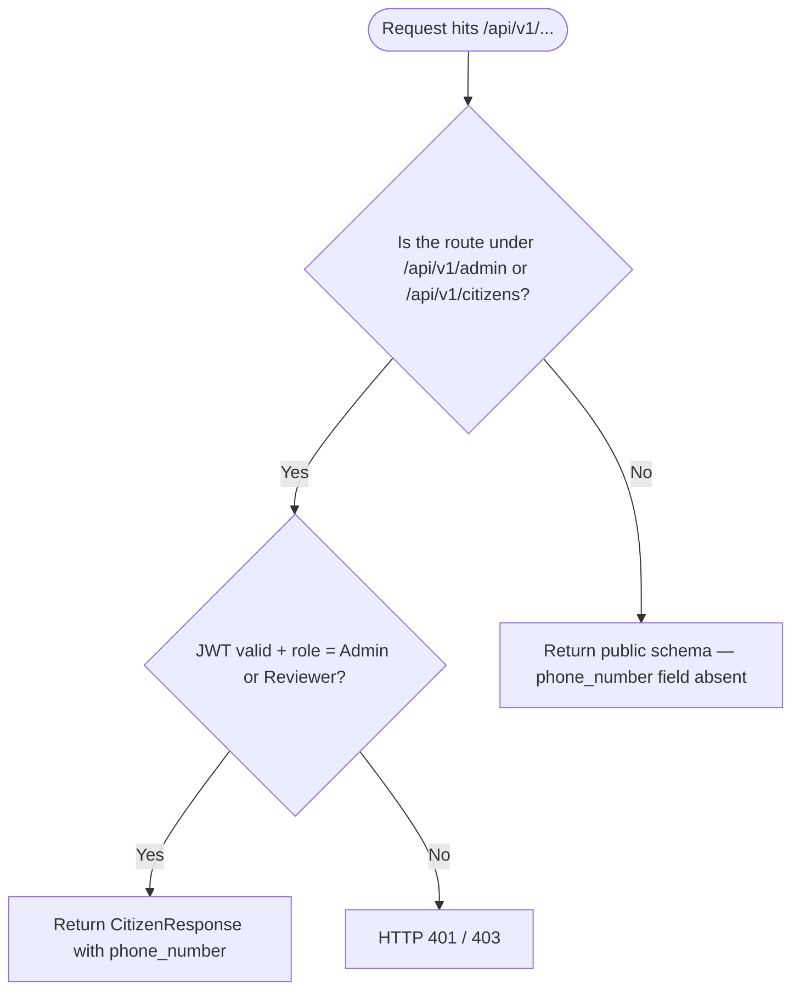
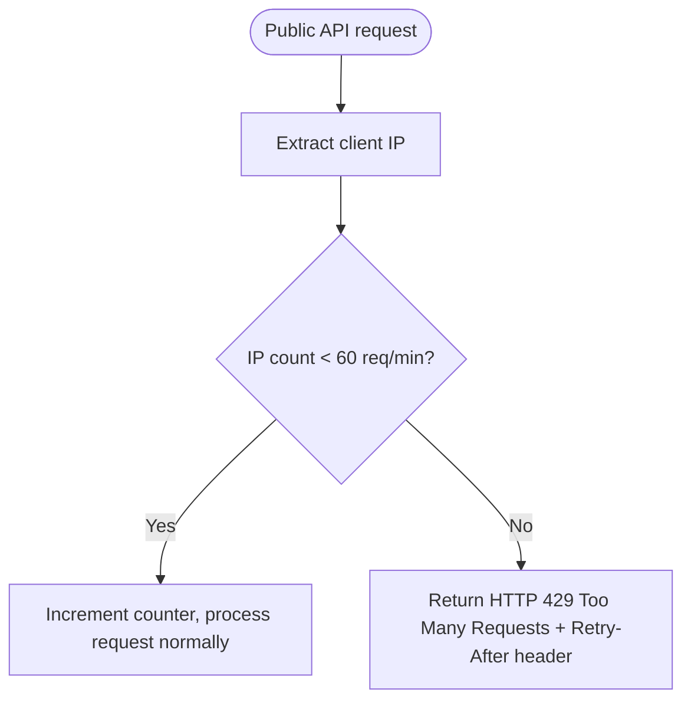

# PRD — Privacy Pipeline & Infrastructure Security

> **Stage 2 of 3 — Documentation Hierarchy**
> Owner: PM + Engineering Lead | Target Location: `docs/prd/privacy_pipeline_prd.md` | References: `docs/Final_SDD.md` §7
> Status: `Approved`
> Sign-off: Engineering Lead: _John, 2026-06-22_ | Design Lead: _Sally, 2026-06-22_

---

## 1. Overview

**One-liner**: Ensure no citizen PII is ever exposed via public API endpoints, and enforce a rate limiter on all public routes.

**Brief / Problem Reference**: `docs/Final_SDD.md` — Section 7 (Security, Privacy & Data Governance), Section 4.5.4 (Public API Strategy)

**What we are building**:
Two focused security hardening sub-tasks:
- **3A — PII Stripping**: Build dedicated Pydantic response schemas for all public `/api/v1/*` endpoints that explicitly exclude PII fields (citizen `phone_number`). Phone numbers remain in plaintext in the database — no encryption is required. Authenticated Admin/Reviewer users retain full visibility via admin-only endpoints.
- **3B — Rate Limiting**: Implement a per-IP rate limiter (60 req/min) on all public `/api/v1/*` routes, returning HTTP 429 when exceeded.

> [!IMPORTANT]
> **Phone number encryption is explicitly out of scope.** No pgcrypto, no Alembic migration for encryption, no `ENCRYPTION_KEY` environment variable.
> GCP Secret Manager integration is also out of scope for this sprint — the Docker-based dev environment and CI pipeline depend on `.env` files.

**Why now**: The platform is approaching public launch. The public `GET /api/v1/incidents` endpoint must guarantee that citizen PII is absent from its response payloads as a legal compliance requirement under the Kenya Data Protection Act 2019, Uganda Data Protection and Privacy Act 2019, and Tanzania Personal Data Protection Act 2022 (SDD §7.8).

---

## 2. Goals & Success Metrics

| Goal | Success Metric | Baseline | Target | Owner |
|------|---------------|----------|--------|-------|
| Public endpoints expose zero PII | No `phone_number` in any public API response | Not enforced | 100% guaranteed via schema | Engineering |
| Authenticated users retain full access | Admin/Reviewer can see `phone_number` via admin API | Passes through | Passes through | Engineering |
| Rate limiting on public API | HTTP 429 returned after 60 req/min/IP | No limit | ≤ 60 req/min/IP | Engineering |

**Anti-Goals**:
- We are NOT encrypting `citizen.phone_number` or any other database field.
- We are NOT migrating secrets management to GCP Secret Manager in this story.
- We are NOT building a token-based authentication for the public API.

---

## 3. Target Users & Personas

| Persona | Job-to-be-Done | Key Frustration | v1 Priority |
|---------|---------------|-----------------|-------------|
| **Public Portal User** | View pollution incident map without authentication | Sees no PII — just aggregated spatial data | Primary |
| **Admin / Reviewer** | Track which watcher submitted a specific report | Must be able to see decrypted phone number in admin interfaces | Primary |
| **Wetland Watcher (Citizen Reporter)** | Submit pollution reports via USSD/WhatsApp | Their phone number must not be visible to the public | Primary |

---

## 4. User Stories

| ID | User Story | Priority (MoSCoW) | FR Reference |
|----|-----------|-------------------|--------------|
| US-001 | As a **public portal user**, I want the incidents endpoint to never reveal citizen phone numbers so that reporter identities are protected. | Must Have | FR-001 |
| US-002 | As an **Admin**, I want to see the phone number of a citizen in the admin data workspace so that I can trace report origin. | Must Have | FR-002 |
| US-003 | As a **Reviewer**, I want to see the citizen phone number in the admin panel (read-only) so I can verify submission identity. | Must Have | FR-002 |
| US-004 | As a **public user** making many API requests, I want the system to enforce fair use limits so it remains available for everyone. | Must Have | FR-003, FR-004 |

---

## 5. Functional Requirements

| ID | Requirement | User Story | Priority |
|----|-------------|------------|----------|
| FR-001 | All Pydantic response schemas for public `/api/v1/*` endpoints MUST NOT include `phone_number` or any other PII field. A `CitizenPublicResponse` schema (if ever used on public routes) omits the field entirely. | US-001 | Must Have |
| FR-002 | Admin-facing endpoints (`/api/v1/admin/*`) and the auth-gated `/api/v1/citizens` endpoint MUST expose `phone_number` for authenticated Admin and Reviewer roles only. The existing `CitizenResponse` schema (used on admin routes) retains the field as-is. | US-002, US-003 | Must Have |
| FR-003 | A per-IP rate limiter MUST be applied to all routes under the public `/api/v1/*` prefix (admin routes under `/api/v1/admin/*` are excluded). | US-004 | Must Have |
| FR-004 | When a public IP exceeds 60 requests within a 60-second sliding window, the backend MUST return HTTP 429 with a `Retry-After` response header. | US-004 | Must Have |
| FR-005 | The rate limiter MUST use an in-memory store (`slowapi` + `limits`) so no additional infrastructure (Redis) is required. | US-004 | Must Have |

---

## 6. Non-Functional Requirements

| Category | Requirement | Metric |
|----------|-------------|--------|
| **Security** | Phone numbers never visible in public API payloads | Zero occurrences in any `/api/v1/*` response (excluding `/api/v1/admin/*`) |
| **Performance** | Rate limiter overhead on public responses | < 2ms per request (in-memory counter) |
| **Compliance** | Kenya DPA 2019, Uganda DPPA 2019, Tanzania PDPA 2022 | PII not in public payloads |
| **Backward Compat.** | Admin endpoints still return phone numbers as before | Zero regressions in existing admin/citizen tests |

---

## 7. User Flows & Wireframes

### 3A — PII Access Flow



### 3B — Rate Limiter Flow



---

## 8. Scope

**v1 — In Scope**:
- Verify that public `/api/v1/*` Pydantic schemas never include `phone_number` (review + fix if exposed)
- `slowapi` rate limiter at 60 req/min/IP on public router
- HTTP 429 response with `Retry-After` header
- Unit tests for: PII-exclusion on public endpoints, rate limiter 429 behaviour

**v1 — Explicitly Out of Scope**:
- Phone number encryption at rest (not required)
- GCP Secret Manager integration (separate infrastructure story)
- Redis-based distributed rate limiting (in-memory is sufficient for Pilot Year 1 scale)
- Audit log masking

**Dependencies**:
| Dependency | Team | Required By | Risk |
|------------|------|-------------|------|
| `slowapi` Python package | Backend | Story start | Low — pure Python, no infra changes |

---

## 9. Architecture Design

### Data Model Changes

**No data model changes required.** `citizen.phone_number` remains `VARCHAR(50)` plaintext — encryption is out of scope.

### Schema Verification

Audit all public Pydantic response schemas to confirm `phone_number` is absent:

| Schema | Used By | `phone_number` |
|--------|---------|----------------|
| `CitizenResponse` | `/api/v1/citizens` (auth-gated — Admin/Reviewer only) | Present ✅ |
| Any schema on public routes | `/api/v1/incidents`, `/api/v1/sites`, etc. | Must be **Absent** |

> [!NOTE]
> The public `/api/v1/incidents` endpoint currently aggregates datapoints by sub-county and **never joins the `citizens` table** directly — this is architecturally safe. The primary risk is a future developer accidentally adding a citizen join to a public endpoint. The schema discipline (no `CitizenResponse` on public routes) is the guard.

### Rate Limiter Implementation

Library: `slowapi` (wraps `limits` — pure Python, no Redis required)

```python
# main.py
from slowapi import Limiter, _rate_limit_exceeded_handler
from slowapi.util import get_remote_address
from slowapi.errors import RateLimitExceeded

limiter = Limiter(key_func=get_remote_address)
app.state.limiter = limiter
app.add_exception_handler(RateLimitExceeded, _rate_limit_exceeded_handler)

# public_router.py — applied to each public endpoint
@router.get("/incidents")
@limiter.limit("60/minute")
def list_incidents(request: Request, ...):
    ...
```

---

## 10. Acceptance Criteria

### User Acceptance Criteria

| ID | Given | When | Then |
|----|-------|------|------|
| UAC-3A.1 | Public user queries `GET /api/v1/incidents` | Response is returned | No `phone_number` field exists anywhere in the JSON payload |
| UAC-3A.2 | Admin queries `GET /api/v1/citizens` (auth-gated) | Response is returned | The `phone_number` field is present and readable |
| UAC-3B.1 | A public user hits any `/api/v1/*` endpoint more than 60 times within one minute | The 61st request arrives | Backend returns HTTP `429 Too Many Requests` with a `Retry-After` header |

### Technical Acceptance Criteria

| ID | Criteria |
|----|----------|
| TAC-3A.1 | No public Pydantic response schema (used on routes under `/api/v1/` excluding `/api/v1/admin/*` and `/api/v1/citizens`) includes a `phone_number` field. |
| TAC-3A.2 | `CitizenResponse` schema (with `phone_number`) is ONLY used on auth-gated endpoints protected by `get_current_user`. |
| TAC-3B.1 | Rate limiter is enforced at the router decorator level using `slowapi` `@limiter.limit("60/minute")` on all public endpoints. |
| TAC-3B.2 | All existing backend tests continue to pass (`./dc.sh exec backend python -m pytest tests/ -v`). |
| TAC-3B.3 | New tests verify: (a) 429 is returned on the 61st request, (b) `phone_number` is returned for Admin on citizen endpoint, (c) `phone_number` is absent in public incident/site responses. |

---

## 11. Edge Cases & Errors

| Scenario | Expected Behaviour |
|----------|-----------------|
| IP behind a reverse proxy (X-Forwarded-For) | `get_remote_address` in `slowapi` respects `X-Forwarded-For` headers; Nginx must set `proxy_set_header X-Real-IP $remote_addr` |
| Rate limit hit on a bot/crawler | HTTP 429 returned; no disruption to legitimate users sharing the same IP (edge case for shared corporate NAT — acceptable for pilot scale) |
| Admin with expired JWT tries to access citizens | Standard `get_current_user` dependency returns 401 before any data is read |
| Future developer adds citizen join on a public route | Schema discipline (no `CitizenResponse` on public routes) and code review are the guards — no phone field is available in public schemas |

---

## 12. Rollout & Rollback Plan

**Rollout**:
1. Add `slowapi` to `backend/requirements.txt` and deploy.
2. Apply `@limiter.limit("60/minute")` to all public router endpoints.
3. Smoke-test rate limiting and public endpoint schema on staging.

**Rollback**:
- Remove `@limiter.limit` decorators from `public_router.py`.
- Remove `slowapi` from `requirements.txt`.
- No database or frontend changes required.

---

## 13. Epic & Ballpark Estimation

| Component | Complexity | Estimate |
|-----------|-----------|----------|
| Audit existing public Pydantic schemas for PII leakage | Simple | 0.5h |
| `slowapi` integration in `main.py` + `@limiter.limit` on all public endpoints | Simple | 1h |
| Unit tests (PII exclusion audit, 429 behavior) | Simple | 1.5h |
| **Total** | | **~3h** |

**Assumptions**:
- `slowapi` is available via `pip` with no Docker infrastructure changes.
- No Alembic migration is needed (no data model changes).
- No frontend changes are required for this story.

---

## 14. Change Log

| Version | Date | Author | Changes |
|---------|------|--------|---------|
| 0.1 | 2026-06-22 | John (PM) / Antigravity | Initial draft based on SDD §7, Issue #67 scope |

---

## Exit Criterion

> [!IMPORTANT]
> This PRD MUST be signed off before LLD begins. No tickets may be created until this is complete.

**Sign-off Checklist**:
- [ ] All functional requirements are testable and unambiguous
- [x] Phone number encryption is explicitly agreed as out of scope
- [x] GCP Secret Manager is explicitly agreed as out of scope for this story
- [ ] Engineering Lead has reviewed rate limiter approach
- [ ] Scope boundary agreed upon by all leads
