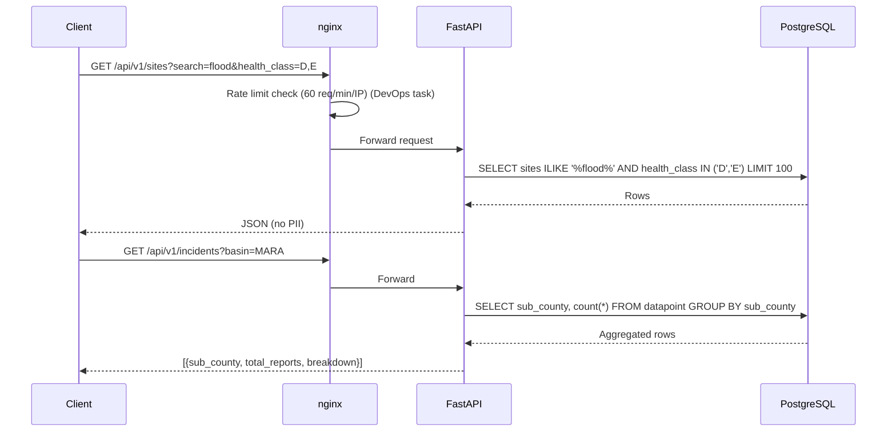

# PRD — Public Open Data API (Sub-Task 1)
**Initiative:** Wetland Data Portal — Public API
**Issue:** #61
**Branch:** `feature/61-sub-task-1-public-open-data-api-aggregator-search-rate-limiting`
**Status:** Approved

---

## I. Overview & Goal

### Problem Statement
The portal's public-facing layer has no stable, read-only API contract. Frontend visualisations (Leaflet map, ECharts) cannot query pollution incidents or site health data without going through internal admin endpoints, which expose PII and lack privacy guards.

### Core Metric
All five public endpoints defined in SDD §4.5.4 return correct, PII-free, filterable payloads in < 800 ms with zero authentication required.

---

## II. User Stories & Flows

### Personas

| Persona | Need |
|---|---|
| Journalist / Researcher | Query site health data and pollution incidents without an account |
| NBD Partner | Embed live data into their own tools via a stable API contract |
| Portal Frontend | Fetch filterable sites and choropleth incident data for map rendering |

### Key User Flows

**Flow A — Site Search**
1. User opens portal, types "flood" in the search bar and selects Health Class D,E.
2. Frontend calls `GET /api/v1/sites?search=flood&health_class=D,E`
3. FastAPI applies ILIKE on `site.name`, `site.description` and filters by health_class.
4. Returns list of matching sites (≤ 100 rows) with current status.

**Flow B — Incident Choropleth**
1. Frontend requests the pollution heat map.
2. `GET /api/v1/incidents?basin=MARA&date_from=2025-01-01`
3. FastAPI runs `GROUP BY sub_county` query on `datapoint` (Form type 1 = Pollution).
4. Returns `[{ "sub_county": "Rorya", "total_reports": 8, "breakdown": {...} }]`. Zero PII.

**Flow C — Site Score History**
1. User clicks a site card → "View Score History".
2. Frontend calls `GET /api/v1/sites/{site_id}/scores`
3. Returns ordered list of HealthScore records (date, class, scores).

**Flow D — External Satellite Data**
1. User opens the satellite overlay tab.
2. Frontend calls `GET /api/v1/sites/{site_id}/external/gee`
3. Returns the latest approved NDVI / precipitation answer values for that site.

---

## III. Requirements

### Must-Have
- `GET /api/v1/sites` — list sites with optional `?search=`, `?health_class=`, `?basin=` filters
- `GET /api/v1/sites/{site_id}` — already implemented; verify it is unauthenticated and expose in public router
- `GET /api/v1/sites/{site_id}/scores` — paginated HealthScore history
- `GET /api/v1/sites/{site_id}/external/{source}` — satellite/external answers per site
- `GET /api/v1/incidents` — GROUP BY sub_county aggregation (PII-free)
- All endpoints return data without authentication (`Authorization` header not required)
- `description` column added to `sites` table (required for `?search=` ILIKE on description)
- nginx rate limit: 60 req/min/IP → HTTP 429 (out of scope for #61 backend task, handled in a separate DevOps story)

### Nice-to-Have
- `?date_from` / `?date_to` filters on `/incidents` and `/scores`
- `?basin=` filter on `GET /api/v1/sites`
- `breakdown` nested object on `/incidents` showing per-type counts (Confirmed Required)
- `?page` / `?limit` cursor on `/scores`

### Out of Scope
- Any write (POST/PATCH/DELETE) endpoints
- Authenticated or partner-tier endpoints
- Frontend implementation (separate story)
- GEE live satellite integration (reads from pre-ingested `Answer` rows for Form type 5)
- nginx rate limit configuration (moved to separate DevOps task)

---

## IV. Architecture Design

### Data Flow

### Data Model Changes

| Change | Reason |
|---|---|
| ADD `sites.description TEXT NULL` + Alembic migration | Required for `?search=` ILIKE on description (SDD §4.5.3) |
| New `public_router.py` | Isolate public unauthenticated endpoints from admin router |
| New schemas: `SiteListItem`, `SiteScoreHistory`, `ExternalDataResponse`, `IncidentAggregation` | Typed response contracts |

> [!NOTE]
> `GET /api/v1/sites/{site_id}` already exists in `spatial_router.py` and returns status + management_actions. It must be **verified as unauthenticated** and **registered** under `public_router.py` — not duplicated.

### Incident Aggregation — Join Strategy

The `datapoint` table has `basin_id` and `site_id` but no direct FK to `spatial_boundaries`.
Two options were evaluated:

- **Option A (Chosen):** Use `site_id → Site → wetland → basin → spatial_boundary` hierarchy. Group all incidents by the sub-counties that belong to the site's basin. Simple SQL JOIN. Chosen because datapoint geo coordinates can sometimes be NULL.
- **Option B (Rejected):** `ST_Within(dp.geo::geometry, sb.geom)` — accurate per-report geolocation lookup but requires valid GeoJSON coords on every pollution submission.

### New Endpoints Summary

| Endpoint | Auth | Returns |
|---|---|---|
| `GET /api/v1/sites` | None | Filtered list of sites + latest health_class |
| `GET /api/v1/sites/{site_id}` | None | Site detail + status + management_actions (existing) |
| `GET /api/v1/sites/{site_id}/scores` | None | Ordered HealthScore history |
| `GET /api/v1/sites/{site_id}/external/{source}` | None | Latest NDVI/precip answers |
| `GET /api/v1/incidents` | None | Sub-county aggregated counts, no PII |

---

## V. Acceptance Criteria

### User Acceptance Criteria (UAC)
- **UAC-1 (Aggregated Privacy):** `GET /api/v1/incidents` returns `[{"sub_county": "Rorya", "total_reports": 8, "breakdown": {"smell": 5, "fish_kill": 3}}]`. Zero phone numbers, citizen IDs, or individual answer rows appear in the payload.
- **UAC-2 (Advanced Search):** `GET /api/v1/sites?search=flood&health_class=D,E` returns only sites where `name` or `description` ILIKE `%flood%` AND `health_class IN ('D','E')`.

### Technical Acceptance Criteria (TAC)
- **TAC-1 (Strict Routing):** All 5 endpoints exist under `/api/v1/` prefix with exact paths from SDD §4.5.4.
- **TAC-2 (SQL Grouping):** `GET /api/v1/incidents` uses SQLAlchemy `GROUP BY`. No raw citizen row is serialised.
- **TAC-3 (Filtering & Text Search):** Accepts `?search=`, `?health_class=A,B,C` (comma-separated multi-select), `?basin=`, `?date_from=`, `?date_to=`.
- **TAC-4 (Rate Limiting):** nginx rate limiting of 60 req/min/IP is out of scope for #61 backend task and will be implemented in a separate DevOps task.
- **TAC-5 (No Auth):** All 5 endpoints have zero `Depends(get_current_user)` decorators.
- **TAC-6 (Pagination):** Default `LIMIT 100`. `/scores` accepts `?limit=` and `?offset=`.
- **TAC-7 (Performance):** All endpoints respond in < 800 ms. Index on `health_scores.site_id`, `datapoint.form_id`, `datapoint.basin_id`.

---

## VI. Edge Cases & Errors

| Scenario | Response |
|---|---|
| `?health_class=X` (invalid class) | HTTP 422 Unprocessable Entity |
| `GET /sites/{site_id}` — no HealthScore yet | `status: null`, `management_actions: []` |
| `GET /incidents` — no pollution data | `[]` |
| `GET /sites/{id}/external/unknown` | HTTP 404 `{"detail": "Source 'unknown' not found"}` |
| Rate limit exceeded | HTTP 429 from nginx (handled in DevOps task) |
| `?search=` empty string | Treated as no filter |
| `?health_class=` empty string | Treated as no filter |

---

## VII. Open Questions (Resolved)

- **OQ-1 (Sub-County Join Strategy):** Resolved. Option A (site hierarchy join) chosen because datapoint coordinates can sometimes be NULL.
- **OQ-2 (Breakdown Object):** Resolved. Breakdown object (e.g. `breakdown: {"smell": 5, "fish_kill": 3}`) is required per sub-county in `/incidents`.
- **OQ-3 (Rate Limit Owner):** Resolved. Will be handled in a separate DevOps task, out of scope for the current #61 story backend implementation.

---

## VIII. Rollout & Rollback Plan

- **Rollout:** New `public_router.py` registered in `main.py`. No feature flag needed — endpoints are additive.
- **Rollback:** Remove router registration in `main.py`; revert nginx config.

---

## IX. Epic & Ballpark Estimation

| Component | Complexity | Estimate |
|---|---|---|
| DB migration: `sites.description` column | Simple | 0.5h |
| `public_router.py` + `GET /sites` with filtering | Medium | 2h |
| `GET /sites/{id}` — verify & re-register as public | Simple | 0.5h |
| `GET /sites/{id}/scores` — HealthScore history | Simple | 1h |
| `GET /sites/{id}/external/{source}` — Answer query | Medium | 2h |
| `GET /incidents` — GROUP BY aggregation | Complex | 3h |
| Pydantic response schemas | Simple | 1h |
| nginx `limit_req_zone` config | Simple | 0.5h |
| Tests (unit + integration, all 5 endpoints) | Medium | 3h |
| **Total** | | **~13.5h** |

### Assumptions
- Pollution Reporting Form is queryable by `Form.name == "Pollution Reporting Form"` (type 1).
- External satellite data is stored as `Answer` rows on `Form` type 5 (External Satellite & Climate Data).
- nginx `nginx.conf` is editable within the Docker stack repository.
- `sites.description` will be NULL for existing records; search gracefully handles NULLs.
