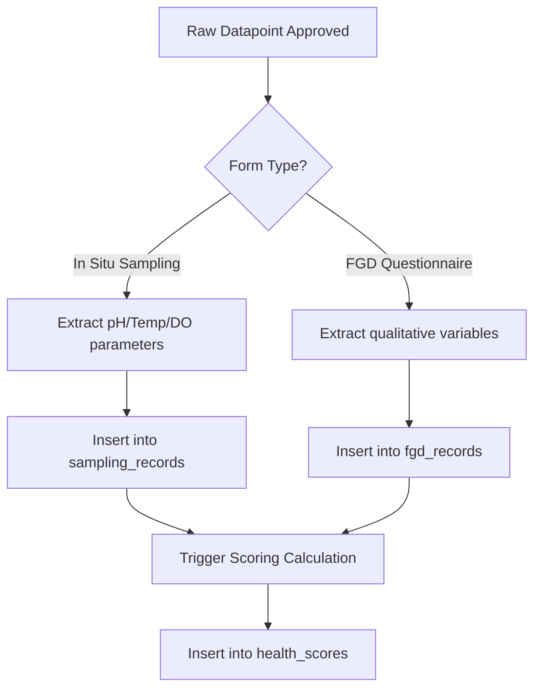

# PRD — Remaining Database Schemas Implementation

> **Stage 2 of 3 — Documentation Hierarchy**
> Owner: PM / John | Target Location: `docs/prd/remaining_database_schemas_prd.md` | References: `docs/product_brief.md`, `docs/database_schema.md`
> Status: `Draft`

---

## I. Overview & Goal

### Problem Statement
The raw ingestion EAV store (`datapoint` and `answer`) is successful at dynamically capturing raw forms. However, the Nile Basin Wetland Monitoring Platform requires structured, flat, and index-optimized tables for downstream domain services:
1. **Reporting & Dashboards**: Physical/chemical metrics and Focus Group Discussion qualitative assessments need to be queried instantly for frontend visualization (ECharts, Leaflet) without parsing dynamic EAV answers.
2. **PII Isolation**: Citizen phone numbers and credentials must be isolated into a structured recorder profile.
3. **Scoring Engine Outputs**: The results of the fuzzy logic scoring calculations (WQI, composite scores, classes) must be stored in a permanent audit table.
4. **Management Recommendations**: Portal actions based on health levels must be editorialized and easily retrieved.

### Core Metric
* **Data Retrieval Latency**: Keep query times for analytical data points under 50ms (optimized via indices on flat tables vs generic EAV queries which would degrade).
* **Code Coverage**: Maintain 100% unit test coverage for all new models, schemas, and migrations.

---

## II. User Stories & Flows

### Personas
* **CSO Admin**: Manages recommendation actions on the portal.
* **Citizen Recorder (Watcher / Scientist)**: Submits sampling records linked to their profile.
* **Fuzzy Logic Ingestion Engine**: Periodically reads moderated dynamic submissions, calculates scores, and populates domain records.

### Logic Flow

---

## III. Scope Guardrails

### Must-Have
* **Five New Database Tables**:
  * `management_actions` (References `sites.id`)
  * `citizens` (References `sites.id`)
  * `sampling_records` (References `sites.id`)
  * `fgd_records` (References `wetlands.id`)
  * `health_scores` (References `sites.id`)
* **ORM Models**: Implement five SQLAlchemy models inside `backend/app/models/`.
* **Pydantic Validation Schemas**: Define validation schemas for ingestion and response payloads in `backend/app/schemas/`.
* **Alembic Migration**: Generate a single version migration creating all five tables, unique indices, and foreign keys.

### Nice-to-Have
* Automated backend trigger logic that automatically projects dynamic submissions into flat tables upon state transition to `APPROVED` (deferred to the moderation pipeline task).

### Out of Scope
* Implementing the actual fuzzy inference engine logic (deferred to the scoring epic).
* Developing the admin user interface for writing management recommendations.

---

## IV. Acceptance Criteria

### User Acceptance Criteria (UAC)
* **UAC-1.1**: The system must successfully persist physico-chemical parameters in `sampling_records` when an approved dataset is mapped.
* **UAC-1.2**: FGD entries must link to their parent wetland UUIDs in `fgd_records`.
* **UAC-1.3**: Portal recommendation actions can be assigned to a specific Site UUID and status color.
* **UAC-1.4**: Citizens profiles can be created, linking their phone number and role (Watcher/Scientist) to a home site.

### Technical Acceptance Criteria (TAC)
* **TAC-1.1**: Alembic DDL must define UUID foreign keys referencing `sites.id` and `wetlands.id` with correct referential actions (`ON DELETE CASCADE` / `ON DELETE RESTRICT`).
* **TAC-1.2**: Column value constraints (`CHECK` boundaries for pH, Temp, DO, and fuzzy score limits) must be enforced at the database level.
* **TAC-1.3**: Build indexes on fields frequently used in analytical filtering (`site_id`, `wetland_id`, `status_color`).

---

## V. Edge Cases & Errors
* **Foreign Key Violations**: Handled gracefully with database rollback and custom HTTP validation errors (e.g. attempting to link a record to a non-existent site UUID).
* **Constraint Violations**: Out-of-bound sampling parameters (e.g. pH = 11.0) must be caught by both Pydantic schema validation (first layer) and DB check constraints (defense-in-depth).

---

## VI. Epic & Ballpark Estimation
* **Component Breakdown**:
  * **Database Migration**: Alembic DDL scripts (Simple, 0.5 dev days)
  * **ORM & Pydantic Layer**: Models and schemas definitions (Medium, 1 dev day)
  * **CRUD API & Routing**: Basic endpoints for reference lookup (Simple, 1 dev day)
  * **Testing**: Comprehensive pytest suite (Medium, 1 dev day)
* **Ballpark Estimate**: 3.5 Developer Days

---

## VII. Change Log

| Version | Date | Author | Changes |
|---------|------|--------|---------|
| 0.1 | 2026-06-05 | PM / John | Initial draft |
