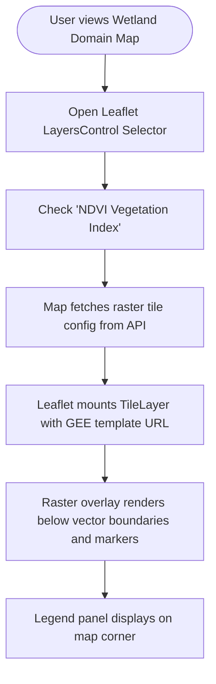

# PRD — Integrate Satellite Rasters to Wetlands Map

> **Stage 2 of 3 — Documentation Hierarchy**
> Owner: John (Product Manager) & Winston (Architect) | Target Location: `docs/prd/satellite_raster_integration_prd.md` | References: `docs/product_brief.md`, `docs/prd/wetland_map_integration_prd.md`
> Status: `Draft`
> Sign-off: Engineering Lead: _[Pending]_ | Design Lead: _[Pending]_

---

## 1. Overview

**One-liner**:
Integrating satellite raster layer overlays (e.g., NDVI vegetation index, water surface extent) on the Leaflet-based wetlands map, allowing users to toggle between different remote sensing visualizations.

**Brief / Problem Reference**:
Ref: `docs/product_brief.md` (Section 3.1: "Satellite Data Ingestion: Integration of Sentinel 1 & 2 and CHIRPS...").

Currently, the portal map only shows vector basin boundaries, wetland outlines, and site markers. While the database stores tabular GEE index values (like mean NDVI per site), users cannot visually inspect the spatial distribution of vegetation health or water extent across the whole wetland. This feature integrates GEE-rendered raster tile layers directly into the Leaflet map container.

**What we are building** (What):

- A map overlay controller (UI layer selector) in the MapViewer component.
- Integration of Leaflet `TileLayer` or WMS layers referencing pre-rendered Google Earth Engine (GEE) tile URLs or standard public tile services.
- A read-only backend API endpoint or static registry returning the current satellite raster tile URL templates for the active basins/wetlands.

**Why now** (Strategic context):
Cross-referencing citizen science ground-truth parameters (like pH and DO) with macro-scale satellite rasters helps decision-makers detect early signs of wetland encroachment, papyrus clearing, and seasonal water level changes that localized site measurements might miss.

---

## 2. Goals & Success Metrics

| Goal                                | Success Metric                                                   | Baseline | Target                     | Owner      |
| :---------------------------------- | :--------------------------------------------------------------- | :------- | :------------------------- | :--------- |
| Enable spatial raster visualization | % of active wetlands supporting at least one raster overlay      | 0%       | 100% (Mara & Sio-Siteko)   | Dev/Tester |
| Ensure responsive performance       | Raster tile load time addition to MapViewer                      | N/A      | < 1.5 seconds on 3G        | Dev        |
| Maintain map usability              | UI marker clickability and outline visibility with raster active | 100%     | 100% (markers stay on top) | UX/Dev     |

**Anti-Goals**:

- We are not building a real-time, on-demand GEE computation engine triggered from the client (tiles should be cached or pre-rendered GEE map IDs).
- We are not allowing users to upload their own GeoTIFF or raster files.

---

## 3. Target Users & Personas

| Persona                | Job-to-be-Done                                                           | Key Frustration                                                         | v1 Priority |
| :--------------------- | :----------------------------------------------------------------------- | :---------------------------------------------------------------------- | :---------- |
| Ecologist / Field Lead | Monitor vegetation health trends across Sio-Siteko transboundary wetland | Can only see point-level data; no broad overview of papyrus degradation | Primary     |
| NBD Secretariat        | Present visual evidence of wetland encroachment to county officials      | Point charts are hard for non-technical officials to interpret          | Secondary   |

---

## 4. User Stories

| ID     | User Story                                                                                                                                                           | Priority (MoSCoW) | FR Reference           |
| :----- | :------------------------------------------------------------------------------------------------------------------------------------------------------------------- | :---------------- | :--------------------- |
| US-001 | As an **ecologist**, I want to toggle an NDVI raster layer on the wetland map so that I can visually inspect the density of healthy vegetation.                      | Must Have         | FR-001, FR-003, FR-004 |
| US-002 | As a **field manager**, I want the raster tiles to render underneath site markers and boundary outlines so that I don't lose the interactive pins and site metadata. | Must Have         | FR-004                 |
| US-003 | As a **portal user**, I want to view a legend explaining the colors of the active satellite raster layer so that I can interpret what the colors mean.               | Should Have       | FR-005                 |

---

## 5. Functional Requirements

| ID     | Requirement                                                                                                                                                                                          | User Story | Priority    |
| :----- | :--------------------------------------------------------------------------------------------------------------------------------------------------------------------------------------------------- | :--------- | :---------- |
| FR-001 | The MapViewer MUST integrate the raster overlay toggle directly into the existing Leaflet `<LayersControl>` selector as togglable overlays (e.g., "NDVI Vegetation Index" and "Water Surface Extent"). | US-001     | Must Have   |
| FR-002 | The system MUST provide an endpoint or static registry configuration `GET /api/v1/raster-layers` returning the active tile URL templates (with `{x}`, `{y}`, `{z}` placeholders) or GEE MapID URLs.      | US-001     | Must Have   |
| FR-003 | The MapViewer MUST mount a Leaflet `<TileLayer>` dynamically pointing to the selected raster URL template when toggled.                                                                                | US-001     | Must Have   |
| FR-004 | The Leaflet layer stack order MUST place the raster layer directly above the base map layer, but below all vector boundaries (basin/wetland GeoJSONs) and site marker pins.                         | US-002     | Must Have   |
| FR-005 | The map interface MUST render a color ramp legend matching the active raster (e.g., NDVI scale from -0.1 to 0.9 with colors from yellow to deep green).                                               | US-003     | Should Have |

---

## 6. Non-Functional Requirements

| Category          | Requirement                                                 | Metric                                   |
| :---------------- | :---------------------------------------------------------- | :--------------------------------------- |
| **Performance**   | Map panning responsiveness with raster active               | Maintain 60fps panning, no UI stuttering |
| **Availability**  | Onboarding service uptime                                   | 99.9% SLA                                |
| **Security**      | All raster layer endpoints secure or public-read configured | No raw GEE credentials leaked            |
| **Accessibility** | Interactive layer toggles must be keyboard navigable        | Focus outline visible, WCAG 2.1 AA       |

---

## 7. User Flows & Wireframes

### Happy Path: Enabling Raster Overlay

---

## 8. Scope

**v1 — In Scope**:

- Integration of raster options into the existing Leaflet `<LayersControl>` component.
- Support for rendering dynamic Leaflet TileLayers (NDVI and Water Surface Extent).
- Legend panel for selected rasters.
- Static or mock GEE raster tile URL registry on backend to support development and testing.

**v1 — Explicitly Out of Scope**:

- Date slider for historical raster time-series (MVP will show the most recent monthly/quarterly composite).
- Custom opacity sliders for the rasters (fixed opacity of ~0.7 will be used).

---

## 9. Assumptions & Constraints

**Assumptions**:

- Pre-rendered GEE map tiles or standard tile service endpoints are available and can be loaded over public HTTPS.
- Leaflet can load these external tiles without CORS or authentication issues (e.g., public MapID tile URLs from GEE).

**Open Questions**:

- Are we using GEE direct tile endpoint URLs (which expire after a few hours/days unless generated via a service account on demand) or static/WMS endpoints?
  - _Recommendation_: For MVP, we will use a static/mock registry that provides cached/stable mock tile URLs or public cloud storage tile paths, and plan dynamic GEE token exchanges for Phase 2.

---

## 10. Change Log

| Version | Date       | Author                          | Changes                                                 |
| :------ | :--------- | :------------------------------ | :------------------------------------------------------ |
| 0.1     | 2026-06-30 | John (PM) / Winston (Architect) | Initial draft for satellite raster integration planning |

---

## Exit Criterion

This PRD MUST be signed off by both the Engineering Lead and Design Lead before LLD begins.

**Sign-off Checklist**:

- [ ] All functional requirements are testable and unambiguous
- [ ] All user stories have acceptance criteria
- [ ] Engineering Lead has reviewed feasibility
- [ ] Design Lead has reviewed user flows and wireframes
- [ ] Open questions are resolved
