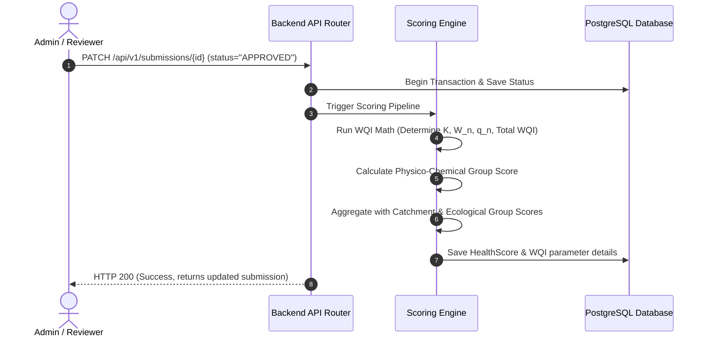

# PRD — Scoring Engine and WQI Calculator

> **Stage 2 of 3 — Documentation Hierarchy**
> Owner: PM + Winston (Architect) | Target Location: `docs/prd/scoring_engine_prd.md` | References: `docs/product_brief.md`, `docs/Final_SDD.md`
> Status: `Under Review`

---

## 1. Overview & Goal

**Problem Statement**:
While citizen scientists collect raw environmental data (such as pH and Dissolved Oxygen), these raw numbers do not directly indicate the ecological health of the wetland. To make these data points meaningful for decision-makers and the public, the platform must automatically convert them into a standardized Water Quality Index (WQI) and a composite site health score.

**Core Metric**:
100% of approved citizen-scientist sampling records must have a computed composite health score and WQI parameter breakdown generated within 2 seconds of admin approval.

**What we are building** (What):
- An automated backend scoring service that triggers immediately when an administrator approves a KoboCollect sampling record.
- A Water Quality Index (WQI) mathematical utility using specific East African permissible limits ($S_{\text{pH}} = 8.5$, $S_{\text{DO}} = 5.0$ mg/L) and ideal parameters ($V_{io} = 7.0$ for pH, $14.6$ mg/L for DO).
- An aggregation pipeline that computes group means and the final raw Composite Score (average of Physico-chemical, Catchment/hydrological, and Ecological group scores).

**Why now** (Strategic context):
This scoring engine forms the core scientific layer of the Nile Basin Discourse data platform, turning raw observations into the traffic light status indicators displayed on the public landing page map.

---

## 2. Target Users & Personas

| Persona | Job-to-be-Done | Key Frustration | v1 Priority |
|---------|---------------|-----------------|-------------|
| Akvo / NBD Admin / Reviewer | Approves incoming citizen scientist logs and expects the platform to immediately calculate and display updated site health status. | Manually calculating water quality metrics or waiting for slow batch runs to verify site health. | Primary |

---

## 3. User Stories & flows

### User Stories
- **US-001**: As an **Admin/Reviewer**, I want the platform to automatically calculate WQI sub-metrics, physico-chemical scores, and composite scores immediately when I approve a sampling record, so that health data is always up to date.
- **US-002**: As a **Public Portal User**, I want to see the WQI parameter ratings and weight breakdowns on the site detail drawer, so I can understand what parameters contribute to the traffic light status.

### Flowchart / Data Flow

---

## 4. Requirements (Scope Guardrails)

### Must-Have
- **Instant Processing**: Trigger scoring immediately during the database transaction when a submission's status changes to `APPROVED`.
- **WQI Formula Implementation**:
  - **Proportionality Constant ($K$)**: $K = \frac{1}{\sum (1/S_n)}$ using parameters:
    - $S_{\text{pH}} = 8.5$
    - $S_{\text{DO}} = 5.0$ mg/L
  - **Unit Weights ($W_n$)**: $W_n = \frac{K}{S_n}$ ($W_{\text{pH}} \approx 0.3704$, $W_{\text{DO}} \approx 0.6297$).
  - **Quality Ratings ($q_n$)**: $q_n = 100 \times \frac{V_n - V_{io}}{S_n - V_{io}}$ where $V_{io} = 7.0$ for pH and $14.6$ mg/L for DO.
  - **Aggregation**: $\text{WQI} = W_{\text{pH}} \times q_{\text{pH}} + W_{\text{DO}} \times q_{\text{DO}}$.
  - **Group score mapping**: $\text{Physico-chemical Score} = \max(0.0, 1.0 - \frac{\text{WQI}}{100})$.
- **Composite Score Aggregation**: Calculate the raw Composite Score as the average of the three groups:
- **Form-Specific Execution (Citizen Scientist)**: The baseline scientific scoring calculations must execute only upon the approval of Citizen Scientist (Form Type 2) records. Other form types (e.g., Pollution Reports, Lab shadow tests) do not trigger baseline scoring calculations.
- **Database Persistence**: Save calculated scores to `health_scores` table linked to the site, period, and original submission.

### Nice-to-Have
- Support for additional parameters (e.g., Turbidity, Electrical Conductivity) in later phases with configurable limits via DB tables rather than code constants.

### Out of Scope
- Fuzzy logic adjustment calculations (this PRD is strictly restricted to base scientific WQI calculations; fuzzy logic is mapped in the next sub-task).
- Direct data modification by non-admin users.

---

## 5. Acceptance Criteria

### User Acceptance Criteria (UAC)
- **UAC-1.1**: When a KoboCollect sampling record with pH `7.8` and Dissolved Oxygen `4.77` mg/L is approved, the physico-chemical group score is computed as `0.16` (corresponding to WQI `84.23`).
- **UAC-1.2**: If the Catchment score is `0.65` and Ecological score is `0.45`, the resulting Composite Score is computed as `0.42` (average of `0.16`, `0.65`, `0.45`).

### Technical Acceptance Criteria (TAC)
- **TAC-1.1**: The scoring engine must run within the same transaction bounds of the submission approval PATCH request to prevent partial updates.
- **TAC-1.2**: If pH or DO observed values are missing or null in the submission, fallback to default ideal values or throw a structured execution error to DLQ.
- **TAC-1.3**: Math equations must implement strict division-by-zero protection (e.g. when observed values equal limits or ideal values).

---

## 6. Edge Cases & Errors

- **Null / Missing Values**: If a subset of water quality metrics is missing, use default standard averages or log the run to the Dead Letter Queue (DLQ).
- **Extreme Inputs**: If pH > 14 or DO < 0, constrain inputs to standard bounds and flag warning in log.
- **Division by Zero**: Check that denominator ($S_n - V_{io}$) is never zero. (For pH: $8.5 - 7.0 = 1.5$; for DO: $5.0 - 14.6 = -9.6$. Both are safe constants).

---

## 7. Rollout & Rollback Plan

- **Rollout**: Seed the default basin limits ($S_n$ constants) into the system configuration during database migration, deploy backend routers, and enable auto-calculation.
- **Rollback**: Disable automated scoring trigger via environment variable `ENABLE_SCORING_ENGINE=false` in the event of critical transaction locking.

---

## 8. Epic & Ballpark Estimation

| Component | Task Description | Complexity | Ballpark Estimate (Hours) |
|-----------|------------------|------------|---------------------------|
| **Backend Service** | Implement WQI math functions and unit tests in Python | Simple | 3h |
| **Ingestion Router Integration** | Wire scoring trigger to `PATCH /api/v1/submissions/{id}` endpoint | Medium | 3h |
| **Database Migrations** | Add tables for storing group means and parameter WQI details | Simple | 2h |
| **API Endpoints** | Expose site health scores details via `GET /api/v1/sites/{id}/scores` | Medium | 4h |

---

## Exit Criterion
> This PRD must be approved by the user to proceed to LLD and implementation plan.
