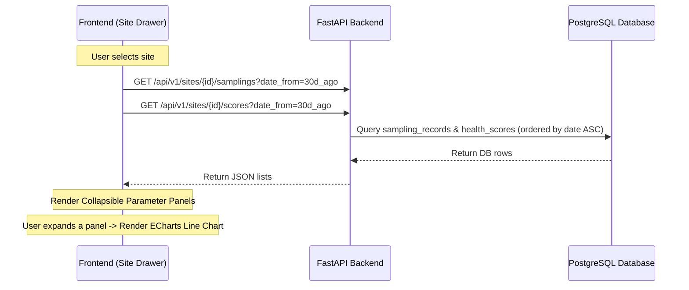

# PRD — Site Detail Timeseries Data History

## I. Overview & Goal
Currently, the site detailed view drawer only shows the latest reported data point and health score. Users need a way to understand trends and see historical values of both the calculated health scores (composite, WQI, ecological, catchment) and the raw water sampling parameters (pH, temperature, dissolved oxygen, invasive macrophytes, CPUE).

This feature introduces interactive, collapsible timeseries line charts (using ECharts) showing historical data over a **1-month window** (default x-axis) directly within the site detail drawer.

---

## II. User Journey & UI Flow

### UI Presentation: Inline Collapsible Charts vs. Tabs
To maintain the high-fidelity layout and keep the current status (such as triggered interventions, current health class, and map) fully visible, we will utilize **collapsible inline trend containers** rather than introducing a global tabbed view.

* An interactive trend icon (e.g., `TrendingUp` or `LineChart`) is added next to each metric.
* Clicking the icon expands a collapsible panel directly below the row, rendering an ECharts line chart mapping the past 30 days of data.

---

## III. Target Sections & Parameters

The 1-month timeseries charts will be added to the following parameters inside their existing sections:

### 1. Score Breakdown Section (Under "Score breakdown" progress bars)
* **Water Quality Index (WQI)** — mapped from historical WQI scores.
* **Composite Score (pre-adjustment)** — mapped from historical composite scores.
* **IK health signal (FGD)** — mapped from historical indigenous knowledge signals.
* **Adjusted Score** — mapped from historical adjusted composite scores.

### 2. Raw Sampling Method Section (Under "Raw sampling method" table rows)
* **pH Value** (`ph_value` / dimensionless scale).
* **Water Temperature** (`temp_value` / °C).
* **Dissolved Oxygen** (`do_value` / mg/L).
* **Invasive Macrophytes** (`invasive_macrophytes` / %).
* **Catch Per Unit Effort** (`cpue_value` / kg/net-night).

---

## IV. Scope Guardrails

### Must-Have (v1)
* **Backend API Endpoint**:
  * `GET /api/v1/sites/{site_id}/samplings` to retrieve historical `SamplingRecord` logs, filterable by date range (defaulting to the last 30 days).
* **Frontend Timeseries Integration**:
  * Fetch historical scores and samplings concurrently when a site is selected.
  * Collapsible panel layout for each major parameter.
  * Integration of interactive ECharts line charts with a 1-month time window on the x-axis.
  * Responsive rendering (scaling cleanly between desktop drawer and mobile bottom-sheet views).

### Nice-to-Have
* A toggle to change the time window (e.g., `7 Days`, `30 Days`, `90 Days`).
* Visual thresholds on the charts (e.g., shaded normal range for pH/DO values).

### Out of Scope
* Multi-site comparison charts.
* Ability to download historical raw CSV data from the drawer (deferred to a general data export ticket).

---

## IV. Technical Design & Data Flow

### API Contracts

### API Contracts (Domain-Agnostic)

To support future domains (e.g., rivers, forests) without backend schema modifications, both endpoints return generic key-value payloads for their parameter and metric records.

#### 1. Samplings History Endpoint
`GET /api/v1/sites/{site_id}/samplings?date_from=...&date_to=...`
* **Response Payload**: `List[GenericSamplingHistory]` containing:
  * `id`: UUID
  * `sampled_at`: ISO timestamp
  * `parameters`: `Dict[str, Any]` (direct mapping from the database `parameters` JSONB column, e.g. `{"ph_value": 7.20, "temp_value": 24.50, "do_value": 6.80, "invasive_macrophytes": 12.50, "water_level": "MEDIUM"}`)

#### 2. Scores History Endpoint
`GET /api/v1/sites/{site_id}/scores?date_from=...&date_to=...`
* **Response Payload**: `List[GenericScoreHistory]` containing:
  * `id`: UUID
  * `calculated_at`: ISO timestamp
  * `composite_score`: Decimal
  * `ik_signal_value`: Decimal
  * `adjusted_score`: Decimal
  * `health_class`: str
  * `breakdown`: `Dict[str, Any]` (direct mapping from the database `breakdown` JSONB column, e.g. `{"physico_chemical": 0.85, "catchment_hydrological": 0.75, "ecological": 0.55}`)

### Data Flow Diagram

---

## V. Acceptance Criteria

### User Acceptance Criteria (UAC)
* **UAC-1 (Collapsible Trend Layout):** Inside the site drawer, the user sees a "Historical Trends" section with collapsible rows for each parameter.
* **UAC-2 (Line Chart Render):** Expanding a row displays a line chart mapping the values over the past 30 days.
* **UAC-3 (Tooltip Precision):** Hovering over chart data points shows the exact date and numeric value.
* **UAC-4 (Empty State):** If a site has no historical data or only one record, a friendly text message or simple point is displayed instead of a broken chart.

### Technical Acceptance Criteria (TAC)
* **TAC-1 (FastAPI Performance):** The query must utilize database indices (e.g., `idx_sampling_records_site_date`) and complete in <150ms.
* **TAC-2 (RSC / Client Boundaries):** Fetching history runs asynchronously on the client-side so it does not block the initial drawer rendering.
* **TAC-3 (Vitest):** Frontend unit tests must verify dynamic API fetching and error states inside the site drawer.

---

## VI. Edge Cases & Errors
1. **No historical records**: Show "No trend data available for this period."
2. **Only 1 data point**: ECharts should show a single point on the graph rather than crash.
3. **Out-of-range dates**: The date query parameters must be validated to prevent arbitrary resource consumption.

---

## VII. Epic Breakdown & Ballpark Estimation

| Component | Task | Complexity | Ballpark Est. |
|---|---|---|---|
| **Backend** | Implement `/api/v1/sites/{site_id}/samplings` and write integration tests. | Simple | 3 hours |
| **Frontend API** | Update `lib/api.ts` clients with new fetch functions and types. | Simple | 1 hour |
| **Frontend UI** | Implement collapsible panels, inject ECharts line charts with tooltips in `site-drawer.tsx`. | Medium | 6 hours |
| **QA / Testing** | Write Vitest components tests for the expanded drawer chart state. | Medium | 3 hours |
| **Total** | | | **~13 hours (1.5 Days)** |
