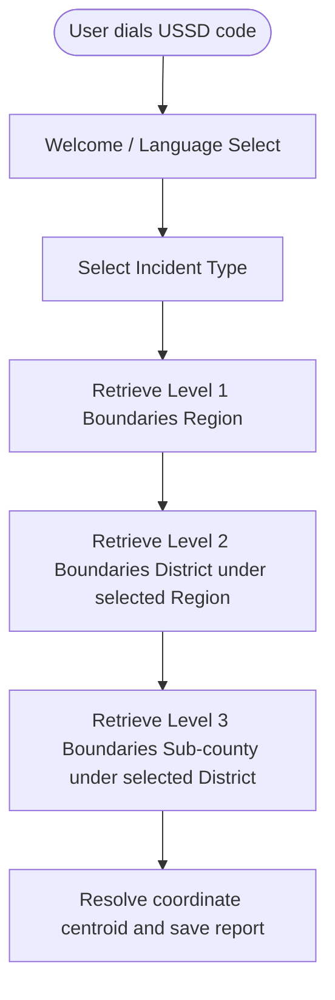

# Product Requirements Document (PRD) — Spatial Boundaries Reference Model (PostGIS)

## I. Overview & Goal

### Problem Statement
USSD pollution reporting operates under a strict 10-second gateway timeout from Africa's Talking. Because feature phone users cannot submit GPS coordinates directly, they must select their administrative locations from a text-based menu (e.g. Region -> District -> Sub-county). To keep queries fast, we need a hierarchical geospatial reference table.

Instead of flat tables, a nested Adjacency List pattern combined with Hierarchical Depth Levels allows infinite administrative depth while keeping USSD queries extremely fast and optimized.

### Core Metric
* **Target Query Latency**: Spatial boundary retrieval queries must resolve in `< 50ms` (baseline: ~150ms with un-indexed flat tables).
* **USSD Success Rate**: Ensure location routing and menu rendering resolve well within the 10-second gateway limit.

---

## II. User Stories & Flows

### User Personas
* **Alice (USSD Citizen Reporter)**: Speaks Swahili/English. Needs to report a pollution incident by navigating regional/district/sub-county menus on a basic feature phone.
* **Bob (System Administrator)**: Needs a pre-populated list of boundaries for Mara Basin (and Sio-Siteko) on platform startup without manually entering database records.

### User Journey / Flow

---

## III. Requirements (Scope Guardrails)

### Must-Have
1. **Adjacency List Schema**:
   * Provision the `spatial_boundaries` table with:
     * `id`: UUID (Primary Key)
     * `name`: String (e.g., 'Mara Region', 'Tarime')
     * `level`: Integer (Indexed, maps to semantic Enum)
     * `parent_id`: UUID (Nullable foreign key pointing back to `spatial_boundaries.id` with `ON DELETE CASCADE`)
     * `basin_id`: UUID (Foreign Key referencing the `basins` table)
     * `centroid_geom`: PostGIS `GEOMETRY(Point, 4326)`
2. **Database Indices**:
   * Composite Index on `(basin_id, level)` to speed up USSD query traversal.
   * GiST Index on `centroid_geom` for fast geospatial checks.
3. **Strict Python Enum**:
   * Map depth level integers to semantic names:
     * `1` = Province / Region
     * `2` = District / County / Kabupaten
     * `3` = Sub-county / Parish / Kecamatan
4. **Automated Seeding**:
   * Pre-populate database with `Mara Region` (level 1) and sub-counties/districts: `Butiama`, `Rorya`, `Tarime`, `Serengeti` (level 2, parent_id pointing to Mara Region).

### Nice-to-Have
* Polygon boundary coordinate support for advanced map overlays in future phases.

### Out of Scope
* Automatic reverse geocoding from GPS to matching sub-county inside USSD.

---

## IV. Acceptance Criteria

### User Acceptance Criteria (UAC)
* **UAC 1**: When a user selects a Region, the system immediately loads only the child Districts belonging to that Region.
* **UAC 2**: The menu options display in under 100ms on the phone screen.

### Technical Acceptance Criteria (TAC)
* **TAC 1 (PostGIS Schema)**: Create an Alembic migration script to provision the `spatial_boundaries` table with the requested columns and composite index on `(basin_id, level)`.
* **TAC 2 (Python Enum)**: Define level mapping in `backend/app/models/spatial.py` without magic numbers.
* **TAC 3 (Mara Seeding)**: Write a seeder script populating Mara Region and its level 2 children.
