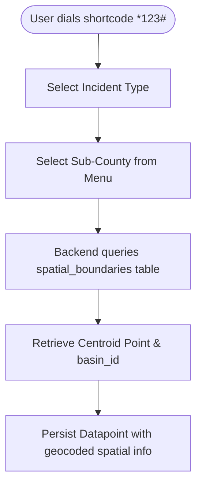

# PRD — Spatial Boundaries Reference Model (PostGIS)

> **Stage 2 of 3 — Documentation Hierarchy**
> Owner: Winston (Architect) | Target Location: `docs/prd/spatial_boundaries_prd.md` | References: `docs/product_brief.md`, `docs/database_schema.md`
> Status: `Draft`

---

## 1. Overview

**One-liner**:
A static reference table storing PostGIS-based centroids and basin associations for sub-counties, enabling USSD menu selections to be resolved to map coordinates.

**Brief / Problem Reference**:
Refers to USSD incident geocoding requirements in `docs/product_brief.md` and cascade questions in `docs/form_definition_schema.md`.

**What we are building**:
We are building a `spatial_boundaries` database table, ORM model, Pydantic schemas, and seed data containing the sub-counties for the Mara and Sio-Siteko basins. This acts as a reference lookup. When a USSD user selects a sub-county like "Butiama", the backend maps the report to Butiama's coordinate centroid and associates it with the Mara Basin.

**Why now**:
USSD reporting is text-based and cannot access device GPS. We must have a pre-seeded, reliable administrative boundary centroid list in the database to geocode incoming USSD submissions.

---

## 2. Goals & Success Metrics

| Goal | Success Metric | Baseline | Target | Owner |
|------|---------------|----------|--------|-------|
| Geocode USSD submissions | Successful resolution rate of USSD location selection to coordinate | 0% (No reference table) | 100% | PM |
| Expose sub-county reference | API latency for listing sub-counties options | N/A | < 100ms | Dev |

---

## 3. Target Users & Personas

| Persona | Job-to-be-Done | Key Frustration | v1 Priority |
|---------|---------------|-----------------|-------------|
| Citizen Reporter | Dial `*123#` and report pollution events via simple text menus. | Can't send GPS coordinates via a basic feature phone. | Primary |

---

## 4. User Stories

| ID | User Story | Priority (MoSCoW) | FR Reference |
|----|-----------|-------------------|--------------|
| US-001 | As a **Citizen Reporter**, I want to select my sub-county from a menu so that my pollution report is geocoded to the correct basin and coordinate. | Must Have | FR-001 |
| US-002 | As an **Admin**, I want the database to pre-populate all sub-counties upon deployment so that I do not need to manually enter administrative lists. | Must Have | FR-002 |

---

## 5. Functional Requirements

| ID | Requirement | User Story | Priority |
|----|-------------|------------|----------|
| FR-001 | The system MUST support storing sub-counties with UUID keys, names, parent `basin_id` associations, and PostGIS `GEOMETRY(Point, 4326)` centroids. | US-001 | Must Have |
| FR-002 | The system MUST pre-populate the `spatial_boundaries` table with the official sub-counties for the Mara and Sio-Siteko basins during deployment. | US-002 | Must Have |
| FR-003 | The system MUST expose a GET `/api/v1/reference/sub-counties` endpoint returning the hierarchical list of sub-counties to populate forms. | US-001 | Must Have |

---

## 6. Non-Functional Requirements

| Category | Requirement | Metric |
|----------|-------------|--------|
| **Performance** | Centroid query resolution latency | < 50ms |
| **Security** | Read-only public access to reference sub-counties | Permitted without authentication |
| **Accuracy** | Centroid coordinates must lie within the bounds of the parent basin | 100% verification check |

---

## 7. User Flows & Wireframes

---

## 8. Scope

**v1 — In Scope**:
- Database table `spatial_boundaries`.
- Alembic migration for schema creation.
- Python seed script containing sub-counties data.
- SQLAlchemy ORM Model `SpatialBoundary`.
- Pydantic schema validation.
- API route `GET /api/v1/reference/sub-counties`.

**v1 — Explicitly Out of Scope**:
- Polygon boundary support for sub-counties (only centroids needed for v1).

---

## 9. Assumptions & Constraints

**Assumptions**:
- Centroids are sufficient for USSD mapping visualization.
- The parent `basins` table has records seeded before `spatial_boundaries` seeds are executed.

**Open Questions**:
- What are the exact coordinates and sub-counties to seed?
  - *Answer*: We will seed the prominent sub-counties/districts in Mara and Sio-Siteko (e.g., Rorya, Tarime, Butiama, Serengeti, Musoma for Mara; Busia, Namayingo, Tororo, Bugiri for Sio-Siteko).

---

## 10. Change Log

| Version | Date | Author | Changes |
|---------|------|--------|---------|
| 0.1 | 2026-06-05 | Winston | Initial draft |
