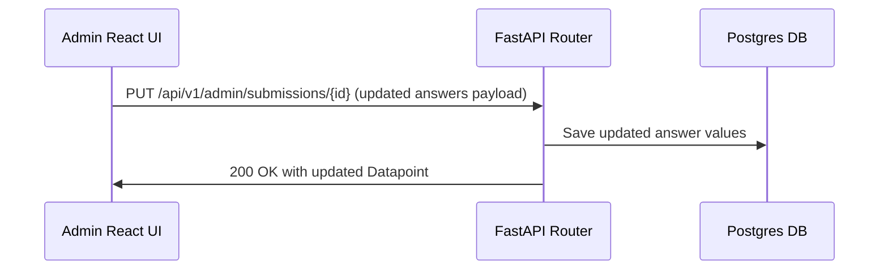

# PRD — Submission Details & Moderation Management

> **Stage 2 of 3 — Documentation Hierarchy**
> Owner: PM (John) + Design Lead (Sally) | Target Location: `docs/prd/submission_details_management_prd.md`
> Status: `Proposed`

---

## 1. Overview & Goal

**Problem Statement**:
While the Admin Portal contains a high-level list of submissions, Reviewers and Admins currently lack the ability to inspect the detailed answer fields, view attachments/images, verify the exact coordinates, or correct/edit submission metadata. Additionally, action buttons (Approve, Reject, Delete) trigger immediately upon click without confirmation, increasing the risk of accidental status modifications or data loss. Once approved or rejected, action buttons lack clear disabled states.

**Core Metric**:
- Zero accidental approvals or deletions via new confirmation safeguards.
- 100% visibility of submission details and answers.
- 100% clear disabled button states for approved/rejected submissions.

---

## 2. User Stories & Flows

### User Personas
- **Reviewer**: Wants to review submissions, inspect detailed water parameters/answers/coordinates, edit answers to correct obvious typos, and safely approve/reject records.
- **Admin**: All reviewer permissions plus the ability to delete submissions after confirmation.

### User Journeys

#### Journey 1: Inspecting & Moderating a Submission
1. Admin/Reviewer navigates to `/admin/data`.
2. Clicks a submission row. The row expands inline (or opens a detailed modal/drawer) showing:
   - Form metadata (created time, submitter name, phone/email, source channel).
   - Structured table of all answers (Questions vs. User Answers with readable labels).
   - Media attachments (images) or document URLs, showing thumbnail/download link.
   - Coordinates (Latitude, Longitude) if available.
3. Click "Approve". A confirmation modal appears asking: "Are you sure you want to approve this submission?"
4. Upon clicking "Yes, Approve", the action is sent. The row updates, the status badge turns to "Approved", and the "Approve" button is disabled.

#### Journey 2: Editing a Submission
1. Reviewer clicks "Edit" in the detailed view of a submission.
2. The user is redirected to a new page route at `/admin/data/edit/[submissionId]`.
3. This page fetches the submission details and its corresponding form schema, and renders the `akvo-react-form` component populated with the submission's current answers.
4. Reviewer changes any parameter/field using the interactive form (supporting default validation rules for each question type).
5. Reviewer clicks "Save". The system validates inputs on the client side, then calls `PUT /api/v1/admin/submissions/{id}` to persist changes.
6. The UI displays a success toast and redirects the user back to `/admin/data`.

---

## 3. Requirements (Scope Guardrails)

### Must-Have
1. **Expanded Detail View**:
   - Inside the row expansion (or a sidebar drawer), show all answers for the selected submission.
   - Group answers logically based on form type (e.g., pH, Temperature, DO for sampling data; photos for incident reports).
   - Render images inline as thumbnail previews that open in a lightbox on click.
2. **Confirmation Modals**:
   - Guard Approve, Reject, and Delete actions with a confirmation dialog (e.g., "Confirm Approval", "Confirm Rejection", "Confirm Deletion").
3. **Disabled Action States**:
   - If status is `Approved`, disable "Approve" and "Reject" buttons.
   - If status is `Rejected`, disable "Approve" and "Reject" buttons.
   - Delete remains enabled for Admins only (irrespective of status).
4. **Edit Submission API & UI**:
   - Backend endpoint `PUT /api/v1/admin/submissions/{id}` allowing Admins/Reviewers to edit submission answers.
   - Frontend "Edit" button redirects to a new page `/admin/data/edit/[submissionId]` that loads `akvo-react-form` pre-filled with the current answers, enabling a standard editing workflow.
5. **Default Filters & Ordering**:
   - The `/admin/data` table MUST filter by "Pending" status by default on initial page load.
   - The submission list retrieved from the backend MUST be ordered chronologically by creation date ascending (oldest first) so that the reviewer handles oldest pending requests first.

### Nice-to-Have
- Map preview for coordinates.
- Log of edits (audit history of who changed which answer field).

### Out of Scope
- Creating new submissions from the detailed view (only editing existing ones).
- Changing form type after creation.

---

## 4. Architecture Design

### Data Flow

---

## 5. Acceptance Criteria

### User Acceptance Criteria (UAC)
- **UAC-001**: Clicking a submission row expands it, rendering a clean grid of all answered questions and their resolved option labels.
- **UAC-002**: If the submission contains a media file, it shows a thumbnail preview that opens the full GCS url on click.
- **UAC-003**: Clicking Approve/Reject/Delete shows a confirmation dialog. The action only proceeds when confirmed.
- **UAC-004**: If a submission is already "Approved", the "Approve" action button is disabled and greyed out.
- **UAC-005**: In edit mode, changing the value of pH and saving successfully updates the database and updates the UI.

### Technical Acceptance Criteria (TAC)
- **TAC-001**: Edit submission API must validate answer types (e.g., float inputs for chemical measurements).
- **TAC-002**: Confirmation dialogs must use responsive, keyboard-accessible components (e.g., headless dialog / Radix).

---

## 6. Epic & Ballpark Estimation

- **Frontend Component (Drawer/Modal, Edit forms, Confirmation dialogs)**: 2 days (Medium)
- **Backend API (PUT endpoint, Validation logic)**: 1.5 days (Medium)
- **Unit / Integration Tests**: 1 day (Simple)
- **Ballpark Estimate**: 4.5 developer days.
