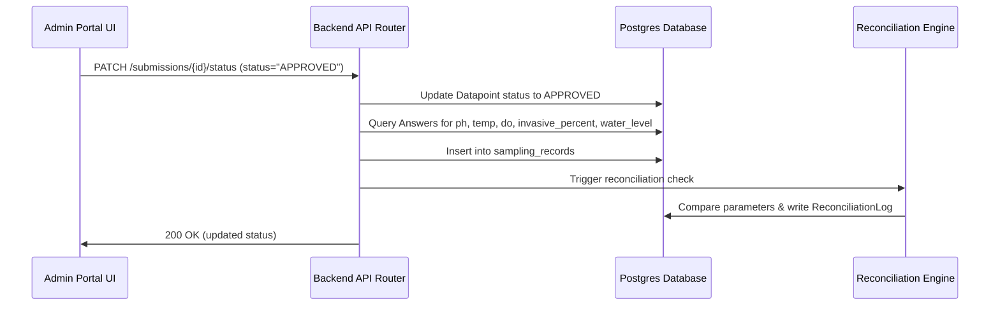

# Submission Moderation and Approval PRD

## I. Overview & Goal

* **Problem Statement**: Submissions made by citizen scientists are saved in the database as generic `Datapoint` and `Answer` records with a status of `PENDING`. Currently, there is no way for administrators to approve/reject these submissions. Furthermore, when approved, the corresponding structured `sampling_records` table must be populated so the auto-reconciliation engine can compare them with academic lab QA data.
* **Core Metric**: 100% of approved citizen scientist sampling submissions successfully translated into structured `sampling_records` rows, triggering auto-reconciliation checks on approval.

---

## II. User Stories & Flows

* **User Persona**: Admin User (Moderator)
* **User Flow**:

  1. Admin opens the Data Overview workspace (`/admin/data`).
  2. Admin reviews the `PENDING` monthly wetland sampling submissions.
  3. Admin clicks **Approve** on a submission.
  4. Backend marks the datapoint as `APPROVED`, extracts water quality parameter answers, creates a `SamplingRecord` row, and invokes the auto-reconciliation check.
  5. The UI updates the row status to `Approved` in real-time.

---

## III. Requirements (Scope Guardrails)

### Must-Have

1. **Backend Moderation API**: `PATCH /api/v1/submissions/{id}/status` allowing admins to set `status` to `"APPROVED"` or `"REJECTED"`.
2. **Translation to SamplingRecord**: On approval, the backend must dynamically parse the submission's answers and insert a row into the `sampling_records` table:
   * `ph_value` <- Answer for question `ph` (number)
   * `temp_value` <- Answer for question `temp` (number)
   * `do_value` <- Answer for question `do` (number)
   * `invasive_macrophytes` <- Answer for question `invasive_percent` (number)
   * `water_level` <- Answer for question `water_level` (option value e.g. "HIGH", "MEDIUM", "LOW" normalized to uppercase)
   * `sampled_at` <- Datapoint `created_at` timestamp
   * `site_id` <- Datapoint `site_id` (must be present)
3. **Trigger Auto-Reconciliation**: Immediately after writing to `sampling_records`, trigger the reconciliation logic to evaluate the new record against any corresponding Lab QA report within the 90-day window.
4. **Frontend API Integration**: Update `handleApprove` and `handleReject` in `frontend/src/app/admin/data/page.tsx` to communicate with the backend API.

---

## IV. Architecture Design

### Data Flow

---

## V. Acceptance Criteria

### User Acceptance Criteria (UAC)

* **UAC-001**: Given a PENDING citizen science submission, when the admin clicks "Approve", the status badge turns green, and the button becomes disabled.
* **UAC-002**: Given an approved submission, when checked in the database, a corresponding row in the `sampling_records` table is populated with matching float values.

### Technical Acceptance Criteria (TAC)

* **TAC-001**: Parameter mapping must handle missing or non-required answers gracefully (leaving them null if allowed or throwing a validation error if required).
* **TAC-002**: All state changes must be committed in a single database transaction.

---

## VI. Epic & Ballpark Estimation

* **Component Breakdown**:
  * **API Backend**: Implement the status update handler, parsing logic, and DB integration (2 days).
  * **Frontend**: API client integration and UI state refresh (1 day).
  * **QA/Testing**: Write unit tests for the moderation endpoint and integration flow (1 day).
* **Ballpark Estimate**: 4 story points (Medium complexity).
