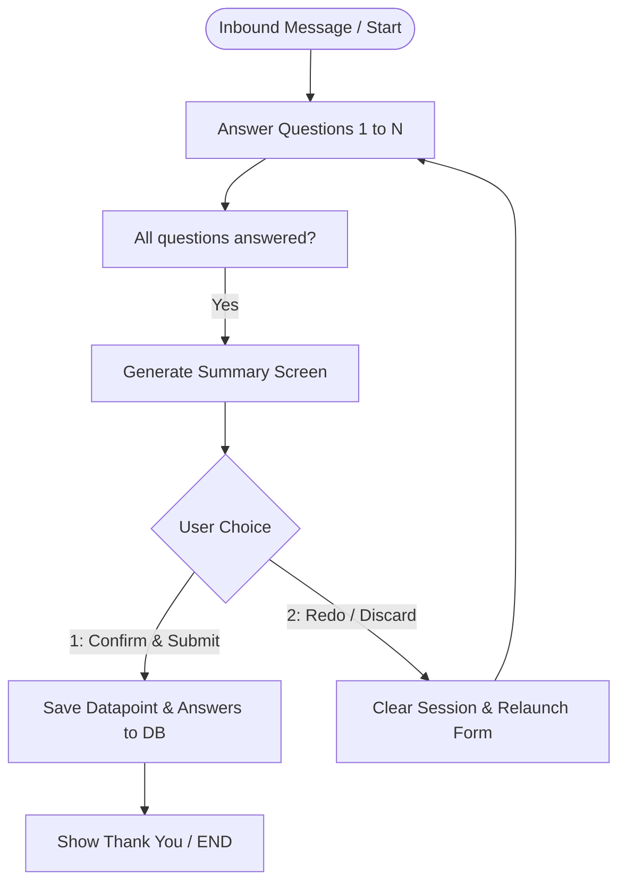

# PRD — Submission Review Screen (USSD & WhatsApp)

> **Stage 2 of 3 — Documentation Hierarchy**
> Owner: PM (John) + Design Lead (Sally) | Target Location: `docs/prd/submission_review_prd.md`
> Status: `Proposed`

---

## 1. Overview

**One-liner**:
Add a validation/review step at the end of the USSD and WhatsApp reporting flows to display a summary of inputs and prompt the user to confirm or redo their submission before persisting data.

**What we are building** (What):
A final review screen in both USSD and WhatsApp reporting channels. When users complete all questionnaire inputs, the system will present a summary of their entries (e.g., location, type of issue, etc.) in their chosen language (English or Kiswahili) and ask them to confirm and submit, or discard and start over. The database tables (`Datapoint` and `Answer`) will only receive data after the user explicitly selects "Confirm".

**Why now** (Strategic context):
Currently, citizens reporting pollution or environmental issues on WhatsApp and USSD have no way to double-check their inputs before submitting. Typing errors, incorrect location clicks, or invalid options are saved immediately, leading to poor data quality and increased admin moderation overhead.

---

## 2. Goals & Success Metrics

| Goal | Success Metric | Baseline | Target | Owner |
|------|---------------|----------|--------|-------|
| Reduce erroneous/accidental submissions | Rate of rejected submissions during moderation | ~15% | < 5% | PM |
| Improve citizen reporter confidence | Percentage of users completing the final confirmation step | N/A | > 90% | PM |

**Anti-Goals** (what we will NOT optimize for):
- Allowing in-line editing of individual questions (a redo restarts the form for simplicity).
- Providing multi-media summary views on USSD.

---

## 3. Target Users & Personas

| Persona | Job-to-be-Done | Key Frustration | v1 Priority |
|---------|---------------|-----------------|-------------|
| Citizen Reporter | Quickly report pollution incidents via WhatsApp or USSD without entering wrong data. | Accidental submissions cannot be undone or corrected. | Primary |
| Portal Administrator | Review clean, reliable, and verified incident reports. | Spending hours cleaning up duplicate or garbage reports from typo-prone mobile submissions. | Secondary |

---

## 4. User Stories

| ID | User Story | Priority (MoSCoW) | FR Reference |
|----|-----------|-------------------|--------------|
| US-001 | As a **Citizen Reporter**, I want to see a summary of my answers before submitting so that I can verify my inputs. | Must Have | FR-001 |
| US-002 | As a **Citizen Reporter**, I want to accept or redo my report so that I can start fresh if I made a mistake. | Must Have | FR-002, FR-003 |
| US-003 | As a **Portal Administrator**, I want reports to only hit the database after they are verified by the user to avoid clutter. | Must Have | FR-004 |

---

## 5. Functional Requirements

| ID | Requirement | User Story | Priority |
|----|-------------|------------|----------|
| FR-001 | The system MUST generate a structured text summary of all questions and answered options at the end of the form. | US-001 | Must Have |
| FR-002 | The system MUST present a clear two-option confirmation prompt: (1) Confirm/Submit, (2) Redo/Discard. | US-002 | Must Have |
| FR-003 | Selecting "Redo/Discard" MUST clear the session state/answers and prompt the user to start the form again. | US-002 | Must Have |
| FR-004 | The system MUST NOT persist the `Datapoint` or `Answer` records in the database until "Confirm" is chosen. | US-003 | Must Have |
| FR-005 | Summaries and prompt options MUST be presented in the user's active session language (English or Kiswahili). | US-001 | Must Have |

---

## 6. Non-Functional Requirements

| Category | Requirement | Metric |
|----------|-------------|--------|
| **Security** | Session inputs held in temp state must be protected. | Standard session logic applies |
| **Performance** | USSD response generation time | < 500ms |
| **Accessibility** | Clean, readable text templates suited for basic phone displays. | Clear plain text format |

---

## 7. User Flows & Wireframes

### Primary Flow (Happy Path)

---

## 8. Scope

**v1 — In Scope**:
- Displaying a summary of question-answer pairs at the end of `FormNames.POLLUTION_REPORTING` (type 1) in English and Kiswahili.
- Implementing a `CONFIRMATION` state in the WhatsApp state machine.
- Injecting a final review prompt step in the USSD traversal loop.
- Ensuring no database insertion of submissions occurs before confirmation.

**v1 — Explicitly Out of Scope**:
- Allowing users to edit a specific question back-and-forth.

---

## 9. Assumptions & Constraints

**Assumptions**:
- USSD session inputs are concatenated in `text` parameter; resetting the session means managing how the telco gateway continues appending inputs or clearing them.
- WhatsApp sessions can easily transition state and clear the JSON `answers` field.

---

## 10. Change Log

| Version | Date | Author | Changes |
|---------|------|--------|---------|
| 0.1 | 2026-06-24 | PM | Initial proposed draft |

---

## Exit Criterion

This PRD must be verified and approved by the user before low-level design (LLD) or sprint planning begins.
