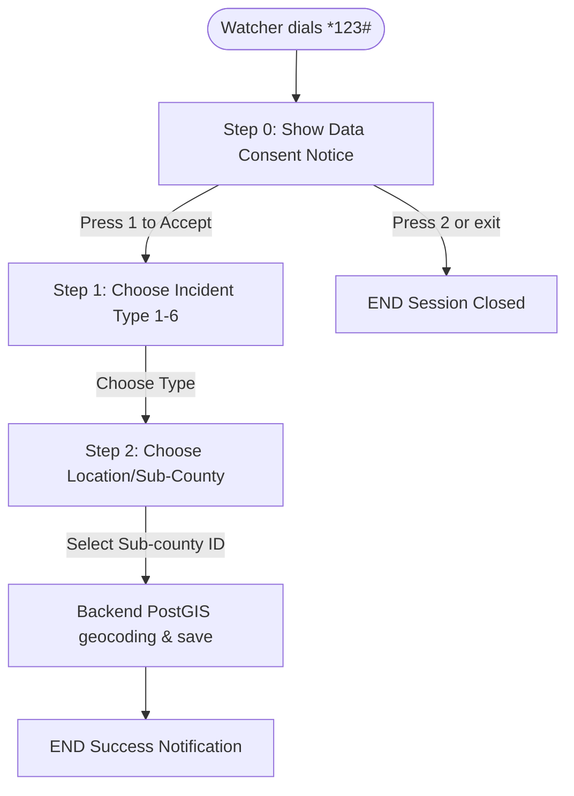

# PRD — USSD Africa's Talking Pipeline

> **Stage 2 of 3 — Documentation Hierarchy**
> Owner: PM + Design Lead | Target Location: `docs/prd/ussd_pipeline_prd.md` | References: `docs/product_brief.md`
> Status: `Approved`
> Sign-off: Engineering Lead: Amelia (Developer) | Design Lead: Sally (UX)

---

## 1. Overview

**One-liner**:
A FastAPI POST webhook to ingest stateful USSD inputs from Africa's Talking, leading users through a consent gate, pollution incident selection, sub-county resolution, and server-side PostGIS geocoding.

**Brief / Problem Reference**:
Refers to Section 7.1 (Pollution Pipeline) and Section 9.3 (Data Sovereignty) of `docs/product_brief.md`.

**What we are building** (What):
A stateful callback handler that processes telco USSD inputs. It tracks the user's progress through a branching menu (Consent -> Incident Type -> Location) and persists the geocoded reports.

**Why now** (Strategic context):
Wetland Watchers in transboundary regions often lack smartphones or internet connectivity. Providing a robust USSD channel enables real-time reporting of environmental degradation from any feature phone.

---

## 2. Goals & Success Metrics

| Goal | Success Metric | Baseline | Target | Owner |
|------|---------------|----------|--------|-------|
| Enable feature-phone reporting | Total pollution incidents ingested via USSD | 0 | > 50 / month | PM |
| Non-blocking execution | Webhook execution response latency | N/A | < 2 seconds | Dev |
| Spatial accuracy | Successful server-side geocoding mapping rate | N/A | 100% | Architect |

---

## 3. Target Users & Personas

| Persona | Job-to-be-Done | Key Frustration | v1 Priority |
|---------|---------------|-----------------|-------------|
| Wetland Watcher | Report pollution episodes quickly over GSM voice/text connection. | No smartphone, no internet access at remote wetland sites. | Primary |

---

## 4. User Stories

| ID | User Story | Priority (MoSCoW) | FR Reference |
|----|-----------|-------------------|--------------|
| US-001 | As a **Wetland Watcher**, I want a clear consent screen first so that I understand how my phone number will be used. | Must Have | FR-001 |
| US-002 | As a **Wetland Watcher**, I want to choose the incident type and sub-county so that my report is accurate. | Must Have | FR-002, FR-003 |
| US-003 | As the **NBD Platform**, I want to prevent duplicate submissions from network retries so that our data is clean. | Must Have | FR-004 |

---

## 5. Functional Requirements

| ID | Requirement | User Story | Priority |
|----|-------------|------------|----------|
| FR-001 | The system MUST present a step-zero privacy consent warning. Only inputs starting with "1" (Accept) can proceed. | US-001 | Must Have |
| FR-002 | The system MUST support incident types: Water colour, Smell, Fish/animal kills, Storm event, High water level, Low water level. | US-002 | Must Have |
| FR-003 | The system MUST resolve the user's country using network code mappings and list matching sub-counties from `spatial_boundaries`. | US-002 | Must Have |
| FR-004 | The system MUST enforce idempotency by locking or checking the `sessionId` to prevent duplicate writes within 5 minutes. | US-003 | Must Have |
| FR-005 | The system MUST sanitize and filter all responses to only permit `[A-Za-z0-9\s?.,:;*#]` characters, prefixing with `CON` or `END`. | US-002 | Must Have |

---

## 6. Non-Functional Requirements

| Category | Requirement | Metric |
|----------|-------------|--------|
| **Performance** | Webhook execution time under load | < 2s (critical telco timeout is 10s) |
| **Security** | PII Boundary: Phone number stored separately | No phone numbers exposed to public API |
| **Reliability** | Idempotency window for session ID | 5-minute TTL |

---

## 7. User Flows & Wireframes

### Stateful USSD Menu Flow

---

## 8. Scope

**v1 — In Scope**:
- FastAPI endpoint `POST /api/v1/ussd`.
- State tracking and concatenated `text` parsing logic.
- PostGIS spatial query matching for sub-county name to `centroid_geom` and `basin_id`.
- Phone number hashing and secure PII boundary separation.
- Response cleaning and telco rendering validation.

**v1 — Explicitly Out of Scope**:
- Free-form text parsing for location coordinates (restricted to menu selections).

---

## 9. Assumptions & Constraints

- We assume sub-counties are pre-seeded in the database `spatial_boundaries` table.
- Network codes are sent correctly by Africa's Talking.

---

## 10. Change Log

| Version | Date | Author | Changes |
|---------|------|--------|---------|
| 1.0 | 2026-06-05 | Winston | Finalized PRD |
