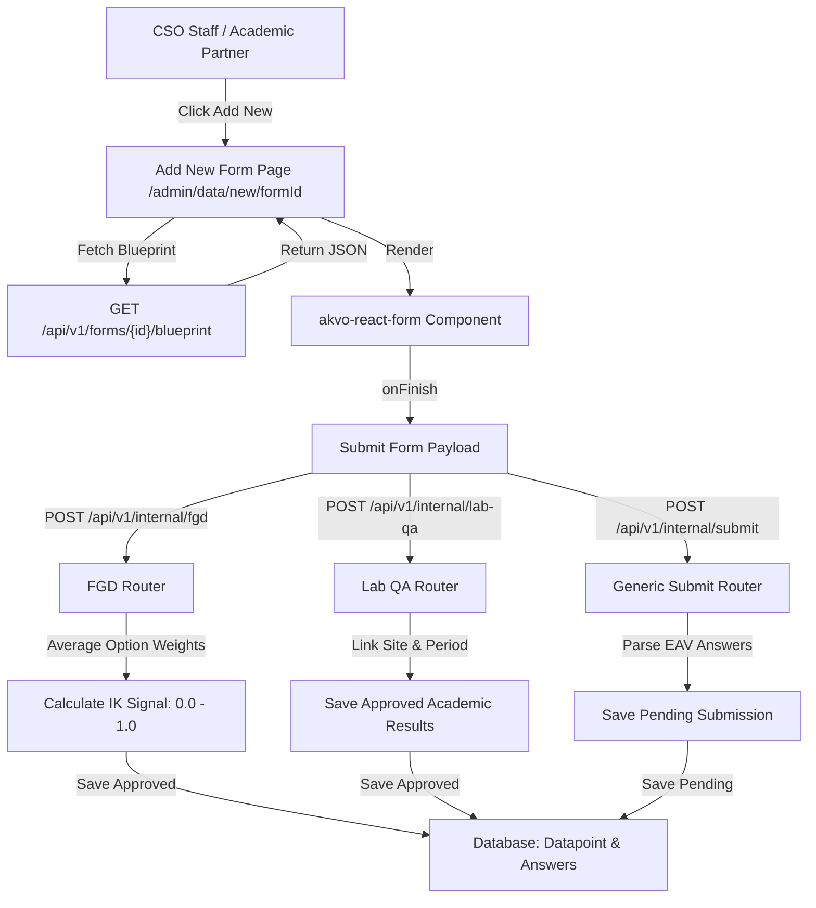

# PRD — Dynamic Web Forms Data Ingestion (akvo-react-form)

> **Stage 2 of 3 — Documentation Hierarchy**
> Owner: John (PM) | Target Location: `docs/prd/webforms_ingestion_prd.md` | References: `docs/prd/admin_layout_prd.md`, `docs/prd/dynamic_datapoints_prd.md`, `docs/prd/arf_form_blueprint_prd.md`
> Status: `Under Review`

---

## 1. Overview & Goal

**Problem Statement**:
CSO Staff and Academic Partners need a direct way to submit environmental data (such as qualitative Focus Group Discussions and complex Lab QA analysis results) directly through the Next.js administrative portal instead of relying solely on USSD or KoboCollect synchronization.

**Solution**:
Integrate the `akvo-react-form` component into the Admin Data overview interface. When users click "+ Add New", the application dynamically renders the required form, collects inputs, and submits them to dedicated, context-specific FastAPI endpoints that process, validate, and store the structured data.

---

## 2. 5W1H Analysis

* **Who**:
  - **CSO Staff**: Submits Monthly Baraza Focus Group Discussion (FGD) surveys.
  - **Academic Partners**: Submits complex Lab QA metrics.
  - **Admin / Secretariat**: Reviews the incoming submissions.
* **What**: Integration of `akvo-react-form` React library to render dynamic JSON schemas and invoke backend POST endpoints (`/api/v1/internal/fgd` and `/api/v1/internal/lab-qa`) to process payloads.
* **Where**:
  - Frontend: Admin Data View modal (`frontend/src/app/admin/data/page.tsx`).
  - Backend: New endpoints under `backend/app/routers/internal_router.py`.
* **When**: Triggers when an authorized user clicks "+ Add New" in the Admin portal, fills out a form, and clicks submit.
* **Why**: Bypasses manual entry errors and enables real-time mathematical indexing (e.g. IK signal averaging) and structured QA tracking.
* **How**:
  1. Frontend fetches the form blueprint JSON from the backend.
  2. Renders `<AkvoReactForm form={blueprint} onFinish={onFinish} />`.
  3. Sends the completed payload to `/api/v1/internal/fgd` (FGD form), `/api/v1/internal/lab-qa` (Lab QA form), or the generic `/api/v1/internal/submit` endpoint (for other dynamic forms).
  4. Backend processes specific calculations (e.g. FGD averages) or saves them directly with status `APPROVED`, while generic forms save with status `PENDING` for administrator moderation.

---

## 3. Requirements (Scope Guardrails)

### Must-Have
- **Library Integration**: Install and configure `akvo-react-form` in the Next.js frontend, ensuring support for `table` and `geo` question types.
- **Form Fetching**: Fetch the JSON form definition dynamically when clicking "+ Add New".
- **CSO FGD Endpoint (`/api/v1/internal/fgd`)**:
  - Saves the submission directly as `APPROVED` status (no moderation review required).
  - Calculates the **IK Signal** by averaging the selected qualitative values for:
    - *Fish abundance*
    - *Water clarity*
    - *Vegetation cover*
  - The resulting IK signal (value between `0.0` and `1.0`) must be saved in the database linked to the `wetland_id`.
- **Lab QA Endpoint (`/api/v1/internal/lab-qa`)**:
  - Receives academic measurements: BOD, Nitrate, and Mercury.
  - Links results to a specific `site_id` and a `sampling_period` string (e.g., `"2026-Q2"`).
  - Saves the submission directly as `APPROVED`.
- **Generic Submission Endpoint (`/api/v1/internal/submit`)**:
  - Receives submission payload for any other form type.
  - Validates and parses question answers using EAV format against the form's blueprint version.
  - Links the submission to the specified geo hierarchy (`basin_id`, `wetland_id`, or `site_id`).
  - Saves the submission under `PENDING` status to go through the standard moderator queue.

### Nice-to-Have
- Progress indicators and draft auto-saving inside the modal.

### Out of Scope
- Direct CSV ingestion or bulk uploads (managed separately).
- Dynamic runtime form creation builder UI on the frontend.

---

## 4. Ingestion & Calculations Architecture

### Data Processing Flow

### FGD IK Signal Calculation Logic
For the FGD inputs, dropdown strings map to numeric weights:
- **Abundance / Clarity / Cover Values**:
  - `GOOD` / `INCREASED` / `HIGH` = `1.0`
  - `MODERATE` / `STABLE` / `MEDIUM` = `0.5`
  - `POOR` / `DECLINED` / `LOW` = `0.0`
- **Formula**:
  $$\text{IK Signal} = \frac{\text{Fish Weight} + \text{Clarity Weight} + \text{Vegetation Weight}}{3}$$

---

## 5. Acceptance Criteria

### User Acceptance Criteria (UAC)
* **UAC-1**: When "+ Add New" is clicked, a modal displays the dynamic questionnaire.
* **UAC-2**: Submitting a Focus Group Discussion (FGD) immediately records it as `Approved` (bypassing `Pending`).
* **UAC-3**: Submitting a Lab QA result correctly displays the saved parameters on the site-specific details.

### Technical Acceptance Criteria (TAC)
* **TAC-1**: `onFinish` callback triggers the POST request with the correctly structured payload.
* **TAC-2**: FGD endpoint correctly links the computed mathematical average (0.0 to 1.0) to `wetland_id`.
* **TAC-3**: Lab QA endpoint checks and links values directly to the specified `site_id` and sampling period.
* **TAC-4**: Generic submission endpoint saves data under `PENDING` status in the EAV dynamic tables, validating bounds and schema constraints.

---

## 6. Edge Cases & Errors
- **Invalid Site/Wetland Mapping**: If the form contains an invalid `site_id` or `wetland_id`, the backend must return a `400 Bad Request`.
- **Missing Required Fields**: If critical calculation inputs (e.g. one of the three FGD parameters) are missing, the backend returns a validation error.

---

## 7. Epic & Ballpark Estimation

| Component | Task Description | Complexity | Ballpark Estimate (Hours) |
|-----------|------------------|------------|---------------------------|
| **Frontend Form Integration** | Install `akvo-react-form` and create "+ Add New" Modal container | Complex | 8h |
| **FGD Ingestion Endpoint** | Build `/api/v1/internal/fgd` router, map option weights, and save `APPROVED` datapoint | Medium | 6h |
| **Lab QA Ingestion Endpoint** | Build `/api/v1/internal/lab-qa` router linking measurements to site and period | Simple | 4h |
| **Test Verification** | Write Vitest tests for the form modal, and Pytest tests for backend routers | Medium | 6h |

---

## Exit Criterion
> This PRD must be approved by the user to proceed to LLD and implementation plan.
