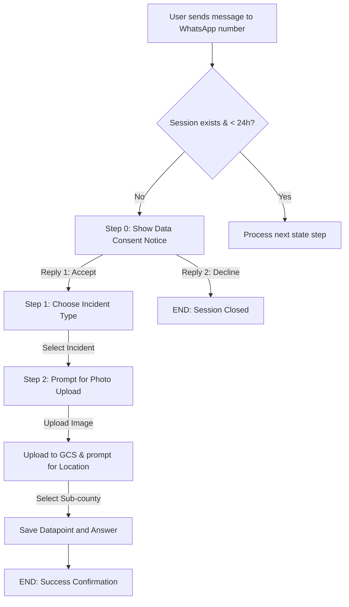

# PRD — WhatsApp Menu Router & Session Logic

> **Stage 2 of 3 — Documentation Hierarchy**
> Owner: PM + Design Lead | Target Location: `docs/prd/whatsapp_pipeline_prd.md` | References: `docs/product_brief.md`, `docs/database_schema.md`
> Status: `Draft`

---

## 1. Overview

**One-liner**:
An inbound/outbound FastAPI webhook interface to process smartphone-based environmental reports via the Meta WhatsApp Cloud API, guiding users through a consent gate, incident choice, media attachment upload to GCS, sub-county resolution, and 24-hour session timeout policy.

**Brief / Problem Reference**:
Refers to Section 7.1 (Pollution Pipeline) and Section 9.3 (Data Sovereignty) of `docs/product_brief.md`.

**What is a Citizen Record?**:
A **Citizen Record** represents a trusted field contributor (either a `WATCHER` or a `SCIENTIST`) whose identity and default monitoring location (`site_id`) have been pre-registered in the system by an Administrator.
- **Registered vs. Unregistered Ingestion Flow**:
  - **Registered Citizen**: If the incoming phone number (hashed MSISDN) matches a registered Citizen Record, the submission (e.g., via WhatsApp) is linked to their profile and automatically associated with their default `site_id`.
  - **Unregistered Citizen**: If the phone number is not found in the Citizen Records database, the WhatsApp flow is **not** blocked. The submission is successfully ingested and saved as an anonymous/public report geocoded to the selected sub-county's centroid.

**What we are building** (What):
A stateful callback handler that processes WhatsApp Meta webhook messages. It guides users through an asynchronous branching flow:
1. **Consent Gate**: User accepts privacy terms.
2. **Incident Selection**: User chooses the type of pollution incident.
3. **Media Upload**: User attaches a photo/image of the incident (uploaded to Google Cloud Storage).
4. **Location Selection**: User selects a sub-county for geocoding.
It also includes a session cleaner that drops incomplete states after 24 hours.

**Why now** (Strategic context):
While USSD supports feature-phone users, smartphone users need a low-friction channel (WhatsApp) to capture and submit rich visual evidence (photos) of environmental degradation.

---

## 2. Goals & Success Metrics

| Goal | Success Metric | Baseline | Target | Owner |
|------|---------------|----------|--------|-------|
| Support rich media reports | Image upload success rate via WhatsApp | 0% | > 95% | Dev |
| Spatial geocoding resolution | Sub-county mapping matching rate | 0% | 100% | Architect |
| Session cleanliness | Autopruning of stale sessions after 24h | Manual cleanup | 100% automatic | SM |

---

## 3. Target Users & Personas

| Persona | Job-to-be-Done | Key Frustration | v1 Priority |
|---------|---------------|-----------------|-------------|
| Citizen Reporter | Submit environmental alerts quickly with visual proof. | Slow loading web apps or data-hungry portal pages when on-site. | Primary |

---

## 4. User Stories

| ID | User Story | Priority (MoSCoW) | FR Reference |
|----|-----------|-------------------|--------------|
| US-001 | As a **Citizen Reporter**, I want a clear privacy consent gate first so that my data usage rights are respected. | Must Have | FR-001 |
| US-002 | As a **Citizen Reporter**, I want to choose the incident type and sub-county so that my report is accurate. | Must Have | FR-002, FR-004 |
| US-003 | As a **Citizen Reporter**, I want to upload a photo of the incident so that investigators have visual proof. | Must Have | FR-003 |
| US-004 | As the **NBD Platform**, I want old incomplete WhatsApp sessions pruned after 24 hours to comply with session policies. | Must Have | FR-005 |

---

## 5. Functional Requirements

| ID | Requirement | User Story | Priority |
|----|-------------|------------|----------|
| FR-001 | The system MUST present a step-zero privacy consent warning to new sessions. | US-001 | Must Have |
| FR-002 | The system MUST support incident selection loaded dynamically from database seed forms. | US-002 | Must Have |
| FR-003 | The system MUST download photo attachments from the Meta media API and stream them to GCS. | US-003 | Must Have |
| FR-004 | The system MUST resolve the user's location via sub-county choices matching the country basin boundaries. | US-002 | Must Have |
| FR-005 | The system MUST automatically prune session states older than 24 hours. | US-004 | Must Have |

---

## 6. Non-Functional Requirements

| Category | Requirement | Metric |
|----------|-------------|--------|
| **Security** | Signature Verification | Validate incoming Meta webhook signature headers using `X-Hub-Signature-256`. |
| **Session Lifetime** | 24-hour Session Expiry | Meta's customer service window constraint. |
| **Performance** | Webhook response acknowledgement | Returns `200 OK` to Meta within 3 seconds to avoid retries. |

---

## 7. User Flows & Wireframes

### Stateful WhatsApp Menu Flow

---

## 8. Scope Boundaries

**In Scope**:
- Inbound webhook `POST /api/v1/whatsapp/webhook` and validation `GET /api/v1/whatsapp/webhook`.
- Signature verification of `X-Hub-Signature-256`.
- Stateful session flow in database.
- GCS upload integration for photo attachments.
- Session cleanup routine triggered every hour (or scheduled task).

**Out of Scope**:
- Audio/voice note parsing or transcoding (v1 strictly supports photos/images).
- Interactive WhatsApp template buttons (v1 will use clear text-based messaging menus for reliability).

---

## 9. Epic & Ballpark Estimation

| Component | Complexity | Ballpark Estimate |
|-----------|------------|-------------------|
| Webhook Verification & Routing | Simple | 0.5 Day |
| State Machine & Session Storage | Medium | 1.0 Day |
| GCS Media Streaming | Medium | 1.0 Day |
| Session Expiry Cron Worker | Simple | 0.5 Day |
| Integration Tests | Medium | 1.0 Day |

**Total Estimated Effort**: 4.0 Developer Days

---

## 10. Rollout & Rollback Plan

- **Rollout**: Enable the WhatsApp webhook routing under a feature toggle or configuration token in `.env`.
- **Rollback**: Disable the route or invalidate the Meta webhook subscription to stop incoming webhooks.
