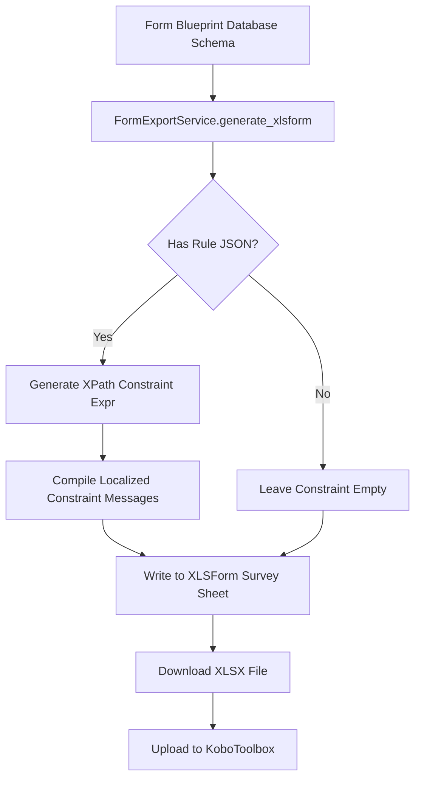

# PRD — XLSForm Validation Criteria Export

> **Stage 2 of 3 — Documentation Hierarchy**
> Owner: PM + Winston (Architect) | Target Location: `docs/prd/xlsform_validation_export_prd.md` | References: `docs/prd/form_blueprint_export_prd.md`, `docs/form_definition_schema.md`
> Status: `In Review`

---

## 1. Overview

**One-liner**:
Export the validation rules (e.g. min, max, allowed values) and validation messages configured on form questions from our database schema into KoboToolbox-compliant `constraint` and `constraint_message` columns in the exported XLSForm.

**Brief / Problem Reference**:
Currently, the form blueprint exporter in `backend/app/services/form_export.py` generates the `survey` sheet with `type`, `name`, `label`, `required`, `hint`, `relevant`, `filter`, and `parameters`, but it completely omits question-level validation criteria (stored in the question's `rule` JSON column) and validation messages. When users import these forms into KoboToolbox, they lose any input validation logic configured in the platform's editor.

**What we are building**:
We are adding support for:

1. Translating numeric and range rules (e.g., `min`, `max`, `allowDecimal`) into XPath validation expressions within the `constraint` column.
2. Exporting user-friendly error messages (e.g., from `tooltip` or translation payloads) into the `constraint_message` column.
3. Ensuring language-specific validation messages (`constraint_message::English (en)`, `constraint_message::Swahili (sw)`) are generated properly.

**Why now**:
Without validation criteria in the exported forms, citizen scientists and field reporters can submit invalid values (e.g., pH of 15, negative temperatures) via KoboCollect, bypassing our application's input constraints and degrading data quality.

---

## 2. Goals & Success Metrics

| Goal                                | Success Metric                                                           | Baseline | Target | Owner |
| ----------------------------------- | ------------------------------------------------------------------------ | -------- | ------ | ----- |
| Complete XLSForm logical integrity  | 100% of numeric rules (`min`, `max`) exported as active validation rules | 0%       | 100%   | PM    |
| Informative feedback on KoboCollect | Multilingual validation messages exported to XLSForm                     | 0%       | 100%   | PM    |
| XLSForm compatibility               | Exported XLSForm passes the ODK/Kobo validator                           | 100%     | 100%   | PM    |

**Anti-Goals**:

- We are not optimizing for power-user workflows in v1.
- We are not implementing client-side validation logic in the web portal as part of this exporter epic.

---

## 3. Target Users & Personas

| Persona               | Job-to-be-Done                                    | Key Frustration                                                          | v1 Priority |
| --------------------- | ------------------------------------------------- | ------------------------------------------------------------------------ | ----------- |
| Admin / Form Designer | Exports form templates for KoboCollect deployment | Manually re-entering range validation limits in Kobo Form Builder        | Primary     |
| Citizen Scientist     | Completes monthly sampling questionnaires         | Accidentally inputting typo values (e.g. pH 70) without getting an alert | Secondary   |

---

## 4. User Stories

| ID     | User Story                                                                                                                                                       | Priority (MoSCoW) | FR Reference   |
| ------ | ---------------------------------------------------------------------------------------------------------------------------------------------------------------- | ----------------- | -------------- |
| US-001 | As an **Admin**, I want the exported XLSForm to include the validation limits (`min` and `max` limits) so that I don't have to rebuild validation logic in Kobo. | Must Have         | FR-001, FR-002 |
| US-002 | As a **Citizen Scientist**, I want to see an error message in KoboCollect when I input a value outside the allowed range, explaining the limit in my language.   | Must Have         | FR-003, FR-004 |

---

## 5. Functional Requirements

| ID     | Requirement                                                                                                                                                                                                             | User Story     | Priority  |
| ------ | ----------------------------------------------------------------------------------------------------------------------------------------------------------------------------------------------------------------------- | -------------- | --------- |
| FR-001 | The exporter MUST add `constraint` and `constraint_message` columns (or multilingual equivalent `constraint_message::[Language]`) to the exported `survey` sheet headers.                                               | US-001, US-002 | Must Have |
| FR-002 | The exporter MUST convert the `rule` object's `min` and `max` constraints into XPath expressions:  - Only `min`: `. >= min` - Only `max`: `. <= max` - Both `min` and `max`: `. >= min and . <= max`           | US-001         | Must Have |
| FR-003 | The exporter MUST map translation values for `constraint_message` dynamically, defaulting to standard localized constraint messages (e.g. `"Value must be between [min] and [max]"`) if no custom message is specified. | US-002         | Must Have |
| FR-004 | The exporter MUST support language mapping matching the languages array resolved in the form blueprint (e.g. English, Swahili).                                                                                         | US-002         | Must Have |

---

## 6. Non-Functional Requirements

| Category            | Requirement                                            | Metric                                                                  |
| ------------------- | ------------------------------------------------------ | ----------------------------------------------------------------------- |
| **Reliability**     | XLSForm structural validity                            | Passes `pyxform` validation with zero errors or warnings                |
| **Performance**     | Overhead for processing validation rules during export | < 50ms additional execution time                                        |
| **Maintainability** | Clean separation of XLSForm formatting                 | Validation expression compilation logic isolated in `FormExportService` |

---

## 7. User Flows & Wireframes

### XLSForm Generation & Ingestion Flow

---

## 8. Scope

**v1 — In Scope**:

- Generation of `. >= min`, `. <= max`, and `. >= min and . <= max` constraint logic for numeric columns (`integer`, `decimal`).
- Creation of corresponding localized `constraint_message` fields using default and translated messages.
- Full test coverage for validation rule exporting.

**v1 — Explicitly Out of Scope**:

- Complex regex validations for text types.
- Relational cross-question constraints (e.g., checking if `temp_water` is less than `temp_air`).

---

## 9. Assumptions & Constraints

**Assumptions**:

- All numeric question validation ranges are defined under `question.rule` with keys `min` and `max`.
- Standard ODK XLSForm runtime parses XPath expressions where `.` represents the current cell/question's value.

---

## 10. Change Log

| Version | Date       | Author    | Changes                                        |
| ------- | ---------- | --------- | ---------------------------------------------- |
| 0.1     | 2026-07-06 | PM (John) | Initial PRD draft for XLSForm validation rules |

---

## Exit Criterion

> [!IMPORTANT]
> This PRD must be approved by the user before low-level design or implementation begins.

**Sign-off Checklist**:

- [ ] Logic for XPath generation specified
- [ ] Out of scope validation boundaries defined
- [ ] Multilingual constraint message handling outlined
