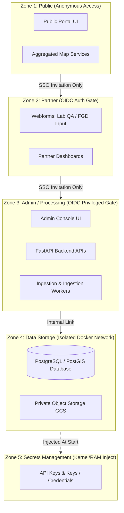

# User Roles and Role-Based Access Control (RBAC) Specification

This document details the security model, identity taxonomy, trust zones, and granular permissions for the Nile Basin Discourse (NBD) Citizen-Led Wetland Monitoring Platform.

---

## 1. Actor Taxonomy & User Classification

The platform manages two distinct categories of identity profiles to maintain separation of concerns between raw contributors and internal managers:

### 1.1 Identity Types
* **Citizens (Data Contributors)**: Community recorders and field volunteers. They are stored in the database with limited attributes (primarily phone numbers as identifiers for ingestion mapping). They submit data but do not possess login accounts on the platform management console.
* **Users (Platform Operators & Partners)**: Institutional actors, reviewers, and admins who authenticate securely via OpenID Connect (OIDC) Single Sign-On (SSO). They have active login credentials and are governed by RBAC.

### 1.2 Specific Roles

#### Internal Roles (Authenticated via SSO)
* **Administrator**: Holds full administrative and technical control over the platform infrastructure, metadata schemas, and user directories.
* **Reviewer**: Operational coordinator who manages the "Clean and Approve" data curation workflows before raw submissions trigger the health score engine.

#### External Roles (Contributors & Partners)
* **Citizen Reporter**: Ad-hoc reporters in local basins submitting pollution indicators via USSD or WhatsApp gateways.
* **Citizen Scientist**: Trained community volunteers conducting monthly structured physical-chemical and biological monitoring via KoboCollect.
* **Academic Partner**: Institutional research entities (e.g., Makerere University, University of Nairobi) responsible for entering quarterly laboratory validation data (Lab QA).
* **CSO Staff (FGD Facilitator)**: Civil Society Organization field personnel who document monthly Focus Group Discussions (FGD / Barazas) to capture qualitative community observations (Indigenous Knowledge Signal).

#### Public Roles (Unauthenticated)
* **General Public / Portal Viewer**: Any anonymous user visiting the portal web application to check site statuses, map overlays, or aggregate trends.

---

## 2. System Trust Zones & Security Boundaries

The system is structured into five concentric, isolated security boundaries to limit the blast radius of potential compromises:



### Boundary Gates & Invitation Policy
* **Self-Registration Prohibition**: There is no self-registration pathway for Zone 2 (Partner) or Zone 3 (Admin).
* **Invitation Protocol**: Administrators must explicitly create user profiles and assign email addresses in the user registry. The invited users then sign in using Google or Microsoft SSO matching that designated email address.

---

## 3. Comprehensive RBAC Permission Matrix

The following matrix outlines the functional operations permitted for each role:

| Role | Create/Submit | Read/View | Edit/Clean | Approve/Score | Delete |
| :--- | :--- | :--- | :--- | :--- | :--- |
| **Administrator** | All Data Forms | All System Layers | All Records & Metadata | All Submissions | All Records, Users & Sites |
| **Reviewer** | All Data Forms | Data Logs & Public Portal | Pending/Approved Data | All Submissions | None |
| **Academic Partner** | Lab QA Form | Own Data / Public Portal | None (Submission Only) | None | None |
| **CSO Staff** | FGD Form | Own Data / Public Portal | None (Submission Only) | None | None |
| **Citizen Scientist** | Sampling Form | Public Portal Only | None (Submit Only) | None | None |
| **Citizen Reporter** | Pollution Form | Public Portal Only | None (Submit Only) | None | None |
| **General Public** | None | Aggregated Portal Only | None | None | None |

---

## 4. Detailed Functional Permissions

### 4.1 Administrative & Review Roles
* **User Provisioning**: Only **Administrators** can create, modify, or disable user profiles and assign roles (`ADMIN` vs `REVIEWER`).
* **Spatial Reference Governance**: Only **Administrators** can add, update, or delete coordinates, polygon boundaries, and site metadata (e.g. adding a new monitoring site code like `NBD-MARA-001`).
* **Curation Workflow ("Clean & Approve")**: **Reviewers** and **Administrators** evaluate incoming raw submissions (status: `PENDING`). They have the authority to edit errors in raw data submissions, update status to `APPROVED` or `REJECTED`, and trigger the scoring engine.
* **Aggregated Health Score Invalidation**: If corrupted data is approved, only **Administrators** can delete or force-recalculate historic `health_scores` rows.

### 4.2 Partner & Field Roles
* **Lab QA Submission**: **Academic Partners** can enter parameters (BOD, Orthophosphate, Nitrate, Mercury, and Heavy metals) strictly matching their authenticated partner domain.
* **FGD Entry**: **CSO Staff** can submit structured forms for FGD sessions mapping to specific wetlands. The submission includes fish abundance decline indices, water clarity, and vegetation cover.
* **Citizen Inputs**: Citizen Scientists and Reporters submit data payloads via offline-capable KoboCollect forms or SMS/WhatsApp webhooks. They operate on a write-only database pathway (`datapoints` / `answers` table inserts) and cannot query raw records of other participants.

---

## 5. Data Governance & PII Safeguards

### 5.1 PII Boundary & Anonymization
* **PII Isolation**: Citizen phone numbers reside strictly inside the `citizens` table in Zone 3 (Admin Zone). Phone numbers are strictly omitted from API responses exposed to Zone 1 and Zone 2.
* **Right to be Forgotten (Anonymization Policy)**: When a citizen profile is requested to be deleted, the system deletes the `phone_number` and any metadata mapping to the citizen profile inside the `citizens` table. However, the raw observations (`sampling_records`, `datapoints`) are preserved in an anonymous state (nullifying `citizen_id` or replacing it with an anonymous placeholder) to protect historical longitudinal datasets and trend statistics.

### 5.2 Non-Repudiation Audit Logs
* **System Logging**: The system records all structural mutations (approvals, rejections, deletes, schema edits) in a secure database audit table.
* **Log Structure**:
  ```sql
  CREATE TABLE audit_logs (
      audit_id UUID PRIMARY KEY DEFAULT gen_random_uuid(),
      actor_id UUID NOT NULL, -- Links to users.user_id (SSO Subject ID)
      action_type VARCHAR(50) NOT NULL, -- e.g., 'APPROVE_DATAPOINT', 'DELETE_SITE'
      target_table VARCHAR(50) NOT NULL,
      target_id VARCHAR(100) NOT NULL,
      change_delta JSONB, -- Stores before/after values
      logged_at TIMESTAMP NOT NULL DEFAULT CURRENT_TIMESTAMP
  );
  ```

---

## 6. Infrastructure & Cryptographic Controls

### 6.1 Authentication Mechanism
* **OIDC SSO Integration**: Authentication is delegated to external identity providers (Google/Microsoft). No password hashes or salt keys are stored in the local database.
* **Session Validity**: Session JSON Web Tokens (JWT) are signed at the backend and enforce a strict 1-hour expiration time with no sliding sessions for administrative layers.

### 6.2 Encryption Standards
* **Data in Transit**: All endpoints enforce TLS 1.3 (HTTPS). Unencrypted HTTP traffic is redirected automatically. USSD and WhatsApp webhooks require cryptographic signature validation (e.g. validation of signing headers from Africa's Talking) before payload ingestion.
* **Data at Rest**: PostgreSQL database storage volumes are encrypted using AES-256. Database backups are encrypted with a public-key standard prior to object storage uploads.
* **Network Isolation**: All server processes run in private containers. The database port is not exposed to the public host; communication between FastAPI (Zone 3) and PostgreSQL (Zone 4) takes place inside an isolated Docker overlay network.

### 6.3 Media Access Controls (Signed URLs)
* **GCS Private Buckets**: Uploaded field photographs and spatial GeoTIFF layers are stored in private Google Cloud Storage buckets with default public access disabled.
* **Temporary Signed Access**: The portal renders media links using Google Cloud Storage signed URLs. These URLs are cryptographically signed at the backend, set to a strict 15-minute Time-To-Live (TTL), and restricted to `GET` requests, preventing URL sharing or permanent indexation by search engine spiders.
